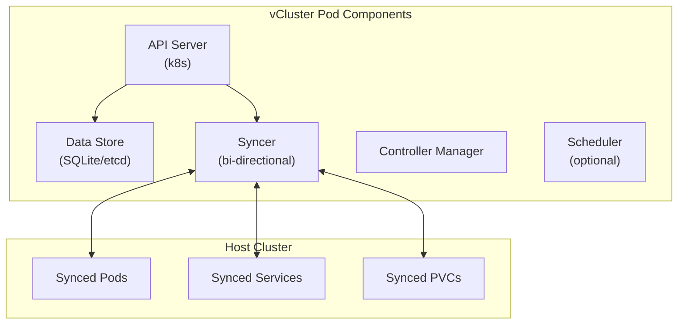

## vCluster Technical Architecture
<!-- new_lines: 1 -->
> Understanding how vCluster achieves Kubernetes isolation
<!-- new_lines: 1 -->

<!-- new_lines: 1 -->
| **Component** | **Purpose** | **Resource Usage** |
|--------------|-------------|--------------------|
| API Server | Full K8s API compatibility | ~100MB RAM |
| Syncer | Resource translation | ~50MB RAM |
| Data Store | Complete state isolation | ~10MB disk |
| Total Overhead | **< 200MB per vCluster** | Minimal impact |
<!-- new_lines: 1 -->
> **Key Innovation:** Containerized control plane with intelligent resource syncing