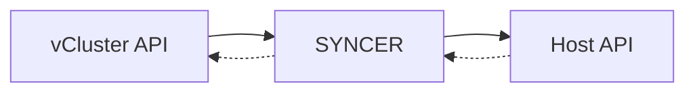

## The Syncer: vCluster's Core Component
<!-- new_lines: 1 -->
> Bidirectional state reconciliation engine between virtual and host clusters
<!-- new_lines: 1 -->

<!-- new_lines: 1 -->
```bash +exec_replace
cat << 'EOF' | ccze -A
SYNCER OPERATIONS:
━━━━━━━━━━━━━━━━━━━━━━━━━━━━━━━
1. Watch vCluster API for resources
2. Transform names: nginx → nginx-x-default-x-vcluster
3. Rewrite namespace: default → vcluster-namespace
4. Track references: ConfigMap:app-config → app-config-x-default-x-vcluster
5. Apply to host cluster
6. Sync status back: pod.Status → vCluster

WHAT IT SYNCS:
━━━━━━━━━━━━━━━━━━━━━━━━━━━━━━━
→ TO HOST: Pods, Services, Secrets (selective), ConfigMaps (selective)
← FROM HOST: Node status, Pod conditions, Service endpoints
↔ BIDIRECTIONAL: Annotations, Labels, Pod status

RECONCILIATION LOOP:
━━━━━━━━━━━━━━━━━━━━━━━━━━━━━━━
Watch(vClusterAPI) → Transform(resource) → Apply(hostAPI) → UpdateStatus(vClusterAPI)
                                              ↑                         ↓
                                              └─────────────────────────┘
EOF
```