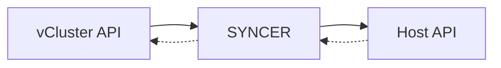

## The Syncer: vCluster's Core Component
<!-- new_lines: 1 -->
> Bidirectional state reconciliation engine between virtual and host clusters
<!-- new_lines: 1 -->

```mermaid +render
graph LR
    VC["vCluster API"] --> S["SYNCER"]
    S --> HC["Host API"]
    HC -.-> S
    S -.-> VC
```
<!-- new_lines: 1 -->
```bash +exec_replace
printf '\e[1;36m%s\e[0m\n\n' "WHAT THE SYNCER DOES"
printf '  \e[35m1\e[0m  watches the vCluster API for pods, services, configmaps\n'
printf '  \e[35m2\e[0m  rewrites names:  \e[37m%s\e[0m\n' "nginx  →  nginx-x-default-x-vcluster"
printf '  \e[35m3\e[0m  applies the translated object to the host cluster\n'
printf '  \e[35m4\e[0m  reflects host status back into the vCluster\n'
```