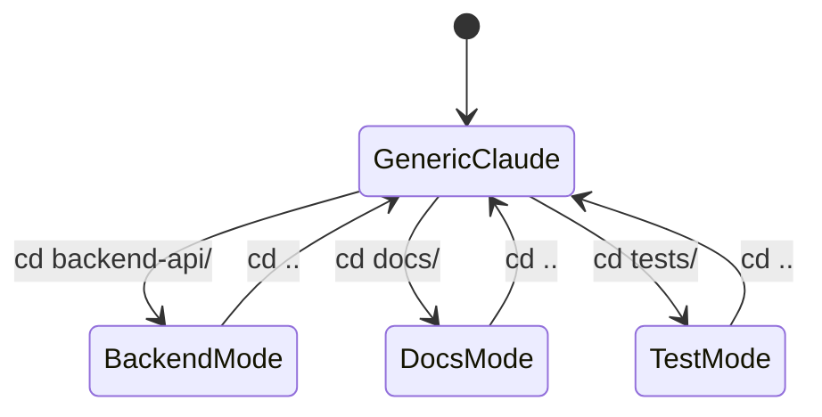

# Directory-Based System Prompt Switching

## Option 1: Tree View

```
Home Directory
│
├── backend-api/
│   ├── .envrc → CLAUDE_SYSTEM_PROMPT=backend-api.md
│   └── (Claude acts as backend engineer)
│
├── docs/
│   ├── .envrc → CLAUDE_SYSTEM_PROMPT=technical-writing.md
│   └── (Claude acts as technical writer)
│
└── tests/
    ├── .envrc → CLAUDE_SYSTEM_PROMPT=test-automation.md
    └── (Claude acts as QA engineer)
```

## Option 2: Flow

```
cd backend-api/
      │
   direnv activates
      │
CLAUDE_SYSTEM_PROMPT=backend-api.md
      │
Claude loads backend rules
      │
"Read source first, Edit > Write"
```

## Option 3: State Transitions


