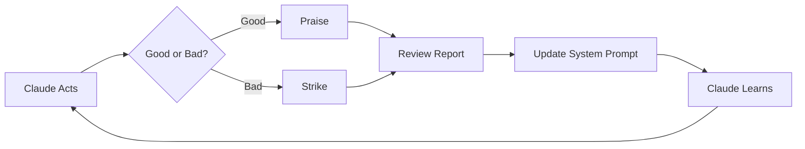

# Feedback Loop Diagram Options

## Option 1: Mermaid Flowchart



## Option 2: ASCII Art

```
   ┌─────────────┐
   │ Claude Acts │
   └──────┬──────┘
          │
      Good/Bad?
          │
    ┌─────┴─────┐
    │           │
 Praise      Strike
    │           │
    └─────┬─────┘
          │
   Review Report
          │
  Update Prompts
          │
   Claude Learns
          │
          └──────> Loop back
```

## Option 3: Simple Flow

```
Claude → Observe → Praise/Strike → Report → Update → Improve
   ↑                                                      │
   └──────────────────────────────────────────────────────┘
```
