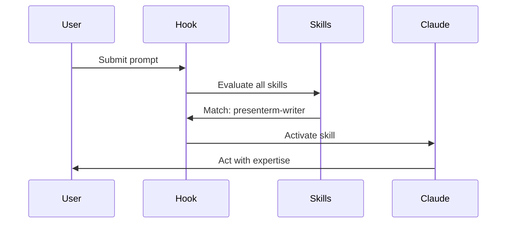
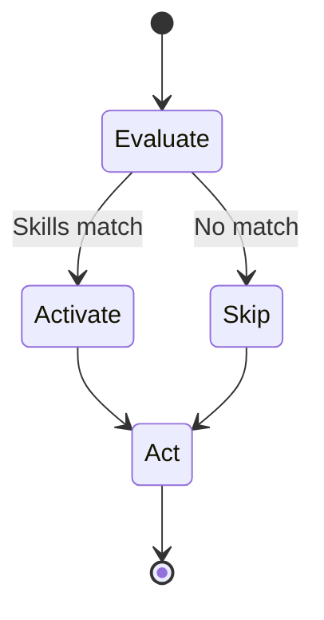

# Skill Activation Sequence Diagrams

## Option 1: Mermaid Sequence



## Option 2: State Machine



## Option 3: Simple Steps

```
┌──────────┐    ┌──────────┐    ┌──────┐
│ EVALUATE │ -> │ ACTIVATE │ -> │ ACT  │
└──────────┘    └──────────┘    └──────┘
     ↓               ↓              ↓
  Check all     Load skills   Use expertise
   skills        needed
```
