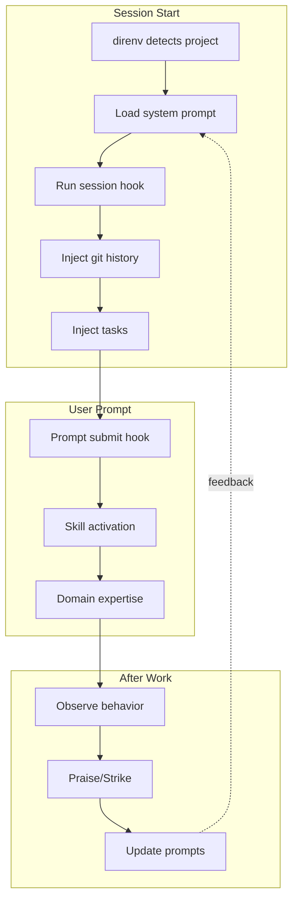

# System Integration Diagram

## Option 1: Mermaid Graph



## Option 2: Layered View

```
┌─────────────────────────────────────────┐
│        SESSION LAYER                    │
│  direnv → prompts → hooks → context     │
└─────────────────────────────────────────┘
           ↓
┌─────────────────────────────────────────┐
│        EXECUTION LAYER                  │
│  user prompt → skill eval → activate    │
└─────────────────────────────────────────┘
           ↓
┌─────────────────────────────────────────┐
│        FEEDBACK LAYER                   │
│  observe → praise/strike → improve      │
└─────────────────────────────────────────┘
           ↑
           └──────── continuous loop
```

## Option 3: Timeline View

```
TIME →

Session Start    Prompt Submit      Post-Action
     │                │                  │
   direnv          evaluate            observe
     │                │                  │
   prompts         activate          praise/strike
     │                │                  │
   hooks             act              improve
     │                │                  │
  context         complete           update prompts
                                          │
                                     (next session)
```
