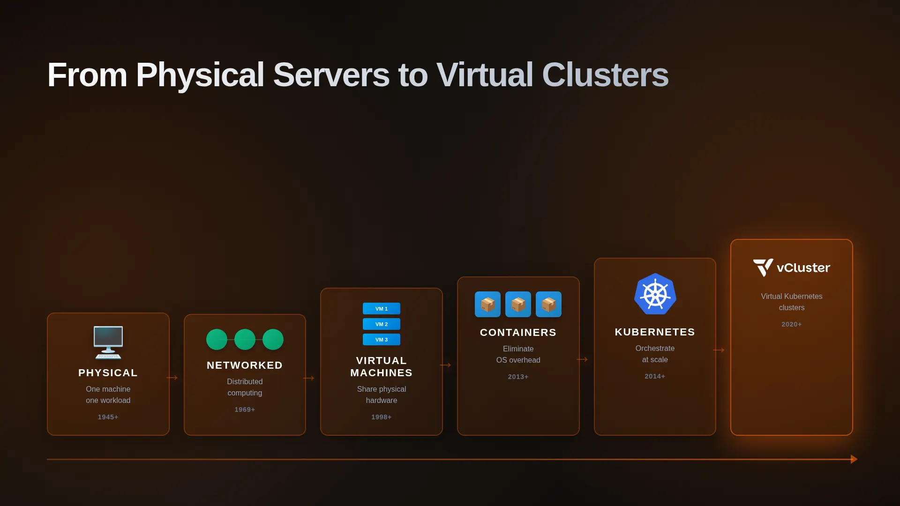
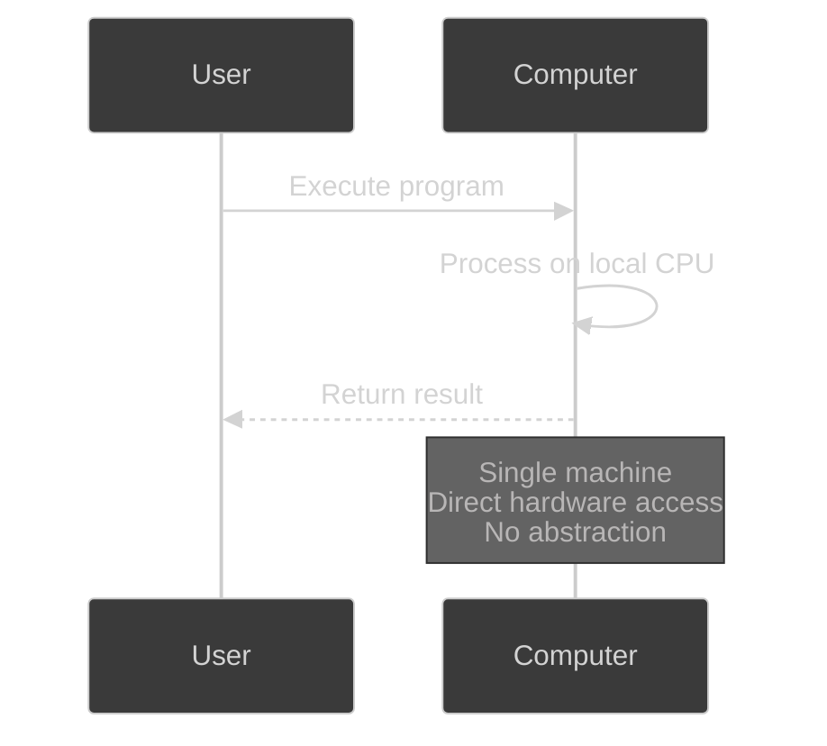
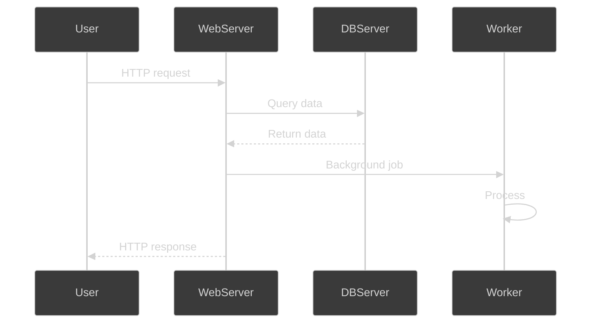
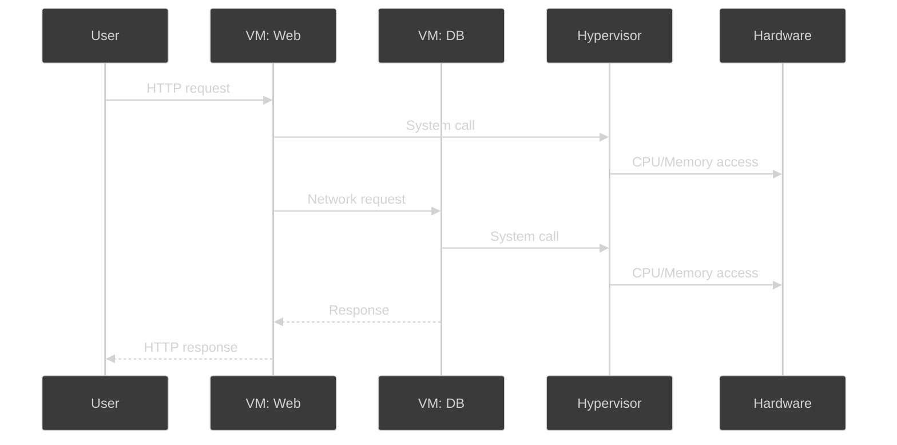
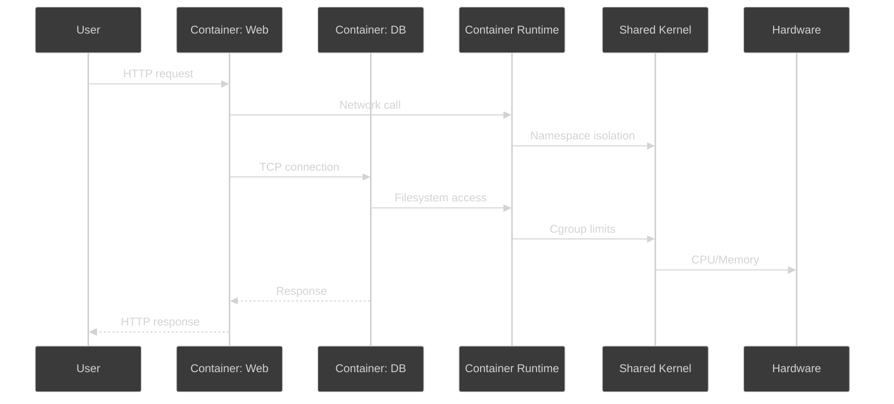
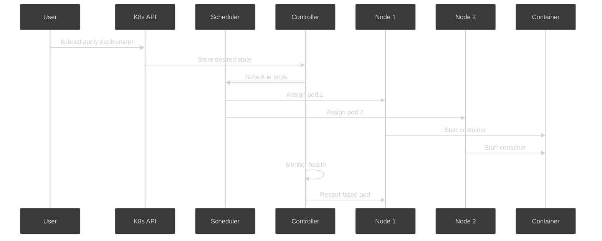
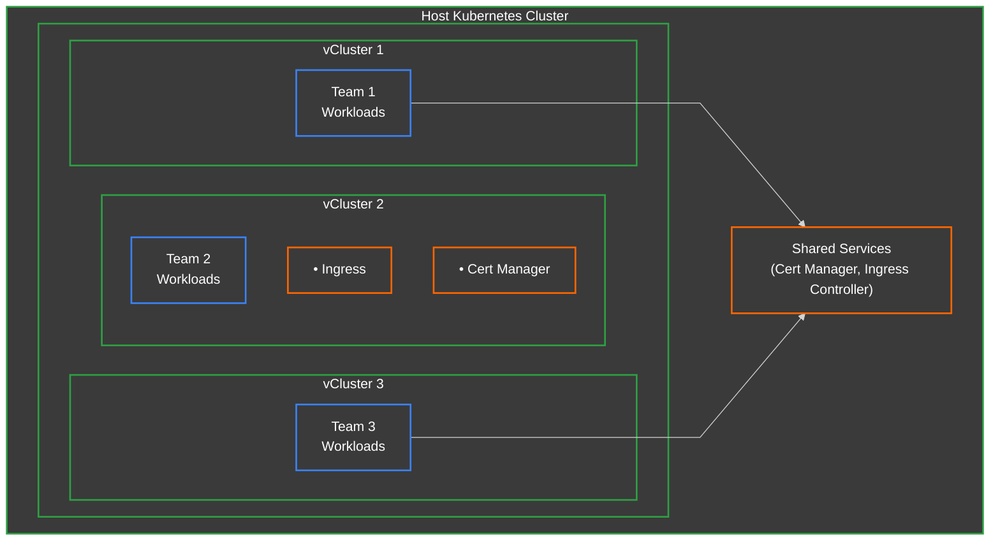
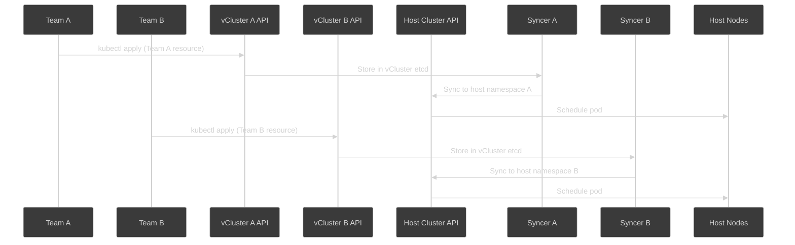

# From Physical Servers to Virtual Clusters

<!-- new_lines: 3 -->



<!-- jump_to_middle -->

<!-- end_slide -->

## 1945: Physical Computers

> Each abstraction solved a problem... and created a new one.



<!-- end_slide -->

## Demo: Single Computer

```bash +exec
bash /home/decoder/dev/dotfiles/scripts/__layouts.sh 5
```

> Open: https://copy.sh/v86/

<!-- end_slide -->

## 1969: Networked Computing



<!-- end_slide -->

## Demo: Networked Machines

```bash +exec
# Show the homelab cluster
kubectl get nodes -o 'custom-columns=NAME:.metadata.name,IP:.status.addresses[0].address'

# Worker1 reaches Worker2
ssh decoder@192.168.178.88 "ping -c 3 192.168.178.89"
```

<!-- end_slide -->

## 1998: Virtual Machines



<!-- end_slide -->

## Demo: Virtual Machines

```bash +exec
# Show VMs in homelab (Kubernetes nodes are VMs!)
kubectl get nodes -o 'custom-columns=NAME:.metadata.name,CPU:.status.capacity.cpu,MEMORY:.status.capacity.memory,OS:.status.nodeInfo.osImage'
```

<!-- end_slide -->

## 2013: Containers



<!-- end_slide -->

## Demo: Containers

```bash +exec
# Start 5 web servers in under a second!
time for i in {1..5}; do
  docker run -d --name web$i nginx:alpine >/dev/null
done

# Show they're all running
docker ps --format "table {{.Names}}\t{{.Status}}\t{{.Size}}"

# Cleanup
docker rm -f web{1..5} >/dev/null 2>&1
```

> **1 second. 5 servers. 1 kilobyte each.**

<!-- end_slide -->

## 2014: Kubernetes



<!-- end_slide -->

## Demo: Kubernetes (My Homelab!)

```bash +exec
# Real production cluster
kubectl get nodes -o wide

# Deploy across nodes
kubectl create deployment demo-app --image=nginx --replicas=3

# Wait for pods to be ready
kubectl wait --for=condition=Ready pod -l app=demo-app --timeout=60s

# Show distribution across nodes
kubectl get pods -l app=demo-app -o 'custom-columns=NAME:.metadata.name,NODE:.spec.nodeName'
```

> **Declarative magic:** "I want 3 replicas" → K8s figures it out

<!-- end_slide -->

## Explore with K9s

```bash +exec +acquire_terminal
k9s
```

<!-- end_slide -->

## But... Multi-Tenancy?



<!-- end_slide -->

## 2020: Virtual Clusters



<!-- end_slide -->

## What is vCluster?

| Feature | Benefit |
|---------|---------|
| Full Kubernetes API | Certified Kubernetes distribution |
| Flexible isolation | Separate control plane per team |
| Resource efficiency | Shared infrastructure, isolated workloads |
| Sub-minute provisioning | Instant test/dev/ci environments |

> **vCluster** = Containerized Kubernetes inside a Pod!

<!-- end_slide -->


## Demo: Create Dev Team vCluster

```bash +exec
# Create development team vCluster
vcluster create dev-team --connect=false

# Wait for ready
kubectl wait --for=condition=ready pod -l app=vcluster -n vcluster-dev-team --timeout=300s

# Show what's running
kubectl get pods -n vcluster-dev-team
```

<!-- end_slide -->

## Connect to vCluster

```bash +exec
# Connect to dev team's vCluster
vcluster connect dev-team

# Show we're in a different cluster
kubectl cluster-info
```

<!-- end_slide -->

## Deploy in vCluster

```bash +exec
# Deploy application in vCluster
kubectl create deployment nginx --image=nginx --replicas=3

# Show pods in vCluster
kubectl get pods -o wide
```

<!-- end_slide -->

## Where Do Pods Actually Run?

```bash +exec
# Switch back to host cluster
kubectl config use-context kind-vcluster-multitenancy

# Show pods in vcluster namespace
kubectl get pods -n vcluster-dev-team -o wide
```

<!-- end_slide -->

## Two Views of Same Pods

```bash +exec
# vCluster view
vcluster connect dev-team
kubectl get pods

# Host view
kubectl config use-context kind-vcluster-multitenancy
kubectl get pods -n vcluster-dev-team | grep nginx
```

<!-- end_slide -->

## Delete vCluster

```bash +exec
# Delete entire dev team environment
vcluster delete dev-team

# Everything gone - pods, config, all of it
kubectl get pods -n vcluster-dev-team
```

<!-- end_slide -->

## The Pattern

| Abstraction         | Solved                | Created               |
|---------------------|----------------------|----------------------|
| Physical → VMs      | Stranded resources   | OS overhead          |
| VMs → Containers    | Heavy OS             | Orchestration chaos  |
| Containers → K8s    | Orchestration        | Multi-tenancy broken |
| K8s → vClusters     | Control plane limits | Another layer        |

> **This is how abstraction works**

<!-- end_slide -->

## Resources

| Resource | Link |
|----------|------|
| Blog Post | https://medium.com/itnext/from-physical-servers-to-virtual-kubernetes-clusters-85f931d4cdff |
| Interactive Tutorial | killercoda.com/decoder/course/vcluster/vcluster_introduction |
| vCluster GitHub | github.com/loft-sh/vcluster |

<!-- end_slide -->

## That's All Folks!

<!-- new_lines: 5 -->

```bash +exec_replace
echo "That's All Folks!" | figlet -f small -w 90
```

<!-- jump_to_middle -->
