# CV Pipeline: From YAML to Professional PDFs

<!-- new_lines: 5 -->

```bash +exec_replace
echo "CV Pipeline" | figlet -f small -w 90
```

<!-- jump_to_middle -->

<!-- end_slide -->

## The CV Problem

> **Job Search Reality:**


> Source: Standout CV & Zety HR Statistics 2024

| **Metric**                        | **Reality**             |
| --------------------------------- | ----------------------- |
| Average applications per search   | 100-200                 |
| Time per customization            | 2-4 hours               |
| Multiple roles needed             | Multiple CVs required   |

<!-- end_slide -->

## The AI Trap

> **Why AI-Generated CVs Fail**

```mermaid +render +width:80%
%%{init: {"theme": "dark", "themeVariables": {"darkMode": true, "background": "#2b2b2b", "mainBkg": "#3a3a3a", "secondBkg": "#4a4a4a"}}}%%
graph LR
    A[AI] -->|❌ Wrong| B[Complete CV]
    A -->|✓ Right| C[YAML Data]
    C --> D[Your Pipeline]
    D --> E[Professional CV]

    style B fill:#4a3a4a,stroke:#e599f7,stroke-width:2px
    style E fill:#3a4a3a,stroke:#94d82d,stroke-width:2px
```



```bash +exec_replace
cat << 'EOF'
The Right Approach:
• AI writes structured data (YAML)
• You control the output
• Consistent quality
• Version controlled
EOF
```

<!-- end_slide -->

## What is LaTeX?

> **Document preparation system for high-quality typesetting**

```markdown
LaTeX = La(mport) + TeX
• Created 1985 by Leslie Lamport
• TeX from Greek τέχνη (technē) = "art" + "craft"

Key Characteristics:
• Separates content from presentation
• Code-based document creation
• Precise typography & layout control
• Professional scientific/academic standard
• Perfect PDF output
```

<!-- end_slide -->

## LaTeX vs Google Docs

| Feature          | Google Docs      | LaTeX              |
|------------------|------------------|--------------------|
| Control          | Manual dragging  | Code-based         |
| Consistency      | Manual effort    | Automatic          |
| Version Control  | Poor             | Git-friendly       |
| Automation       | Limited          | Fully scriptable   |
| Typography       | Basic            | Professional       |
| Reproducibility  | Manual process   | 100% automated     |

> **LaTeX = Code for Documents**

<!-- end_slide -->

## What is a CI Pipeline?

> **Continuous Integration: Automated workflow triggered by code changes**


```bash +exec_replace
cat << 'EOF'
Benefits:
• Automatic builds on every commit
• Consistent, reproducible results
• Immediate feedback on errors
• No manual compilation
EOF
```

<!-- end_slide -->

## GitHub Actions Explained

> **Free CI/CD platform for GitHub repositories**

```bash +exec_replace
cat << 'EOF'
Key Features:
• YAML-configured workflows
• Matrix builds (parallel jobs)
• Docker container support
• Automatic releases
• Free for public repos
EOF
```

<!-- end_slide -->

## GitHub Artifacts & Releases

> **Two ways to store build outputs**

| **Feature**        | **Artifacts**              | **Releases**                 |
| ------------------ | -------------------------- | ---------------------------- |
| Duration           | 90-day retention           | Permanent storage            |
| Purpose            | Testing & review           | Public download              |
| Access             | Per workflow run           | Version-tagged URLs          |
| Use Case           | Temporary builds           | Production-ready PDFs        |

<!-- end_slide -->

## Template Repositories

> **GitHub feature: Reusable project starters**

```bash +exec_replace
cat << 'EOF'
How It Works:
• Create template repo with structure
• Click "Use this template" button
• New repo created with same files
• Customize for your needs
EOF
```

> **Use Case:** cv-pipeline-template → Your personal CV pipeline

<!-- end_slide -->

## Three CV Variants

> **One Person, Three Roles**


> **Color psychology influences hiring managers' perceptions**

<!-- end_slide -->

## Color Psychology: Research-Backed

> **Not just pretty colors - backed by research**

| **Color**        | **Psychology**              | **Research Source**     |
| ---------------- | --------------------------- | ----------------------- |
| Purple (#7C3AED) | Innovation, Creativity      | Standout CV             |
| Orange (#FF6B35) | Energy, Collaboration       | Resume Giants           |
| Blue (#4682B4)   | Trust, Reliability          | Color Psychology Study  |

```bash +exec_replace
cat << 'EOF'
Key Finding:
• Colors influence hiring manager perception in first 30 seconds
• Professional color choices convey specific qualities
• Data-driven design decisions, not aesthetic preferences

Sources:
• standout-cv.com/usa/resume-advice/resume-color-psychology
• resumegiants.com/blog/colors-on-resume
EOF
```

<!-- end_slide -->

## Data-First Architecture

> **Single Source of Truth**


**Key Insight:** Update once → All variants updated automatically

<!-- end_slide -->

## The Pipeline Architecture


<!-- end_slide -->

## Automated Quality Assurance

> **Every CV is tested before release**

```mermaid +render +width:80%
%%{init: {"theme": "dark", "themeVariables": {"darkMode": true, "background": "#2b2b2b", "mainBkg": "#3a3a3a", "secondBkg": "#4a4a4a"}}}%%
graph LR
    A[Generate PDF] --> B[Extract Text]
    B --> C[Validate Data]
    C --> D{All Present?}
    D -->|Yes| E[✓ Pass]
    D -->|No| F[✗ Fail]

    style E fill:#3a4a3a,stroke:#94d82d,stroke-width:2px
    style F fill:#4a3a4a,stroke:#e599f7,stroke-width:2px
```



```bash +exec_replace
cat << 'EOF'
What Gets Tested:
• All YAML data appears in PDF
• Special characters properly escaped
• Consistent formatting across variants
• 100% data completeness guaranteed
EOF
```

<!-- end_slide -->

## Advanced: GitHub Pages Hosting

> **Public CV hosting architecture**


```bash +exec_replace
cat << 'EOF'
Benefits:
• Single URL for all variants
• Always up-to-date
• Professional presentation
• No manual uploads
EOF
```

<!-- end_slide -->

## Demo Time!

<!-- new_lines: 5 -->

```bash +exec_replace
echo "DEMO" | figlet -f big -w 90
```

<!-- jump_to_middle -->

<!-- end_slide -->

## Resources

```bash +exec_replace
cat << 'EOF'
Learn More:
• Template: github.com/Piotr1215/cv-pipeline-template
• LaTeX Project: latex-project.org
• GitHub Actions: docs.github.com/actions
• Blog: cloudrumble.net
EOF
```

<!-- end_slide -->

## That's All Folks!

<!-- new_lines: 3 -->

```bash +exec_replace
echo "Thank You!" | figlet -f small -w 90
```

<!-- jump_to_middle -->
