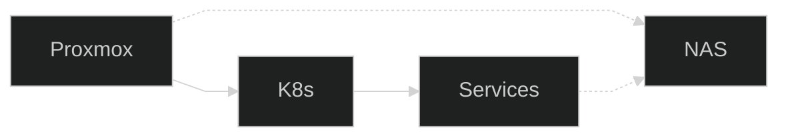
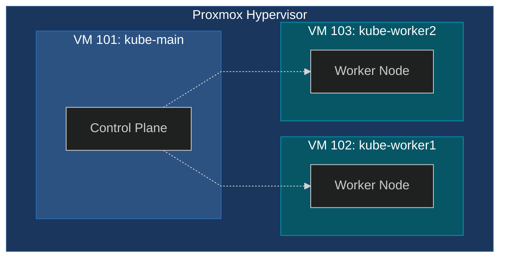
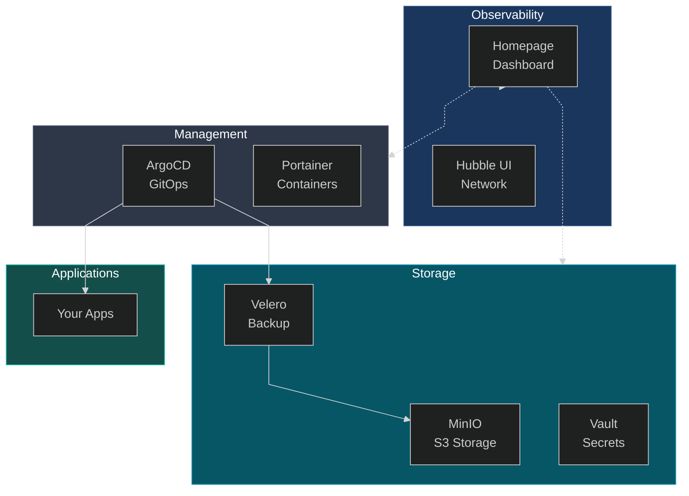

# Kubernetes Homelab

> Your Experimentation Playground

```bash +exec_replace
echo "Kubernetes Homelab" | figlet -f slant -c -w 90
```

<!-- end_slide -->


## Why Homelab?

> **Anyone can set up a homelab on almost any hardware**



<!-- end_slide -->


## Kubernetes Cluster



> **3 VMs**: One control plane, two workers

<!-- end_slide -->


## GitOps Flow


<!-- end_slide -->


## Service Ecosystem


<!-- end_slide -->


## Key Takeaways

| Icon | Benefit |
|------|--------|
| > | Experimentation platform |
| > | Your own useful tools |
| > | Data sovereignty |

<!-- end_slide -->


## Resources

| Tool | URL |
|------|-----|
| ArgoCD | https://argo-cd.readthedocs.io/ |
| Velero | https://velero.io/docs/ |
| MinIO | https://min.io/docs/ |
| Homepage | https://gethomepage.dev/ |

<!-- end_slide -->


## That's All Folks!

```bash +exec_replace
echo "That's all folks" | figlet -f slant -c -w 90
```
