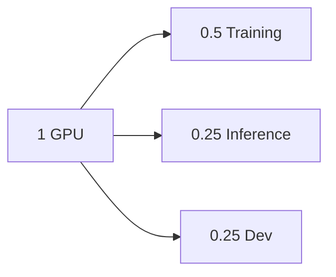
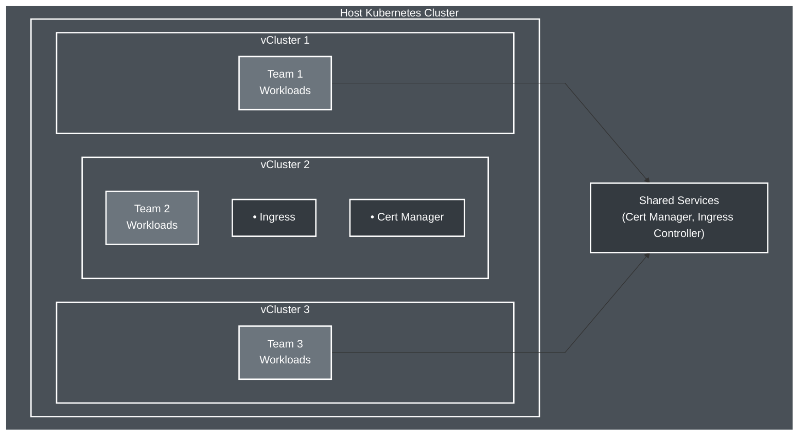
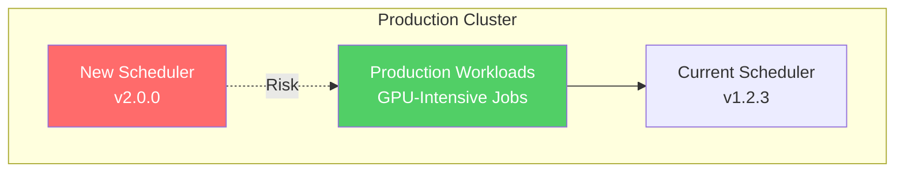
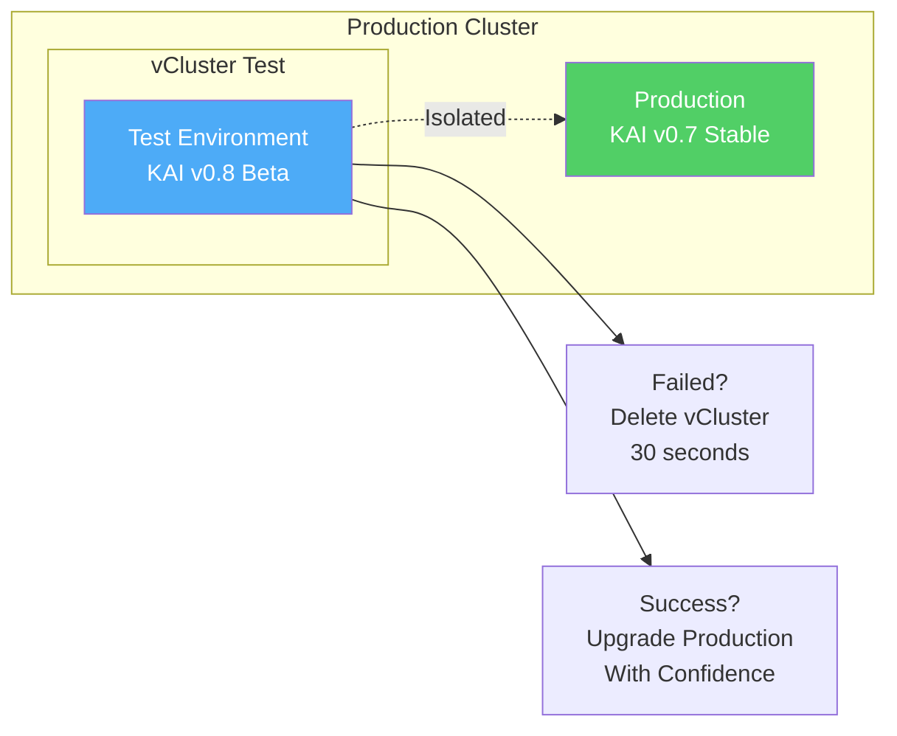
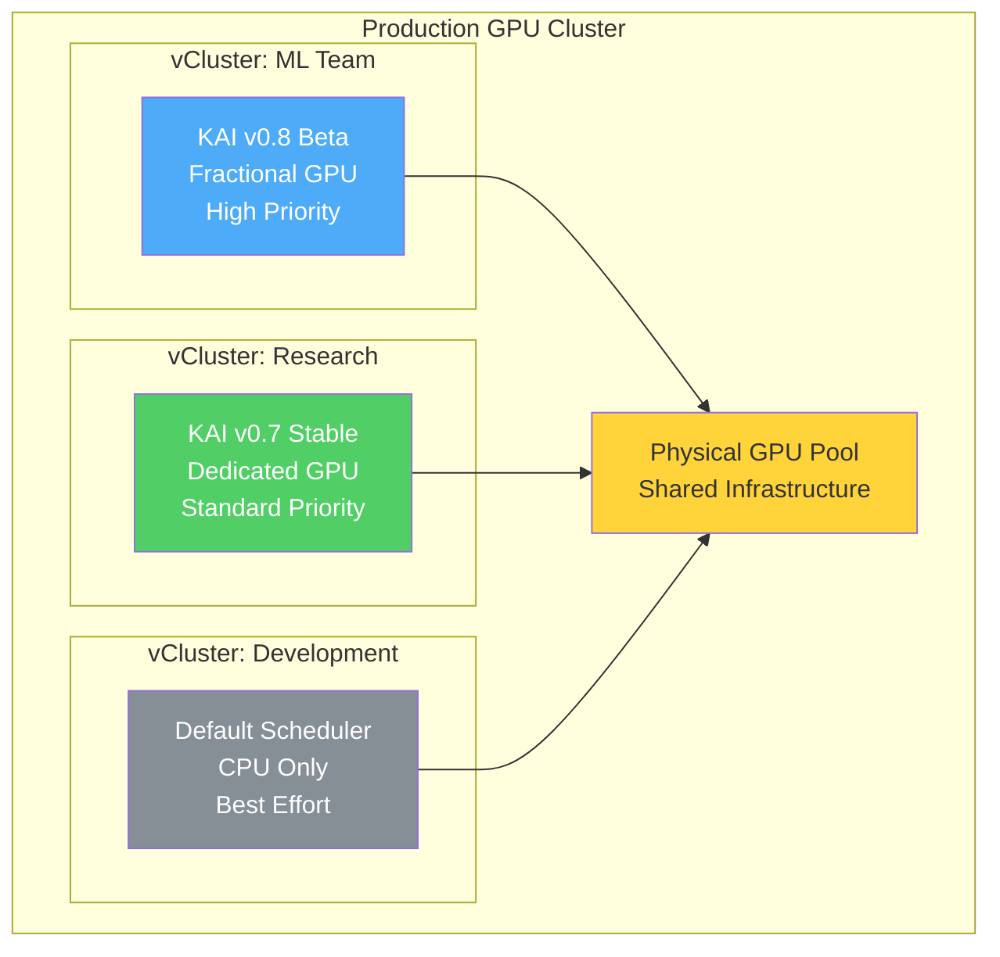

<!--
Note: Commands marked with +exec can be run with Ctrl+E
For better output display, use the spane script in a separate terminal
-->

# vCluster + NVIDIA KAI Scheduler
<!-- new_lines: 5 -->

```bash +exec_replace
echo "vCluster + KAI" | figlet -f small -w 90
```

<!-- jump_to_middle -->


<!-- end_slide -->


## Setup: GPU-Enabled Kind Cluster

> Setting up a local Kubernetes cluster with GPU support using Kind and nvkind
> **Note:** Usually run before the talk to save time

```bash +exec
# Configure Docker for GPU pass-through
sudo nvidia-ctk runtime configure --runtime=docker --set-as-default
sudo systemctl restart docker

# Wait for Docker to be ready
until docker info >/dev/null 2>&1; do
  sleep 2
done

# Create cluster with GPU support
nvkind cluster create --name kai-demo --config-template=nvkind-config.yaml
kubectl apply -f https://github.com/kubernetes-sigs/metrics-server/releases/latest/download/components.yaml

# Preload images into kind cluster for faster demo
./preload-images.sh
```

<!-- end_slide -->


## Deploy KAI Scheduler on Host Cluster

> Installing KAI directly on the host cluster - this affects all workloads

```bash +exec
# Deploy KAI v0.7.11 directly on host cluster
KAI_VERSION=v0.7.11

helm upgrade -i kai-scheduler \
  oci://ghcr.io/nvidia/kai-scheduler/kai-scheduler \
  -n kai-scheduler --create-namespace \
  --version $KAI_VERSION \
  --set "global.gpuSharing=true" &

# Continue with GPU setup while KAI installs in background
```

<!-- end_slide -->


## Install GPU Device Plugin

> The NVIDIA device plugin enables Kubernetes to discover and allocate GPU resources to pods

```bash +exec
# Label worker node for GPU workloads
kubectl label node kai-demo-worker nvidia.com/gpu.present=true --overwrite

# Install NVIDIA device plugin
kubectl apply -f https://raw.githubusercontent.com/NVIDIA/k8s-device-plugin/v0.16.2/deployments/static/nvidia-device-plugin.yml

# Create RuntimeClass for NVIDIA containers
kubectl apply -f - <<EOF
apiVersion: node.k8s.io/v1
kind: RuntimeClass
metadata:
  name: nvidia
handler: nvidia
EOF

# Wait for device plugin
kubectl wait --for=condition=ready pod -n kube-system \
  -l name=nvidia-device-plugin-ds --timeout=60s

# Wait for KAI scheduler to be ready
kubectl wait --for=condition=ready pod -n kai-scheduler --all --timeout=120s
```

<!-- end_slide -->


## What is NVIDIA KAI Scheduler?

> **Advanced Kubernetes scheduler for GPU workload optimization**



| **Feature** | **Benefit** |
|---|---|
| Fractional GPU allocation | Share single GPU between workloads |
| Queue-based scheduling | Hierarchical resource management |
| Topology awareness | Optimize for hardware layout |
| Fair sharing | Prevent resource monopolization |

> **Open-sourced 2025:** Enterprise GPU management for the community

<!-- end_slide -->


## Verify GPU Access

> Running nvidia-smi in a test pod to confirm GPU passthrough is working

```bash +exec
# Test GPU accessibility
kubectl run gpu-verify --image=nvidia/cuda:12.2.0-base-ubuntu20.04 \
  --rm -it --restart=Never \
  --overrides='{"spec":{"runtimeClassName":"nvidia","nodeSelector":{"nvidia.com/gpu.present":"true"}}}' \
  -- nvidia-smi -L
```

<!-- end_slide -->


## What is vCluster?



| **Feature** | **Benefit** |
|---|---|
| Full Kubernetes API | Certified Kubernetes distribution |
| Complete isolation | Separate control plane per team |
| Resource efficiency | Shared infrastructure, isolated workloads |
| Sub-minute provisioning | Instant test environments |

> **vCluster** = Containerized Kubernetes inside a Pod!

<!-- end_slide -->


## Configure KAI Scheduler and Deploy Test Pod

> KAI uses Queue CRDs to manage resources. This pod requests 50% of a GPU.

```bash +exec
# Apply queue configuration and test pod
kubectl apply -f queues.yaml
kubectl apply -f gpu-pod.yaml

# Wait for pod to be scheduled
kubectl wait --for=condition=ready pod gpu-pod --timeout=30s || true
kubectl get pod gpu-pod -o wide

```

<!-- end_slide -->


## Monitor GPU Allocation

> Checking that KAI successfully scheduled our pod with fractional GPU allocation

```bash +exec_replace
echo "━━━ GPU ALLOCATION STATUS ━━━"
echo "  • GPU Fraction: $(kubectl get pod gpu-pod -o jsonpath='{.metadata.annotations.kai\.scheduler/gpu-fraction}' 2>/dev/null || echo 'N/A')"
echo "  • Scheduler:    $(kubectl get pod gpu-pod -o jsonpath='{.spec.schedulerName}' 2>/dev/null || echo 'N/A')"
echo "  • Queue:        $(kubectl get pod gpu-pod -o jsonpath='{.metadata.labels.kai\.scheduler/queue}' 2>/dev/null || echo 'N/A')"
echo ""
echo "━━━ KAI SCHEDULER COMPONENTS ━━━"
echo "  • Running Pods: $(kubectl get pods -n kai-scheduler --no-headers | wc -l)"
echo "  • Pod shell: $( kubectl exec gpu-pod -- nvidia-smi)"
```

<!-- end_slide -->


## Upgrading Schedulers in Production



```bash +exec_replace
cat << 'EOF'
Current Reality:
• Testing new schedulers affects all workloads
• Rollback procedures take hours
• Teams blocked on single scheduler version
EOF
```

<!-- end_slide -->


## GPU Scheduling: Risk Analysis

| **Failure Mode** | **Impact** | **Recovery Time** | **Business Cost** |
|---|---|---|---|
| Scheduler bug | All pods pending | 2-4 hours | High |
| CRD conflicts | Namespace corruption | 6+ hours | Critical |
| Version mismatch | Random pod failures | 1-2 days | Very High |
| Resource leak | GPU exhaustion | 4-8 hours | Critical |

> **Industry Data:** Enterprise downtime costs $100k-1M+ per hour (New Relic 2024)

<!-- end_slide -->


## Solution: vCluster Isolation (Not New Clusters!)



> **Key Point:** vCluster creates isolated Kubernetes inside your existing cluster - NOT new EKS/GKE!

<!-- end_slide -->


## Production Scheduler Risk

```bash +exec_replace
cat << 'EOF'
Current Situation:
• Single scheduler controls entire cluster
• Any changes affect all workloads
• No isolation between teams

Business Impact:
• Blocked innovation due to risk
• Slow adoption of new features
• Teams waiting on scheduler upgrades
EOF
```

> **Question:** How can we test KAI scheduler without risking production?

<!-- end_slide -->


## Deploy KAI in vCluster

> vCluster can swap out Kubernetes components like schedulers, providing isolated testing environments

```bash +exec
# Create vCluster with KAI-specific configuration
cat << 'EOF' > kai-vcluster.yaml
experimental:
  syncSettings:
    setOwner: false  # Required for KAI pod-grouper

sync:
  fromHost:
    nodes:
      enabled: true
    runtimeClasses:
      enabled: true
EOF

# Create isolated vCluster
vcluster create kai-isolated --values kai-vcluster.yaml --connect=false

# Connect to the vCluster
vcluster connect kai-isolated
```

<!-- end_slide -->


## vCluster Resource Footprint

> vCluster runs as a single pod with minimal overhead

```bash +exec_replace
echo "━━━ VCLUSTER POD RESOURCES ━━━"
kubectl get pod -n vcluster-kai-isolated -l app=vcluster -o custom-columns=NAME:.metadata.name,CPU:.spec.containers[0].resources.requests.cpu,MEMORY:.spec.containers[0].resources.requests.memory
```

<!-- end_slide -->


## Install KAI Inside vCluster

> Same KAI installation but inside vCluster - production remains untouched

```bash +exec
# Already connected from previous slide
# Install KAI in isolated environment
KAI_VERSION=v0.7.11
helm upgrade -i kai-scheduler \
  oci://ghcr.io/nvidia/kai-scheduler/kai-scheduler \
  -n kai-scheduler --create-namespace \
  --version $KAI_VERSION \
  --set "global.gpuSharing=true"

kubectl wait --for=condition=ready pod -n kai-scheduler --all --timeout=120s
```

<!-- end_slide -->


## Deploy and Test GPU Workload in vCluster

> GPU sharing works identically inside vCluster but with zero production risk

```bash +exec
# Apply queues and test workload
kubectl apply -f queues.yaml
kubectl apply -f gpu-pod.yaml

# Show pod status without waiting
kubectl get pod gpu-pod -o wide
```

<!-- end_slide -->


## Verify KAI Scheduler in vCluster

> KAI is fully functional inside vCluster while host cluster continues normally

```bash +exec_replace
echo "━━━ VCLUSTER STATUS ━━━"
echo "  • Pod:         $(kubectl get pod gpu-pod -o jsonpath='{.metadata.name}' 2>/dev/null || echo 'N/A')"
echo "  • Scheduler:   $(kubectl get pod gpu-pod -o jsonpath='{.spec.schedulerName}' 2>/dev/null || echo 'N/A')"
echo "  • GPU Fraction: $(kubectl get pod gpu-pod -o jsonpath='{.metadata.annotations.kai\.scheduler/gpu-fraction}' 2>/dev/null || echo 'N/A')"
echo ""
echo "━━━ ISOLATION ━━━"
echo "  • Level:       COMPLETE"
echo "  • Risk:        ZERO"
echo "  • Rollback:    30 seconds"
```

<!-- end_slide -->


## Version Switching with vCluster

> Switch between scheduler versions instantly. vCluster also supports snapshot/restore for complete state management.

```bash +exec_replace
cat << 'EOF'
Simulating critical bug discovered in KAI deployment

Traditional approach: 30-60 minute rollback
vCluster approach: Watch this...
EOF
```

```bash +exec
# Disconnect from vCluster
vcluster disconnect

# Delete the entire vCluster (timed)
time vcluster delete kai-isolated --delete-namespace
```

<!-- end_slide -->


## Multi-Team Requirements

```bash +exec_replace
cat << 'EOF'
Challenge:
  • ML Team needs KAI v0.8 beta for new features
  • Research Team requires stable KAI v0.7
  • Dev Team uses default scheduler

Current approach limitation: One scheduler version for everyone

Question: How can teams run different scheduler versions simultaneously?
EOF
```

<!-- end_slide -->


## Parallel Scheduler Versions

> Multiple teams can run different scheduler versions simultaneously

```bash +exec
# Create multiple vClusters for different teams
# Team 1: Stable version
vcluster create team-stable --values kai-vcluster.yaml --connect=false &

# Team 2: Beta version
vcluster create team-beta --values kai-vcluster.yaml --connect=false &

# Wait for both to create
wait

```

<!-- end_slide -->


## Install Different KAI Versions Per Team

> Each team gets their preferred scheduler version in complete isolation

```bash +exec +id:teams
# Team Stable: v0.7.10 (production)
vcluster connect team-stable
helm upgrade -i kai-scheduler \
  oci://ghcr.io/nvidia/kai-scheduler/kai-scheduler \
  -n kai-scheduler --create-namespace \
  --version v0.7.10 --wait &
STABLE_PID=$!

# Team Beta: v0.7.11 (testing)
vcluster connect team-beta
helm upgrade -i kai-scheduler \
  oci://ghcr.io/nvidia/kai-scheduler/kai-scheduler \
  -n kai-scheduler --create-namespace \
  --version v0.7.11 --wait &
BETA_PID=$!

# Wait for both installations
wait $STABLE_PID $BETA_PID

vcluster disconnect
```

<!-- end_slide -->

### Installation Progress

<!-- snippet_output: teams -->

<!-- end_slide -->


## Deploy Workloads to Both Teams

> Each team's workloads are managed by their own scheduler version

```bash +exec
# Deploy to team-stable
vcluster connect team-stable
kubectl apply -f queues.yaml
kubectl apply -f gpu-pod.yaml
vcluster disconnect

# Deploy to team-beta
vcluster connect team-beta
kubectl apply -f queues.yaml
kubectl apply -f gpu-pod.yaml
vcluster disconnect
```

<!-- end_slide -->


## Verify Parallel Operations

> Both vClusters are running with different KAI versions

```markdown
PARALLEL SCHEDULER DEPLOYMENTS
- team-stable: KAI v0.7.10 (production)
- team-beta:   KAI v0.7.11 (beta testing)

CLUSTER STATUS
- Host Impact:  NONE
- Isolation:    COMPLETE
- Risk:         ZERO
```

```bash +exec
vcluster list
```

<!-- end_slide -->


## Operational Capabilities Achieved

| **Capability** | **Time Saved** | **Risk Reduced** |
|---|---|---|
| Test scheduler upgrades | 4 hours → 5 min | 100% → 0% |
| Rollback bad changes | 2 hours → 30 sec | Critical → None |
| A/B test versions | Not possible → Easy | High → Zero |
| Per-team schedulers | Days → Minutes | Complex → Simple |
| GPU sharing validation | Weeks → Hours | High → None |

> **Measured Impact:** Based on typical enterprise deployment scenarios

<!-- end_slide -->


## Architecture Example



<!-- end_slide -->


## Cleanup

> Cleaning up the demo environment

```bash +exec
kind delete cluster --name kai-demo

# Revert Docker runtime configuration
sudo jq 'del(."default-runtime")' /etc/docker/daemon.json | sudo sponge /etc/docker/daemon.json
sudo systemctl restart docker
```

<!-- end_slide -->


## Resources

```markdown
Documentation:
- vCluster Docs: https://vcluster.com/docs
- KAI Scheduler: https://github.com/NVIDIA/KAI-Scheduler
- vCluster KAI Integration: https://docs.vcluster.com/third-party-integrations/scheduler/kai-scheduler

Community:
- vCluster Slack: https://slack.loft.sh
- Office Hours: https://www.loft.sh/events
```

<!-- end_slide -->
<!-- new_lines: 10 -->


<!-- jump_to_middle -->
```bash +exec_replace
echo "Thank You!" | figlet -f small -w 90
```

## Questions?
