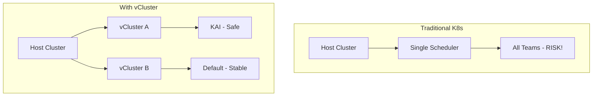
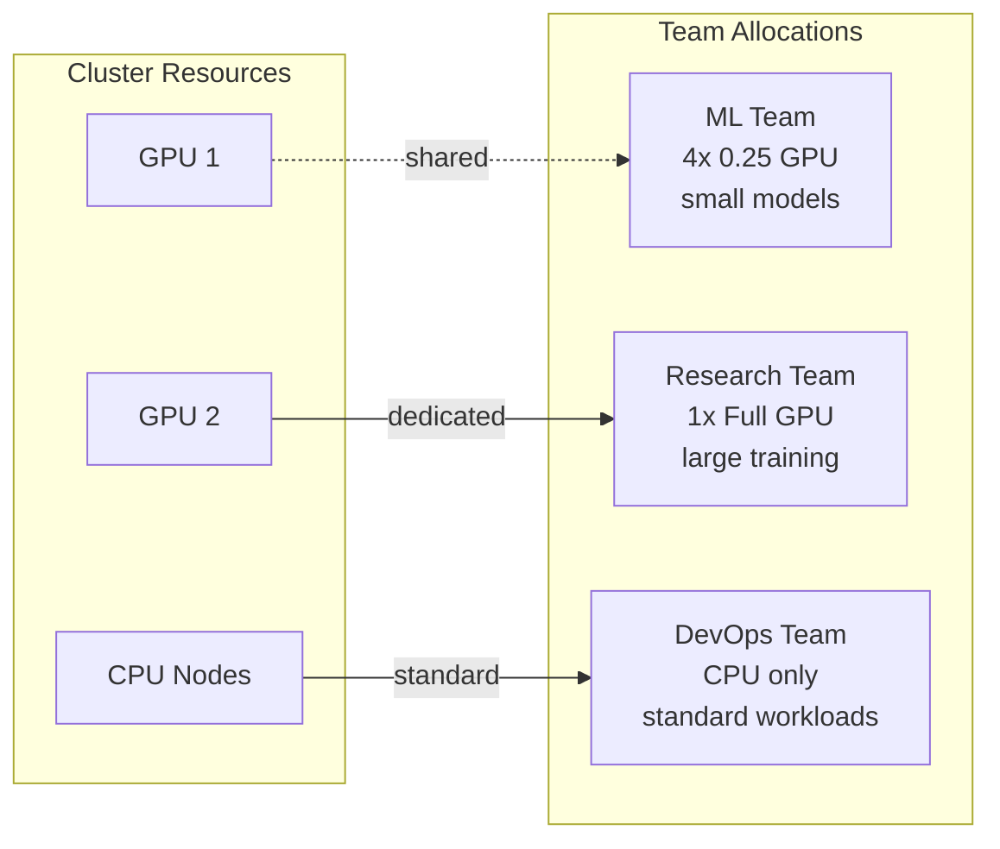
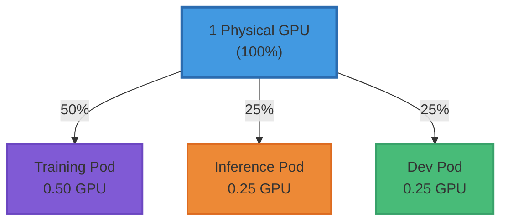

<!--
Note: Commands marked with +exec can be run with Ctrl+E
For better output display, use the spane script in a separate terminal
-->

# vCluster + NVIDIA KAI Scheduler

> How vCluster enables advanced schedulers in multi-tenant environments

```bash +exec_replace
cd /home/decoder/dev/youtube && just intro "vCluster + KAI"
```

<!-- end_slide -->

## The vCluster Advantage



<!-- end_slide -->

## Real World: Multi-Tenant GPU Cluster



With vCluster: Each team chooses their own scheduler!

<!-- end_slide -->

## Today's Example: NVIDIA KAI Scheduler



KAI enables fractional GPU allocation!

<!-- end_slide -->

## Setup Lab Environment

Create kind cluster with GPU support

```yaml +line_numbers
# kind-config.yaml
kind: Cluster
apiVersion: kind.x-k8s.io/v1alpha4
nodes:
- role: control-plane
  extraPortMappings:
  - containerPort: 30000
    hostPort: 30000
  extraMounts:
  - hostPath: /dev/null
    containerPath: /var/run/nvidia-container-devices
```

<!-- end_slide -->

## Deploy Cluster - KIND or Minikube

### Option A: KIND with GPU Support (Recommended)

```bash +exec
kind create cluster --config=kind-config-gpu.yaml --name kai-gpu-demo
```

> **GPU Support in KIND**: We successfully enabled GPU support! See setup details below.

### Option B: Minikube (CPU-only)

```bash +exec
minikube start --cpus=4 --memory=8192
```

<!-- end_slide -->

## 🚀 KIND GPU Support - What We Achieved!

**Breaking News**: We successfully enabled GPU support in KIND!

This is significant because:
- KIND typically doesn't support GPUs (runs in containers)
- We made it work with nvidia-container-toolkit
- Full GPU access inside Kubernetes pods

**Key Achievement**: `nvidia.com/gpu: 1` ✅

<!-- end_slide -->

## Prerequisites for KIND GPU Support

Before starting, ensure you have:

1. **NVIDIA GPU** with drivers installed
2. **Docker** with nvidia-container-toolkit  
3. **Test Docker GPU access** with docker run

Check GPU with nvidia-smi:
```bash
nvidia-smi  # Should show your GPU
```

Install nvidia-container-toolkit:
```bash
# Install nvidia-container-toolkit
sudo apt-get install -y nvidia-container-toolkit
sudo nvidia-ctk runtime configure --runtime=docker
sudo systemctl restart docker
```

Test Docker GPU access:
```bash
docker run --rm --gpus all nvidia/cuda:11.6.2-base-ubuntu20.04 nvidia-smi
```

<!-- end_slide -->

## Required Files for This Demo

Make sure you have these files in your directory:

```bash +exec
ls -1 *.yaml setup-nvidia-kind.sh
```

Key files:
- `kind-config-gpu.yaml` - KIND cluster config with GPU mounts
- `setup-nvidia-kind.sh` - Script to configure nvidia runtime in KIND
- `nvidia-device-plugin-full.yaml` - Working device plugin config
- `proper-queues.yaml` - KAI scheduler queue hierarchy
- `vcluster-kai-v26.yaml` - vCluster config for KAI

<!-- end_slide -->

## KIND GPU Configuration - The Secret Sauce

Create `kind-config-gpu.yaml` with GPU device mounts:

```yaml
kind: Cluster
apiVersion: kind.x-k8s.io/v1alpha4
nodes:
- role: control-plane
  extraMounts:
  # GPU devices
  - hostPath: /dev/nvidia0
    containerPath: /dev/nvidia0
  - hostPath: /dev/nvidiactl
    containerPath: /dev/nvidiactl
  # NVIDIA libraries (match your driver version!)
  - hostPath: /usr/lib/x86_64-linux-gnu/libnvidia-ml.so.565.77
    containerPath: /usr/lib/x86_64-linux-gnu/libnvidia-ml.so.565.77
  # ... more libraries
```

<!-- end_slide -->

## Setup NVIDIA Runtime Inside KIND

After cluster creation, configure the KIND node:

```bash +exec
./setup-nvidia-kind.sh
```

This script:
1. Installs nvidia-container-toolkit inside KIND node
2. Configures containerd with nvidia runtime
3. Restarts containerd
4. Verifies GPU access with nvidia-smi

**Critical**: Must configure container runtime inside KIND!

<!-- end_slide -->

## Deploy NVIDIA Device Plugin - The Tricky Part

Standard deployment often fails. Our working configuration:

```yaml
# Key settings that made it work:
hostNetwork: true
securityContext:
  privileged: true
volumeMounts:
- name: nvidia-libs
  mountPath: /usr/lib/x86_64-linux-gnu
- name: dev
  mountPath: /dev
```

Apply with: `kubectl apply -f nvidia-device-plugin-full.yaml`

<!-- end_slide -->

## Verify GPU in Kubernetes

Check node capacity - the moment of truth:

```bash +exec
kubectl describe node | grep -A5 "Capacity:"
```

Should show:
```
Capacity:
  nvidia.com/gpu: 1  # 🎉 SUCCESS!
```

<!-- end_slide -->

## Check nodes

```bash +exec +id:get_nodes
kubectl get nodes
```

<!-- snippet_output: get_nodes -->

<!-- end_slide -->

## Install NVIDIA Device Plugin (Optional)

Skip if no real GPUs - KAI works with CPU-only nodes too

```bash +exec
kubectl apply --validate=false -f https://raw.githubusercontent.com/NVIDIA/k8s-device-plugin/v0.16.2/deployments/static/nvidia-device-plugin.yml || echo "Note: Device plugin may fail without real GPUs - that's OK"
```

<!-- end_slide -->

## Deploy KAI Scheduler

Get latest version and install with GPU sharing enabled

```bash +exec
KAI_VERSION=${KAI_VERSION:-v0.7.11}
helm upgrade -i kai-scheduler \
  oci://ghcr.io/nvidia/kai-scheduler/kai-scheduler \
  -n kai-scheduler \
  --create-namespace \
  --version $KAI_VERSION \
  --set "global.gpuSharing=true"
```

<!-- end_slide -->

## Configure KAI Scheduler Queues

KAI requires a queue hierarchy - this is critical!

```bash +exec
cat > queues.yaml << 'EOF'
apiVersion: scheduling.run.ai/v2
kind: Queue
metadata:
  name: default
spec:
  resources:
    cpu:
      quota: -1
      limit: -1
      overQuotaWeight: 1
    gpu:
      quota: -1
      limit: -1
      overQuotaWeight: 1
    memory:
      quota: -1
      limit: -1
      overQuotaWeight: 1
---
apiVersion: scheduling.run.ai/v2
kind: Queue
metadata:
  name: test
spec:
  parentQueue: default
  resources:
    cpu:
      quota: -1
      limit: -1
      overQuotaWeight: 1
    gpu:
      quota: -1
      limit: -1
      overQuotaWeight: 1
    memory:
      quota: -1
      limit: -1
      overQuotaWeight: 1
EOF

kubectl apply -f queues.yaml
```

<!-- end_slide -->

## The vCluster Integration Challenge

When using custom schedulers with vCluster:
- vCluster syncs pods to host cluster
- Sets owner references for tracking
- Custom schedulers may traverse these references
- **Problem**: They can't access vCluster internals

This is where vCluster's flexibility shines!

<!-- end_slide -->

## Create vCluster with KAI Support

Deploy vCluster with the special configuration

```bash +exec +id:create_vcluster
cat > kai-scheduler-values.yaml << 'EOF'
experimental:
  syncSettings:
    setOwner: false
EOF

# Delete if exists, then create fresh
vcluster delete my-vcluster --delete-namespace || true
vcluster create my-vcluster \
  --values kai-scheduler-values.yaml \
  --connect=false
```

<!-- end_slide -->

## vCluster Creation Output

<!-- snippet_output: create_vcluster -->

<!-- end_slide -->

## Connect to vCluster

When ready, connect to your vCluster

```bash +exec
vcluster connect my-vcluster
```

<!-- end_slide -->

## Check GPU Availability

Verify GPU resources in your cluster

```bash +exec
nvidia-smi || echo "No GPUs detected - using CPU only"
```

<!-- end_slide -->

## Demo: vCluster Enables Team Isolation

**Scenario:**
- ML Team needs GPU sharing for their workloads
- They want to test KAI scheduler
- Can't risk affecting production cluster

**Solution with vCluster:**
1. Create isolated vCluster for ML team
2. Configure it to work with KAI
3. Team experiments safely
4. Zero impact on other teams!

<!-- end_slide -->

## CPU Workload Example

Save and apply this pod:

```bash +exec
cat > cpu-pod.yaml << 'EOF'
apiVersion: v1
kind: Pod
metadata:
  name: cpu-pod
  labels:
    kai.scheduler/queue: test  # Required queue assignment!
spec:
  schedulerName: kai-scheduler
  containers:
  - name: main
    image: ubuntu
    args: ["sleep", "infinity"]
    resources:
      requests:
        cpu: 100m
        memory: 250M
EOF
kubectl apply -f cpu-pod.yaml
```

<!-- end_slide -->

## GPU Workload Example

Create a full GPU pod:

```bash +exec
cat > gpu-pod.yaml << 'EOF'
apiVersion: v1
kind: Pod
metadata:
  name: gpu-pod
  labels:
    kai.scheduler/queue: test  # Required queue assignment!
spec:
  schedulerName: kai-scheduler
  containers:
  - name: main
    image: ubuntu
    command: ["nvidia-smi"]
    resources:
      limits:
        nvidia.com/gpu: '1'  # Full GPU allocation
      requests:
        nvidia.com/gpu: '1'
EOF
kubectl apply -f gpu-pod.yaml || echo "GPU pod created (may fail without real GPUs)"
```

<!-- end_slide -->

## Fractional GPU Allocation

Share expensive GPUs efficiently - like CPU cores!

```bash +exec
cat > gpu-sharing.yaml << 'EOF'
apiVersion: v1
kind: Pod
metadata:
  name: gpu-sharing
  labels:
    kai.scheduler/queue: test  # Required queue assignment!
  annotations:
    gpu-fraction: "0.5"  # Half GPU!
spec:
  schedulerName: kai-scheduler
  containers:
  - name: main
    image: ubuntu
    args: ["sleep", "infinity"]
EOF
kubectl apply -f gpu-sharing.yaml || echo "Fractional GPU pod created"
```

<!-- end_slide -->

## Let's See GPU Sharing in Action!

Check if our fractional GPU pod is running:

```bash +exec +id:check_sharing
kubectl get pods gpu-sharing
```

<!-- snippet_output: check_sharing -->

<!-- end_slide -->

## Deploy Second Workload - Share Same GPU!

```bash +exec
cat > inference-pod.yaml << 'EOF'
apiVersion: v1
kind: Pod
metadata:
  name: inference-api
  labels:
    kai.scheduler/queue: test  # Required queue assignment!
  annotations:
    gpu-fraction: "0.25"  # Only 25% GPU!
spec:
  schedulerName: kai-scheduler
  containers:
  - name: main
    image: ubuntu
    args: ["sleep", "infinity"]
EOF
kubectl apply -f inference-pod.yaml
```

<!-- end_slide -->

## Check GPU Sharing Status

```bash +exec +id:both_pods
kubectl get pods | grep -E "gpu-sharing|inference" | awk '{print $1 " - Status: " $3}'
```

<!-- snippet_output: both_pods -->

```bash +exec +id:check_allocations
kubectl get pods gpu-sharing inference-api -o custom-columns=NAME:.metadata.name,GPU-FRACTION:.metadata.annotations.gpu-fraction
```

<!-- snippet_output: check_allocations -->

<!-- end_slide -->

## Verify KAI Scheduler

```bash +exec
kubectl get pod cpu-pod -o jsonpath='{.spec.schedulerName}'
```

```bash +exec
kubectl get pods -n kai-scheduler
```

<!-- end_slide -->

## Inspect KAI GPU Sharing

View pod scheduling details:

```bash +exec +id:describe_sharing
kubectl get pod gpu-sharing -o jsonpath='{"GPU Fraction: "}{.metadata.annotations.gpu-fraction}{"\nScheduler: "}{.spec.schedulerName}{"\n"}'
```

<!-- snippet_output: describe_sharing -->

<!-- end_slide -->

## Check GPU Reservation Pods

KAI creates special pods to manage GPU sharing:

```bash +exec +id:reservations
kubectl get pods -n kai-resource-reservation
```

<!-- snippet_output: reservations -->

These pods "claim" the GPU and share it!

<!-- end_slide -->

## Troubleshooting GPU in KIND

**Common Issues & Solutions:**

1. **"Incompatible strategy detected auto"**
   - Solution: Configure containerd inside KIND node
   - Run setup-nvidia-kind.sh script

2. **"ERROR_LIBRARY_NOT_FOUND"**
   - Solution: Mount nvidia libraries in device plugin
   - Use privileged mode & hostNetwork

3. **Device plugin crashes**
   - Check logs: `kubectl logs -n kube-system nvidia-device-plugin-xxx`
   - Verify nvidia-container-cli works inside KIND

<!-- end_slide -->

## Resources & Credits

**GPU in KIND:**
- [nvidia-kind-deploy](https://github.com/SeineAI/nvidia-kind-deploy) - Inspiration for our setup
- [nvkind](https://github.com/NVIDIA/nvkind) - NVIDIA's KIND fork (didn't work for us)
- [nvidia-container-toolkit](https://github.com/NVIDIA/nvidia-container-toolkit) - Essential component

**KAI Scheduler:**
- [NVIDIA KAI Scheduler](https://github.com/NVIDIA/KAI-Scheduler)
- [vCluster Docs](https://www.vcluster.com/docs)

**Key Learning**: KIND GPU support requires:
1. Host Docker with nvidia runtime
2. Device & library mounts in KIND config
3. nvidia-container-toolkit inside KIND node
4. Special device plugin configuration

<!-- end_slide -->

## Demo 2: Second Team, Different Scheduler!

Create another vCluster for Research team:

```bash +exec
vcluster create research-cluster --connect=false
```

<!-- end_slide -->

## Research Team Uses Default Scheduler

```bash +exec
vcluster connect research-cluster --update-current=false -- kubectl apply -f - <<EOF
apiVersion: v1
kind: Pod
metadata:
  name: research-pod
spec:
  containers:
  - name: main
    image: ubuntu
    args: ["sleep", "infinity"]
    resources:
      requests:
        nvidia.com/gpu: "1"  # Full GPU, no sharing!
EOF
```

<!-- end_slide -->

## Compare Both vClusters

ML Team vCluster (with KAI):
```bash +exec
kubectl get pods --context vcluster_my-vcluster
```

Research Team vCluster (default scheduler):
```bash +exec
kubectl get pods --context vcluster_research-cluster
```

**Same host cluster, different schedulers!**

<!-- end_slide -->

## vCluster: Your Path to Advanced K8s

**What you just saw:**
- 2 teams, 2 vClusters, 2 different schedulers
- ML team saves GPU costs with KAI
- Research team keeps standard workflow
- Zero conflicts, total isolation!

**Your next steps:**
1. Install vCluster today
2. Try KAI or any custom scheduler
3. Give each team their perfect K8s!

**The future is multi-tenant!**

<!-- end_slide -->

## That's All Folks!

Questions?

```bash +exec_replace
cd /home/decoder/dev/youtube && just intro "Thank You!"
```
