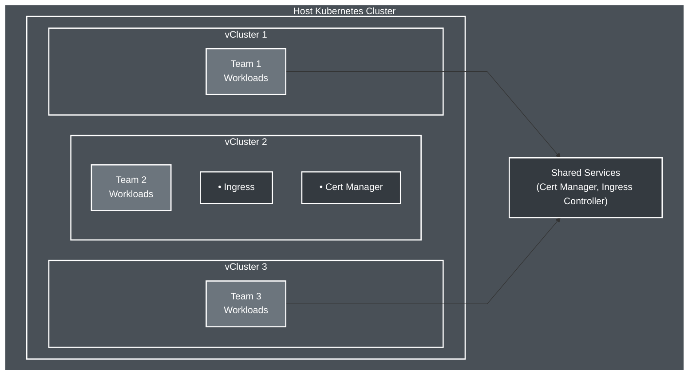
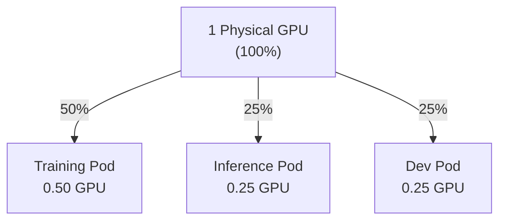
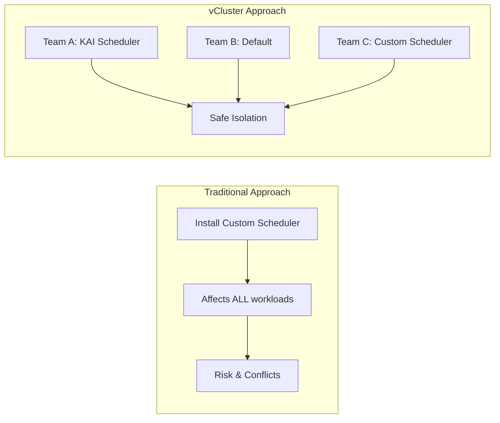
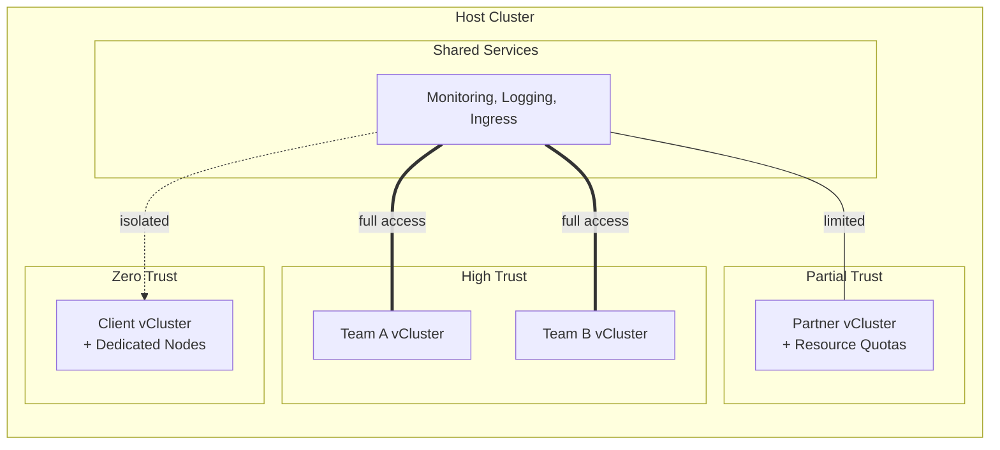

<!--
Note: Commands marked with +exec can be run with Ctrl+E
For better output display, use the spane script in a separate terminal
-->

# vCluster + NVIDIA KAI Scheduler

> Virtual clusters enable safe scheduler experimentation

```bash +exec_replace
echo "vCluster + KAI" | figlet -f small -c -w 90
```

<!-- end_slide -->

## What is vCluster?



> **vCluster** = Containerized Kubernetes inside a Pod!

<!-- end_slide -->

## Real World: Multi-Tenant GPU Cluster

| **Resource** | **Allocation** | **Team** |
|---|---|---|
| GPU 1 | Shared (4x 0.25) | ML Team - small models |
| GPU 2 | Dedicated (1x 1.0) | Research Team - large training |
| CPU Nodes | Standard | DevOps Team - standard workloads |

> **Benefits of vCluster approach:**
> - Each team chooses their own scheduler
> - No conflicts between team configurations
> - Complete isolation of resources
> - Easy rollback if issues arise

<!-- end_slide -->

## Deploy KIND Cluster

```bash +exec
kind create cluster --config=kind-config.yaml --name kai-demo
```

> **Note**: vCluster works with ANY Kubernetes cluster (cloud, on-prem, local)

<!-- end_slide -->

## Check nodes


```bash +exec +id:get_nodes
kubectl get nodes
```

<!-- snippet_output: get_nodes -->

<!-- end_slide -->

## Today's Example: NVIDIA KAI Scheduler



> KAI enables fractional GPU allocation!

<!-- end_slide -->

## Deploy KAI Scheduler


```bash +exec
KAI_VERSION=${KAI_VERSION:-v0.7.11}
helm upgrade -i kai-scheduler \
  oci://ghcr.io/nvidia/kai-scheduler/kai-scheduler \
  -n kai-scheduler \
  --create-namespace \
  --version $KAI_VERSION
```

<!-- end_slide -->

## Wait for KAI Scheduler to be Ready


```bash +exec
kubectl wait --for=condition=ready pod -n kai-scheduler --all --timeout=300s
```

<!-- end_slide -->

## Verify KAI Webhooks are Ready


> KAI scheduler uses webhooks for queue validation - let's ensure they're ready

```bash +exec
# Check webhook endpoints are available
kubectl get validatingwebhookconfigurations | grep kai || echo "Waiting for KAI webhooks..."
kubectl get endpoints -n kai-scheduler
```

<!-- end_slide -->

## Configure KAI Scheduler Queues


> KAI uses a parent/child queue hierarchy for resource allocation and scheduling priorities
> The queues.yaml file defines a default parent queue and a test child queue with unlimited quotas

```bash +exec
head -n 20 queues.yaml
kubectl apply -f queues.yaml || echo "Note: If webhook errors occur, wait for KAI to fully initialize"
```

<!-- end_slide -->

## vCluster's Superpower: Custom Schedulers!



> **Key Insight**: vCluster lets each team choose their scheduler!

<!-- end_slide -->

## Why KAI Scheduler + vCluster?

| **KAI Scheduler Requirements** | → | **Perfect for vCluster because** |
|---|---|---|
| Needs queue hierarchy (parent/child) | → | ✅ Isolated CRDs don't affect other teams |
| Requires custom CRDs | → | ✅ Queue configs stay within vCluster |
| Modifies scheduling behavior globally | → | ✅ Scheduling changes are contained |
| Complex configuration | → | ✅ Easy rollback - just delete vCluster |

> **The Challenge**: KAI uses owner references that vCluster must handle specially

<!-- end_slide -->

## Create vCluster with KAI Support


> Deploy vCluster with the special configuration
> The kai-scheduler-values.yaml disables owner references to allow KAI's pod-grouper to work

```bash +exec +id:create_vcluster
cat kai-scheduler-values.yaml

# Delete if exists, then create fresh
vcluster delete my-vcluster --delete-namespace || true
vcluster create my-vcluster \
  --values kai-scheduler-values.yaml \
  --connect=false
```

<!-- snippet_output: create_vcluster -->

<!-- end_slide -->

## Wait for vCluster to be Ready


> Ensure vCluster is fully deployed

```bash +exec
kubectl wait --for=condition=ready pod -l app=vcluster -n vcluster-my-vcluster --timeout=300s
```

<!-- end_slide -->

## Connect to vCluster


> When ready, connect to your vCluster

```bash +exec
vcluster connect my-vcluster
```

> **Note**: This updates your current kubeconfig context

<!-- end_slide -->

## vCluster Architecture: What's Inside?


```bash +exec
# Show all containers in the vCluster pod
kubectl --context kind-kai-demo get pod -n vcluster-my-vcluster -l app=vcluster -o json | \
  jq -r '.items[0] | 
    "INIT CONTAINERS:\n" + 
    (.spec.initContainers[] | "  \(.name): \(.image)") + 
    "\n\nMAIN CONTAINERS:\n" + 
    (.spec.containers[] | "  \(.name): \(.image)")'
```

> **Architecture**: Init container copies K8s binaries, syncer runs embedded k3s API server & controller!

<!-- end_slide -->

## vCluster Data Storage: SQLite Inside!


```bash +exec
# Check the SQLite database file inside vCluster pod
kubectl --context kind-kai-demo exec -n vcluster-my-vcluster my-vcluster-0 -c syncer -- ls -lh /data/state.db

# Also check for kine database (k3s uses kine as SQLite wrapper)
kubectl --context kind-kai-demo exec -n vcluster-my-vcluster my-vcluster-0 -c syncer -- ls -lh /data/
```

> **Storage**: vCluster uses embedded SQLite - all K8s data in a single file!

<!-- end_slide -->

## The Multi-Tenancy Challenge

| **The Problem** | → | **vCluster Solution** |
|---|---|---|
| Teams need different Kubernetes configurations | → | ✅ Each team gets a **full** Kubernetes API |
| Testing new schedulers/operators is risky | → | ✅ Complete isolation from other teams |
| Resource conflicts between teams | → | ✅ Test anything without fear |
| No true multi-tenancy in vanilla K8s | → | ✅ KAI scheduler is just one example! |

<!-- end_slide -->

## vCluster Multi-Tenancy Models



> vCluster adapts to your trust requirements!

<!-- end_slide -->

## CPU Workload Example


> Deploy a CPU-only pod with KAI scheduler
> The cpu-pod.yaml includes queue assignment label and specifies the KAI scheduler

```bash +exec
cat cpu-pod.yaml
kubectl apply -f cpu-pod.yaml

# Verify it's using KAI
echo "Scheduler: $(kubectl get pod cpu-pod -o jsonpath='{.spec.schedulerName}')"
echo "Queue: $(kubectl get pod cpu-pod -o jsonpath='{.metadata.labels.kai\.scheduler/queue}')"
```

> **What makes it special?** Uses KAI scheduler with queue assignment!

<!-- end_slide -->

## vCluster Isolation Demo: CRDs


> CRDs created in vCluster are isolated from the host cluster
> The test-crd.yaml defines a simple CustomResourceDefinition for demonstration

```bash +exec
head -n 15 test-crd.yaml
kubectl apply -f test-crd.yaml
```

<!-- end_slide -->

## Verify Isolation: CRD Only in vCluster!


```bash +exec
# In vCluster
kubectl get crd demos.vcluster.io --no-headers | awk '{print "✓ Found:", $1}'

# In Host Cluster  
kubectl --context kind-kai-demo get crd demos.vcluster.io 2>&1 | grep -q "NotFound" && echo "✗ Not found - Isolated!"
```

> **Key takeaway**: Changes in vCluster don't affect the host cluster

<!-- end_slide -->


## Demo 2: Second Team, Different Setup


> Create another vCluster for Research team:

```bash +exec
# First disconnect from current vCluster, then create new one
vcluster disconnect
vcluster create research-cluster --connect=false
```

<!-- end_slide -->

## Research Team: Standard Kubernetes

> Research team uses vanilla K8s without KAI scheduler

```bash +exec
# Connect to research cluster and create deployment
vcluster connect research-cluster -- kubectl create deployment nginx --image=nginx:alpine

# Show it uses default scheduler (not KAI)
vcluster connect research-cluster -- kubectl get deployment nginx -o jsonpath='{.spec.template.spec.schedulerName}'
echo " (empty = default scheduler)"
```

<!-- end_slide -->

## Compare Both vClusters

> Let's see the key differences between the two teams' setups

```bash +exec
echo "=== vCluster Pods in Host Cluster ==="
kubectl --context kind-kai-demo get pods -A | grep -E "vcluster-my-vcluster|vcluster-research-cluster" | grep -v "^NAME"

echo ""
echo "=== Scheduler Configuration ==="
echo "Dev Team (my-vcluster):      Uses KAI scheduler with queue system"
echo "Research Team (research):    Uses default Kubernetes scheduler"
```

> Each team has their own isolated environment with different schedulers!

<!-- end_slide -->

## vCluster: The Multi-Tenancy Solution

| **Feature** | → | **Use Case** |
|---|---|---|
| Complete Kubernetes API per team | → | ✅ Dev/Test environments that spin up/down quickly |
| Install ANY operator/CRD without conflicts | → | ✅ Customer isolation with true multi-tenancy |
| Test schedulers, controllers, webhooks safely | → | ✅ Experimentation with K8s upgrades and operators |
| Resource isolation and quotas | → | ✅ CI/CD with ephemeral clusters for testing |
| No namespace limitations | → | ✅ Full flexibility for any K8s customization |

> **KAI was just an example - vCluster enables ANY K8s customization!**

<!-- end_slide -->

## That's All Folks!

> Questions?

```bash +exec_replace
echo "Thank You!" | figlet -f small -c -w 90
```
