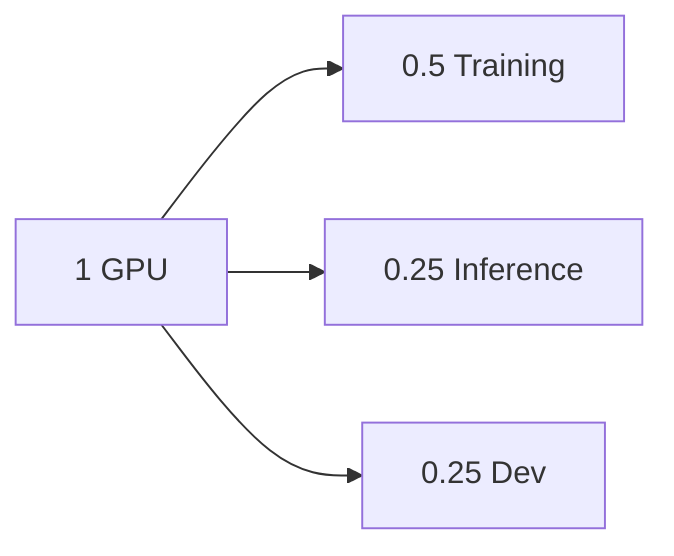
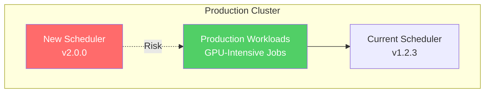

<!--
Note: Commands marked with +exec can be run with Ctrl+E
For better output display, use +exec +acquire_terminal
To colourize output, use +exec_replace with ccze -A
-->

# vCluster + NVIDIA KAI Scheduler
<!-- new_lines: 5 -->

```bash +exec_replace
echo "vCluster + KAI" | figlet -f small -w 90
```

<!-- jump_to_middle -->


<!-- end_slide -->

## Setup Demo Environment

> Running preflight setup for the demo

```bash +exec
# Configure Docker for GPU pass-through
# Create cluster with GPU support (port 5000 exposed for demo app)
# Install metrics server with Kind-specific configuration
# Create secret for OpenAI API (from environment variable)
# Deploy KAI Scheduler
# Label worker node for GPU workloads
# Install NVIDIA device plugin
# Create RuntimeClass for NVIDIA containers
# Apply KAI queues configuration
# Preload images into kind cluster for faster demo
./setup-cluster.sh
```

<!-- end_slide -->

## What is NVIDIA KAI Scheduler?

> **Advanced Kubernetes scheduler for GPU workload optimization**



| **Feature**               | **Benefit**                        |
| ------------------------- | ---------------------------------- |
| Fractional GPU allocation | Share single GPU between workloads |
| Queue-based scheduling    | Hierarchical resource management   |
| Topology awareness        | Optimize for hardware layout       |
| Fair sharing              | Prevent resource monopolization    |

> **Open-sourced 2025:** Enterprise GPU management for the community

<!-- end_slide -->

## Verify GPU Access

> Running nvidia-smi in a test pod to confirm GPU passthrough is working

```bash +exec_replace
kubectl config current-context | sed 's/^/CURRENT_CONTEXT: /'
```

```bash +exec
# Test GPU accessibility
kubectl run gpu-verify --image=nvidia/cuda:12.2.0-base-ubuntu20.04 \
  --rm -it --restart=Never \
  --overrides='{"spec":{"runtimeClassName":"nvidia","nodeSelector":{"nvidia.com/gpu.present":"true"}}}' \
  -- nvidia-smi -L
```

<!-- end_slide -->

<!-- include: ../_partials/what-is-vcluster.md -->

<!-- end_slide -->

<!-- include: ../_partials/vcluster-architecture.md -->

<!-- end_slide -->

<!-- include: ../_partials/vcluster-syncer.md -->

<!-- end_slide -->

## What Actually Runs on GPUs?

> Understanding GPU workloads in modern infrastructure

| **Workload**         | **Examples**                    | **GPU Usage**             |
| -------------------- | ------------------------------- | ------------------------- |
| Model Training       | Fine-tuning LLMs, Deep Learning | 100% for hours/days       |
| Stable Diffusion     | Image generation                | ~50% GPU                  |
| LLM Inference        | ChatGPT API, Claude API         | 25-75% depending on model |
| Video Processing     | Transcoding, streaming          | Variable 20-80%           |
| CUDA Development     | Jupyter notebooks, testing      | Often < 20%               |
| Batch Processing     | Scientific computing            | Spikes to 100%            |

<!-- end_slide -->

## Deploy GPU Demo

```bash +exec_replace
kubectl config current-context | sed 's/^/CURRENT_CONTEXT: /'
```

```bash +exec
./deploy-gpu-pod.sh
```

> vCluster syncer dynamically updates allocatable values as pods start/stop, preventing oversubscription
<!-- end_slide -->

## Scan QR Code

```bash +exec_replace
NGROK_URL=$(curl -s http://localhost:4040/api/tunnels | jq -r '.tunnels[0].public_url')
echo "$NGROK_URL" | qrencode -t UTF8 -s 1 -m 2
echo ""
echo "$NGROK_URL"
```

<!-- end_slide -->

## Audience Haikus

> SRE Horror Haikus generated by the audience (auto-refreshing, press 'q' to continue)

```bash +exec +acquire_terminal
./show-haikus.sh
```

<!-- end_slide -->

## Upgrading Schedulers in Production



```bash +exec_replace
cat << 'EOF'
Current Reality:
• Testing new schedulers affects all workloads
• Rollback procedures take hours
• Teams blocked on single scheduler version
EOF
```

<!-- end_slide -->

## GPU Scheduling: Risk Analysis

| **Failure Mode** | **Impact**           | **Recovery Time** | **Business Cost** |
| ---------------- | -------------------- | ----------------- | ----------------- |
| Scheduler bug    | All pods pending     | 2-4 hours         | High              |
| CRD conflicts    | Namespace corruption | 6+ hours          | Critical          |
| Version mismatch | Random pod failures  | 1-2 days          | Very High         |
| Resource leak    | GPU exhaustion       | 4-8 hours         | Critical          |

> **Industry Data:** Enterprise downtime costs $100k-1M+ per hour (New Relic 2024)

<!-- end_slide -->

## Solution: vCluster Isolation


> **Key Point:** vCluster creates isolated Kubernetes inside your existing cluster - NOT new EKS/GKE!

<!-- end_slide -->

## Production Scheduler Risk

```bash +exec_replace
cat << 'EOF'
Host-cluster scheduler:
• Single scheduler controls entire cluster
• Any changes affect all workloads
• No isolation between teams

Impact:
• Blocked innovation due to risk
• Slow adoption of new features
• Teams waiting on scheduler upgrades
EOF
```

> **Question:** How can we test KAI scheduler without risking production?

<!-- end_slide -->

## Deploy KAI in vCluster: Virtual Scheduler Configuration

> Using virtual scheduler for true KAI isolation per team

```yaml
experimental:
  syncSettings:
    setOwner: false  # Required for KAI pod-grouper

controlPlane:
  advanced:
    virtualScheduler:
      enabled: true   # Runs scheduler iside a virtual cluster

sync:
  fromHost:
    nodes:
      enabled: true   # Syncs host nodes for labels detection
    runtimeClasses:
      enabled: true   # Syncs NVIDIA runtime
    # Auto-enabled with virtual scheduler:
    csiDrivers: auto
    csiNodes: auto
    csiStorageCapacities: auto
```

| **Virtual Scheduler Benefits** | **Impact**                                |
| ------------------------------ | ----------------------------------------- |
| Independent KAI versions       | Each team runs v0.7.11, v0.9.2, or v0.9.3 |
| Complete scheduler isolation   | KAI decisions stay within vCluster        |
| True scheduling autonomy       | No cross-team interference                |
| Verified working               | Pods scheduled by vCluster's KAI          |

```bash +exec
vcluster create kai-isolated --values kai-vcluster.yaml
```

<!-- end_slide -->

### Check Install Progress

```bash +exec +acquire_terminal
k9s -c pod
```

<!-- end_slide -->

## vCluster Resource Footprint & Internals

```bash +exec_replace
kubectl config current-context | sed 's/^/CURRENT_CONTEXT: /'
```

> Understanding what runs inside a vCluster pod

```bash +exec_replace
cat << 'EOF' | ccze -A
━━━ vCluster Components ━━━
CONTROL PLANE:
  • API Server (k8s): Handles all K8s API calls
  • Syncer: Bi-directional resource sync with host
  • SQLite/etcd: Complete state isolation
  • Scheduler (optional): Independent scheduling decisions
EOF
```

```bash +exec_replace
echo "━━━ Resources Utilization ━━━"
kubectl --context kind-kai-demo top pod -n vcluster-kai-isolated -l app=vcluster --no-headers 2>/dev/null || echo "  Metrics not available (requires metrics-server)"
echo ""
echo "━━━ Data Storage ━━━"
kubectl --context kind-kai-demo exec -n vcluster-kai-isolated -l app=vcluster -c syncer -- ls -lh /data/state.db 2>/dev/null || echo "  SQLite database: /data/state.db (10-50MB typical)"
```

<!-- end_slide -->

## Install KAI Inside vCluster

> Installing KAI scheduler that will make independent scheduling decisions

```bash +exec_replace
kubectl config current-context | sed 's/^/CURRENT_CONTEXT: /'
```

```bash +exec
# Connect to vCluster first
vcluster connect kai-isolated

# Install KAI - it will be THE scheduler for this vCluster
KAI_VERSION=v0.7.11
helm upgrade -i kai-scheduler \
  oci://ghcr.io/nvidia/kai-scheduler/kai-scheduler \
  -n kai-scheduler --create-namespace \
  --version $KAI_VERSION \
  --set "global.gpuSharing=true"

kubectl wait --for=condition=ready pod -n kai-scheduler --all --timeout=120s
```

<!-- end_slide -->

## KAI Scheduler Pods

> View KAI scheduler components 

```bash +exec +acquire_terminal
k9s -c pod -n kai-scheduler
```

<!-- end_slide -->

## GPU Workloads

> KAI inside vCluster schedules pods independently with GPU sharing

```bash +exec_replace
kubectl config current-context | sed 's/^/CURRENT_CONTEXT: /'
```

```bash +exec_replace
cat << 'EOF' | ccze -A
SCHEDULING FLOW:
━━━━━━━━━━━━━━━━━━━━━━━━━━━━━━━━
1. Pod submitted with schedulerName: kai-scheduler
2. vCluster's virtual scheduler sees pod
3. KAI scheduler (inside vCluster) makes decision
4. Pod scheduled to synced node
5. Syncer translates to host cluster
━━━━━━━━━━━━━━━━━━━━━━━━━━━━━━━━
EOF
```

```bash +exec +acquire_terminal
nvim -O gpu-demo-pod1.yaml gpu-demo-pod2.yaml
```

<!-- end_slide -->

## Deploy and Test GPU Workload in vCluster

```bash +exec
# Apply queues and deploy two pods with different GPU fractions
kubectl apply -f queues.yaml
kubectl apply -f gpu-demo-pod1.yaml
kubectl apply -f gpu-demo-pod2.yaml

kubectl wait --for=condition=ready pod -n default --all --timeout=120s

# Show both pods sharing the GPU
kubectl get pods -l app=gpu-demo -o custom-columns=NAME:.metadata.name,FRACTION:.metadata.annotations."kai\.scheduler/gpu-fraction",STATUS:.status.phase
```

<!-- end_slide -->

## Version Switching with vCluster

```bash +exec_replace
kubectl config current-context | sed 's/^/CURRENT_CONTEXT: /'
```

> Switch between scheduler versions instantly. vCluster also supports snapshot/restore for complete state management.

```bash +exec
# Disconnect from vCluster
vcluster disconnect

# Delete the entire vCluster (timed)
time vcluster delete kai-isolated --delete-namespace
```

<!-- end_slide -->

## Multi-Team Requirements

```bash +exec_replace
cat << 'EOF'
Challenge:
  • ML Team needs KAI v0.9.3 for new features
  • Research Team requires stable KAI v0.7
  • Dev Team uses default scheduler

Current approach limitation: One scheduler version for everyone

Question: How can teams run different scheduler versions simultaneously?
EOF
```

<!-- end_slide -->

## Parallel Scheduler Versions

```bash +exec_replace
kubectl config current-context | sed 's/^/CURRENT_CONTEXT: /'
```

> Multiple teams can run different scheduler versions simultaneously

```bash +exec
# Create multiple vClusters for different teams using existing config
# Team 1: Stable version
vcluster create team-stable --values kai-vcluster.yaml --connect=false &

# Team 2: Beta version
vcluster create team-beta --values kai-vcluster.yaml --connect=false &

# Wait for both to create
wait

```

<!-- end_slide -->

## Install Different KAI Versions Per Team

```bash +exec_replace
kubectl config current-context | sed 's/^/CURRENT_CONTEXT: /'
```

> Each team's vCluster runs its own KAI version with virtual scheduler

```bash +exec +id:teams
# Team Stable: v0.7.11 (stable)
vcluster connect team-stable
helm upgrade -i kai-scheduler \
  oci://ghcr.io/nvidia/kai-scheduler/kai-scheduler \
  -n kai-scheduler --create-namespace \
  --version v0.7.11 --wait &
STABLE_PID=$!

# Team Beta: v0.9.3 (testing new features)
vcluster connect team-beta
helm upgrade -i kai-scheduler \
  oci://ghcr.io/nvidia/kai-scheduler/kai-scheduler \
  -n kai-scheduler --create-namespace \
  --version v0.9.3 --wait &
BETA_PID=$!

# Wait for both installations
wait $STABLE_PID $BETA_PID

vcluster disconnect
```

<!-- end_slide -->

### Installation Progress

<!-- snippet_output: teams -->

<!-- end_slide -->

## Deploy Workloads to Both Teams

> Each team's workloads are managed by their own scheduler version

```bash +exec_replace
kubectl config current-context | sed 's/^/CURRENT_CONTEXT: /'
```

```bash +exec
# Deploy to team-stable (30% + 50% GPU allocation)
vcluster connect team-stable
kubectl apply -f queues.yaml,gpu-demo-pod1.yaml,gpu-demo-pod2.yaml
vcluster disconnect

# Deploy to team-beta (different allocation strategy)
vcluster connect team-beta
kubectl apply -f queues.yaml,gpu-demo-pod1.yaml,gpu-demo-pod2.yaml
vcluster disconnect
```

<!-- end_slide -->

## Parallel Operations

> Both vClusters running with independent KAI schedulers

```markdown
PARALLEL SCHEDULER DEPLOYMENTS
- team-stable: KAI v0.7.11 (stable version)
- team-beta:   KAI v0.9.3 (testing new features)

ARCHITECTURE
- Virtual Scheduler: ENABLED in each vCluster
- KAI Location:      Inside each vCluster
- Scheduling:        Independent per team
- Host Impact:       NONE
- Isolation:         COMPLETE
```

```bash +exec
vcluster list
```

<!-- end_slide -->

## View Running vClusters

> View all vClusters and their resources

```bash +exec +acquire_terminal
k9s -c pod
```

<!-- end_slide -->

## Operational Capabilities Achieved

| **Capability**          | **Time Saved**      | **Risk Reduced** |
| ----------------------- | ------------------- | ---------------- |
| Test scheduler upgrades | 4 hours → 5 min     | 100% → 0%        |
| Rollback bad changes    | 2 hours → 30 sec    | Critical → None  |
| A/B test versions       | Not possible → Easy | High → Zero      |
| Per-team schedulers     | Days → Minutes      | Complex → Simple |
| GPU sharing validation  | Weeks → Hours       | High → None      |

> **Measured Impact:** Based on typical enterprise deployment scenarios

<!-- end_slide -->

## Cleanup

> Cleaning up the demo environment

```bash +exec
# Kill ngrok process
pkill -f ngrok || true

# Delete the Kind cluster
kind delete cluster --name kai-demo

# Revert Docker runtime configuration
sudo jq 'del(."default-runtime")' /etc/docker/daemon.json | sudo sponge /etc/docker/daemon.json
sudo systemctl restart docker
```

<!-- end_slide -->

## Resources

```markdown
Documentation:
- vCluster Docs: https://vcluster.com/docs
- KAI Scheduler: https://github.com/NVIDIA/KAI-Scheduler
- vCluster KAI Integration: https://docs.vcluster.com/third-party-integrations/scheduler/kai-scheduler

Community:
- vCluster Slack: https://slack.loft.sh
- Office Hours: https://www.loft.sh/events
```

<!-- end_slide -->
<!-- new_lines: 10 -->


<!-- jump_to_middle -->
```bash +exec_replace
echo "Thank You!" | figlet -f small -w 90
```

## Questions?
