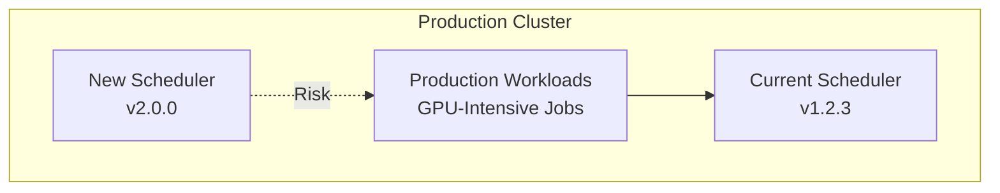
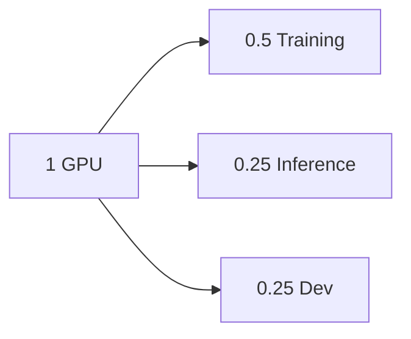
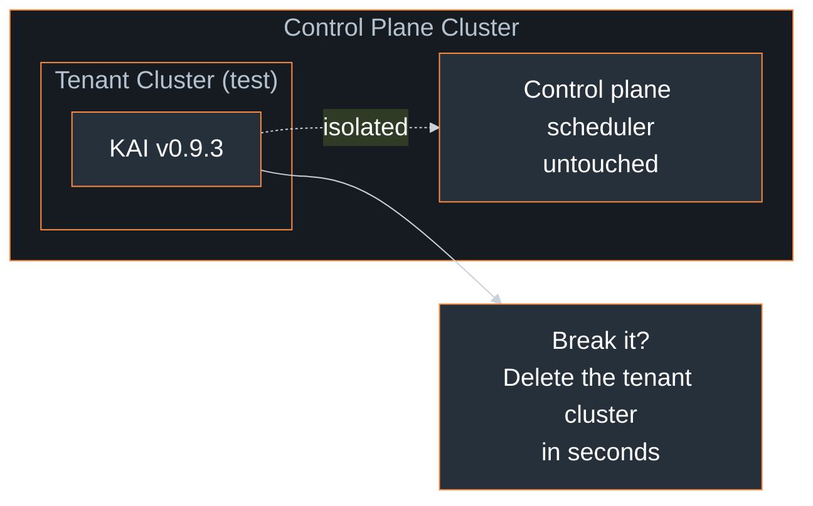
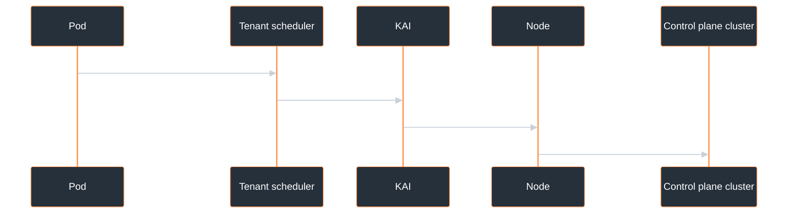
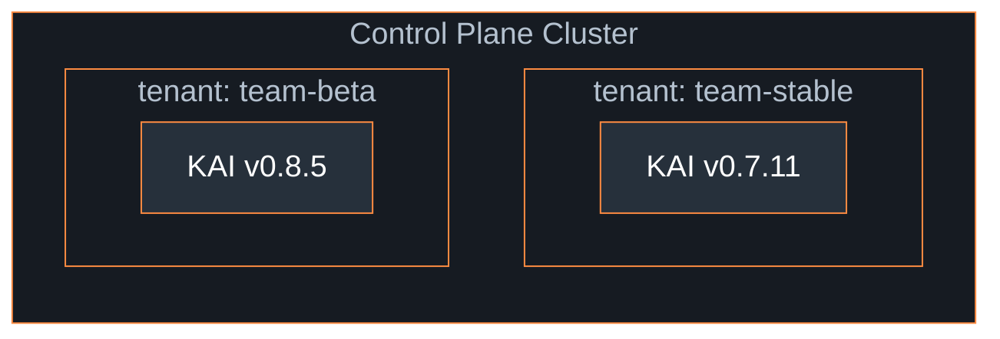
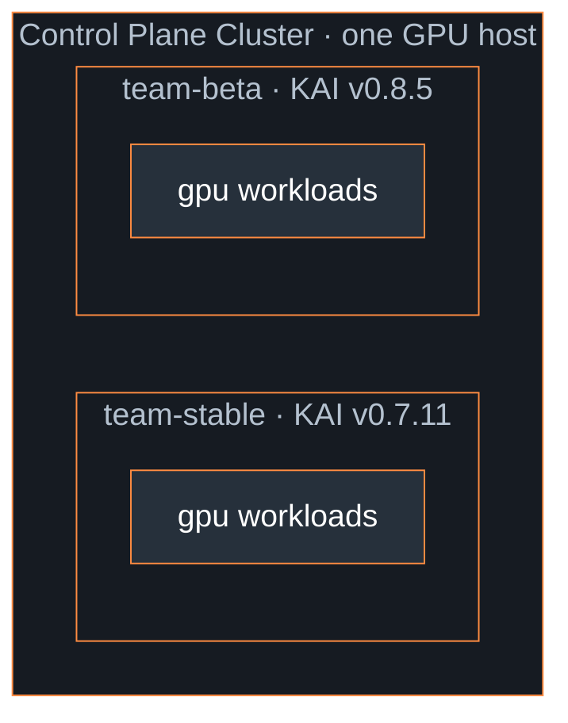

<!--
Note: Commands marked with +exec can be run with Ctrl+E
For better output display, use +exec +acquire_terminal
To colourize output, use +exec_replace with ccze -A

MERMAID THEME REFERENCE:
New diagrams use a high-contrast init block (orange borders, white text) so they
stay legible on the dark slide background. See the %%{init}%% lines below.
-->

# vCluster + NVIDIA KAI Scheduler
<!-- new_lines: 5 -->

```bash +exec_replace
echo "vCluster + KAI" | figlet -f small -w 90
```

<!-- jump_to_middle -->

```bash +exec_replace
while IFS= read -r line; do
    printf '\033[38;2;255;102;0m%s\033[0m\n' "$line"
done < vcluster-logo-ascii.txt
```

<!-- end_slide -->

## About Me

```bash +exec_replace
echo "Piotr Zaniewski" | figlet -f small -w 90
```

> **Head of Engineering Enablement** @ vCluster

```bash +exec_replace
printf "  Expertise  │  Platform teams, Kubernetes, GitOps, SRE, CNCF\n  Speaking   │  Workshops, presentations, live demos\n  Content    │  YouTube, Medium, Killercoda\n  Projects   │  Neovim, CLI tools, MCP servers, K8s operators" | ccze -A
```

```bash +exec_replace
qrencode -t UTF8 -m 2 "https://cloudrumble.net"
```

> cloudrumble.net  ·  github.com/Piotr1215  ·  @cloud-native-corner

<!-- end_slide -->

## Setup Demo Environment

> Kick this off first. It provisions in the background while we cover the why and the how.

```bash +exec
# Configure Docker for GPU pass-through
# Create cluster with GPU support (port 5000 exposed for demo app)
# Install metrics server with Kind-specific configuration
# Create secret for OpenAI API (from environment variable)
# Deploy KAI Scheduler
# Label worker node for GPU workloads
# Install NVIDIA device plugin (legacy path; DRA driver is the GA successor)
# Create RuntimeClass for NVIDIA containers
# Apply KAI queues configuration
# Preload images into kind cluster for faster demo
./setup-cluster.sh
```

<!-- end_slide -->

## Upgrading Schedulers in Production


```mermaid +render
graph TB
    subgraph "Production Cluster"
        PROD["Production Workloads<br/>GPU-Intensive Jobs"]
        SCHED["Current Scheduler<br/>v1.2.3"]

        NEWSCHED["New Scheduler<br/>v2.0.0"]

        PROD --> SCHED
        NEWSCHED -.-> |"Risk"| PROD
    end
```

```bash +exec_replace
cat << 'EOF'
Current Reality:
• Testing new schedulers affects all workloads
• Rollback procedures take hours
• Teams blocked on single scheduler version
EOF
```

<!-- end_slide -->

## GPU Scheduling: Risk Analysis

| **Failure Mode** | **Impact**           | **Recovery Time** | **Business Cost** |
| ---------------- | -------------------- | ----------------- | ----------------- |
| Scheduler bug    | All pods pending     | 2-4 hours         | High              |
| CRD conflicts    | Namespace corruption | 6+ hours          | Critical          |
| Version mismatch | Random pod failures  | 1-2 days          | Very High         |
| Resource leak    | GPU exhaustion       | 4-8 hours         | Critical          |

Enterprise downtime runs $100k-1M+ per hour (New Relic 2024).

> How do we test a new KAI version without risking production?

<!-- end_slide -->

## What is NVIDIA KAI Scheduler?

> **Advanced Kubernetes scheduler for GPU workload optimization**


```mermaid +render
graph LR
    GPU[1 GPU] --> A[0.5 Training]
    GPU --> B[0.25 Inference]
    GPU --> C[0.25 Dev]
```

| **Feature**               | **Benefit**                        |
| ------------------------- | ---------------------------------- |
| Fractional GPU allocation | Share single GPU between workloads |
| DRA-aware scheduling      | Schedule NVIDIA/AMD ResourceClaims |
| Queue-based scheduling    | Hierarchical resource management   |
| Topology awareness        | Optimize for hardware layout       |
| Fair sharing              | Prevent resource monopolization    |

> **Open-sourced 2025:** Enterprise GPU management for the community

<!-- end_slide -->

## KAI + DRA: Two Layers, Composed

> *DRA allocates the device. KAI schedules and shares it.*

| **Layer**        | **Owns**                                           |
| ---------------- | -------------------------------------------------- |
| DRA (Kubernetes) | *Which* device + selection: CEL, MIG, time-slicing |
| KAI (scheduler)  | Queues, fair-share, gang, fractional GPU sharing   |

| **DRA object** | **What it is**                                               |
| -------------- | ------------------------------------------------------------ |
| DeviceClass    | device category: full GPU / MIG / VFIO (like a StorageClass) |
| ResourceClaim  | a workload's request for a device                            |
| ResourceSlice  | driver-published inventory of devices per node               |

DRA is GA and enabled by default; NVIDIA donated the GPU DRA driver to CNCF.

<!-- end_slide -->

## Isolate KAI in a Tenant Cluster

> A tenant cluster is a full Kubernetes API of its own, running as a pod on the control plane cluster.


```mermaid +render
%%{init: {'theme':'base','themeVariables':{'primaryColor':'#26303b','primaryBorderColor':'#ff8c42','primaryTextColor':'#ffffff','lineColor':'#c9d1d9','textColor':'#ffffff','clusterBkg':'#161b22','clusterBorder':'#ff8c42','fontSize':'20px'}}}%%
graph LR
    subgraph CP["Control Plane Cluster"]
        subgraph TEN["Tenant Cluster (test)"]
            TEST["KAI v0.9.3"]
        end
        PROD["Control plane scheduler<br/>untouched"]
        TEST -.->|"isolated"| PROD
    end
    ROLLBACK["Break it?<br/>Delete the tenant cluster<br/>in seconds"]
    TEST --> ROLLBACK
```

```bash +exec_replace
printf '  \e[35m•\e[0m \e[37m%s\e[0m\n' "Own API server, own CRDs, own RBAC, own scheduler"
printf '  \e[35m•\e[0m \e[37m%s\e[0m\n' "The control plane cluster is invisible from inside the tenant"
printf '  \e[35m•\e[0m \e[37m%s\e[0m\n' "No lateral path to production workloads or their scheduler"
```

<!-- end_slide -->

<!-- include: ../_partials/what-is-vcluster.md -->

<!-- end_slide -->

<!-- include: ../_partials/vcluster-architecture.md -->

<!-- end_slide -->

## Verify GPU Access

> Running nvidia-smi in a test pod to confirm GPU passthrough is working

```bash +exec_replace
printf '  \e[35m•\e[0m \e[37m%s\e[0m\n' "Runs a throwaway pod with the nvidia runtime class"
printf '  \e[35m•\e[0m \e[37m%s\e[0m\n' "nvidia-smi -L lists the physical GPU the pod can see"
printf '  \e[35m•\e[0m \e[37m%s\e[0m\n' "Confirms the device plugin and runtime class are wired up"
printf '  \e[35m•\e[0m \e[37m%s\e[0m\n' "The rest of the demo runs on this same GPU"
```

```bash +exec
# Clear any leftover verify pod, then test GPU accessibility (rerun-safe)
kubectl delete pod gpu-verify --ignore-not-found --now
kubectl run gpu-verify --image=nvidia/cuda:12.2.0-base-ubuntu20.04 \
  --rm -it --restart=Never \
  --overrides='{"spec":{"runtimeClassName":"nvidia","nodeSelector":{"nvidia.com/gpu.present":"true"}}}' \
  -- nvidia-smi -L
```

<!-- end_slide -->

## What Actually Runs on GPUs?

> Understanding GPU workloads in modern infrastructure

| **Workload**         | **Examples**                    | **GPU Usage**             |
| -------------------- | ------------------------------- | ------------------------- |
| Model Training       | Fine-tuning LLMs, Deep Learning | 100% for hours/days       |
| Stable Diffusion     | Image generation                | ~50% GPU                  |
| LLM Inference        | ChatGPT API, Claude API         | 25-75% depending on model |
| Video Processing     | Transcoding, streaming          | Variable 20-80%           |
| CUDA Development     | Jupyter notebooks, testing      | Often < 20%               |
| Batch Processing     | Scientific computing            | Spikes to 100%            |

<!-- end_slide -->

## Deploy the GPU Demo App

> A live web app served from one physical GPU. KAI gives each request a fraction of the card instead of a whole GPU.

```bash +exec_replace
printf '  \e[35m•\e[0m \e[37m%s\e[0m\n' "A real GPU workload: an LLM-backed web app"
printf '  \e[35m•\e[0m \e[37m%s\e[0m\n' "KAI schedules it on the GPU with fractional sharing turned on"
printf '  \e[35m•\e[0m \e[37m%s\e[0m\n' "Many requests share one GPU at once"
printf '  \e[35m•\e[0m \e[37m%s\e[0m\n' "End-to-end GPU path test"
```

```bash +exec
# Deploy the haiku app on the GPU, then publish it at a stable URL
./deploy-gpu-pod.sh
./expose-app.sh
```

<!-- end_slide -->

## Scan to Generate a Haiku

> The app is live on the GPU. Scan to generate a haiku: each request is generated on the card and scheduled by KAI.

```bash +exec_replace
qrencode -t UTF8 -s 1 -m 2 "https://haiku.cloudrumble.net"
echo ""
echo "https://haiku.cloudrumble.net"
```

<!-- end_slide -->

## Audience Haikus

> SRE Horror Haikus

```bash +exec +acquire_terminal
./show-haikus.sh
```

<!-- end_slide -->

## Deploy KAI in a Tenant Cluster: Configuration

> One YAML turns on the virtual scheduler and syncs just what KAI needs from the control plane cluster.

```yaml
experimental:
  syncSettings:
    setOwner: false  # Required for KAI pod-grouper

controlPlane:
  advanced:
    virtualScheduler:
      enabled: true   # Runs the scheduler inside the tenant cluster

sync:
  fromHost:
    nodes:
      enabled: true   # Sync control plane cluster nodes for label detection
    runtimeClasses:
      enabled: true   # Sync the NVIDIA runtime
    # Auto-enabled with virtual scheduler:
    csiDrivers: auto
    csiNodes: auto
    csiStorageCapacities: auto
```

| **Virtual Scheduler Benefits** | **Impact**                                |
| ------------------------------ | ----------------------------------------- |
| Independent KAI versions       | Each team runs v0.7.11, v0.9.2, or v0.9.3 |
| Complete scheduler isolation   | KAI decisions stay within the tenant cluster |
| True scheduling autonomy       | No cross-team interference                |

<!-- end_slide -->

## How the Tenant Cluster Runs Its Own Scheduler

> By default a tenant cluster reuses the control plane cluster's scheduler. One setting gives it a scheduler of its own.

```bash +exec_replace
printf '  \e[35m•\e[0m \e[37m%s\e[0m\n' "virtualScheduler.enabled: a scheduler runs inside the tenant, not the control plane cluster's"
printf '  \e[35m•\e[0m \e[37m%s\e[0m\n' "Nodes, runtime classes and CSI sync in, so the tenant sees the real GPU nodes"
printf '  \e[35m•\e[0m \e[37m%s\e[0m\n' "Pods are scheduled inside the tenant, then the syncer makes them real pods on those nodes"
printf '  \e[35m•\e[0m \e[37m%s\e[0m\n' "Label or taint tenant nodes without touching the control plane cluster"
```

<!-- end_slide -->

## Create the Isolated Tenant Cluster

> This creates kai-isolated, an empty tenant cluster with its own API server and scheduler. Nothing runs inside it yet.

```bash +exec_replace
printf '  \e[35m•\e[0m \e[37m%s\e[0m\n' "One command builds a full Kubernetes control plane, running as a pod"
printf '  \e[35m•\e[0m \e[37m%s\e[0m\n' "It has its own API server, scheduler and data store"
printf '  \e[35m•\e[0m \e[37m%s\e[0m\n' "Isolated: the control plane cluster does not see inside it"
printf '  \e[35m•\e[0m \e[37m%s\e[0m\n' "Throwaway by design: deleting it leaves the control plane cluster untouched"
```

```bash +exec
vcluster create kai-isolated --values kai-vcluster.yaml --driver helm --connect=false
vcluster connect kai-isolated --driver helm
```

<!-- end_slide -->

### Check Install Progress

```bash +exec +acquire_terminal
k9s -c pod
```

<!-- end_slide -->

## Install KAI Inside the Tenant Cluster

> KAI installs into kai-isolated, the tenant cluster created a moment ago. The control plane cluster's own scheduler is left alone.

```bash +exec_replace
printf '  \e[35m•\e[0m \e[37m%s\e[0m\n' "KAI becomes the scheduler for this one tenant cluster"
printf '  \e[35m•\e[0m \e[37m%s\e[0m\n' "One helm install into the tenant cluster, pinned to KAI v0.7.11"
printf '  \e[35m•\e[0m \e[37m%s\e[0m\n' "Its PodGroup CRDs and its queues live inside the tenant cluster"
printf '  \e[35m•\e[0m \e[37m%s\e[0m\n' "setOwner:false lets KAI's pod-grouper group the pods it schedules"
printf '  \e[35m•\e[0m \e[37m%s\e[0m\n' "The control plane cluster keeps its own scheduler, untouched"
```

```bash +exec
./install-kai.sh
```

<!-- end_slide -->

## KAI Scheduler Pods

> View KAI scheduler components 

```bash +exec +acquire_terminal
k9s -c pod -n kai-scheduler
```

<!-- end_slide -->

## GPU Workloads

> Two identical pod specs. Each requests a different GPU fraction.


```mermaid +render
%%{init: {'theme':'base','themeVariables':{'primaryColor':'#26303b','primaryTextColor':'#ffffff','lineColor':'#c9d1d9','textColor':'#ffffff','actorBkg':'#26303b','actorBorder':'#ff8c42','actorTextColor':'#ffffff','signalColor':'#c9d1d9','signalTextColor':'#ffffff','labelBoxBkgColor':'#26303b','labelBoxBorderColor':'#ff8c42','labelTextColor':'#ffffff','noteBkgColor':'#3a2a1a','noteTextColor':'#ffffff','fontSize':'18px'}}}%%
sequenceDiagram
    participant P as Pod
    participant VS as Tenant scheduler
    participant K as KAI
    participant N as Node
    participant CP as Control plane cluster
    P->>VS: submit (schedulerName: kai-scheduler)
    VS->>K: hand off the decision
    K->>N: place on a synced node
    N->>CP: syncer reflects the pod up to run
```

```bash +exec +acquire_terminal
nvim -d gpu-demo-pod1.yaml gpu-demo-pod2.yaml
```

<!-- end_slide -->

## Deploy and Test a GPU Workload in the Tenant Cluster

> Two pods request different GPU fractions. KAI, running inside the tenant cluster, places both on one physical card.

```bash +exec
./run-tenant-gpu-demo.sh
```

```bash +exec_replace
printf '  \e[35m•\e[0m \e[37m%s\e[0m\n' "KAI made the scheduling decision, not the control plane cluster's scheduler"
printf '  \e[35m•\e[0m \e[37m%s\e[0m\n' "Both pods share one physical GPU, each on the fraction it requested"
printf '  \e[35m•\e[0m \e[37m%s\e[0m\n' "KAI, its CRDs and its queues live inside the tenant cluster"
printf '  \e[35m•\e[0m \e[37m%s\e[0m\n' "The control plane cluster never saw these pods"
printf '\n\e[33m%s\e[0m\n' "Blast radius of this scheduler and its config: one tenant cluster."
```

<!-- end_slide -->

## Version Switching

> Deleting a tenant cluster removes scheduler and all its resources, and the host cluster keeps using the default version.

```bash +exec_replace
printf '  \e[35m•\e[0m \e[37m%s\e[0m\n' "The scheduler, its CRDs, and all state go with the tenant cluster"
printf '  \e[35m•\e[0m \e[37m%s\e[0m\n' "Zero blast radius on the control plane cluster"
printf '  \e[35m•\e[0m \e[37m%s\e[0m\n' "A new version becomes a safe, reversible experiment"
printf '\n\e[33m%s\e[0m\n' "To switch or roll back, we simply delete the tenant cluster."
```

<!-- end_slide -->

## Multi-Team Requirements

```bash +exec_replace
cat << 'EOF'
Challenge:
  • ML Team needs KAI v0.8.5 for new features
  • Research Team requires stable KAI v0.7
  • Dev Team uses default scheduler

Current approach limitation: One scheduler version for everyone

Question: How can teams run different scheduler versions simultaneously?
EOF
```

<!-- end_slide -->

## Different KAI Versions Per Team

> Each team gets its own tenant cluster and its own KAI version, on one shared control plane cluster.


```mermaid +render
%%{init: {'theme':'base','themeVariables':{'primaryColor':'#26303b','primaryBorderColor':'#ff8c42','primaryTextColor':'#ffffff','lineColor':'#c9d1d9','textColor':'#ffffff','clusterBkg':'#161b22','clusterBorder':'#ff8c42','fontSize':'20px'}}}%%
graph LR
    subgraph CP["Control Plane Cluster"]
        subgraph A["tenant: team-stable"]
            K1["KAI v0.7.11"]
        end
        subgraph B["tenant: team-beta"]
            K2["KAI v0.8.5"]
        end
    end
```

```bash +exec
./deploy-team-versions.sh
```

<!-- end_slide -->

## Deploy Workloads to Both Teams

> Same workloads, two schedulers. Each team's pods are placed by its own KAI version, on one shared GPU host with no crosstalk.


```mermaid +render
%%{init: {'theme':'base','themeVariables':{'primaryColor':'#26303b','primaryBorderColor':'#ff8c42','primaryTextColor':'#ffffff','lineColor':'#c9d1d9','textColor':'#ffffff','clusterBkg':'#161b22','clusterBorder':'#ff8c42','fontSize':'20px'}}}%%
graph TB
    subgraph CP["Control Plane Cluster · one GPU host"]
        subgraph A["team-stable · KAI v0.7.11"]
            P1["gpu workloads"]
        end
        subgraph B["team-beta · KAI v0.8.5"]
            P2["gpu workloads"]
        end
    end
```

```bash +exec
./deploy-both-teams.sh
```

<!-- end_slide -->

## Parallel Operations

> Both tenant clusters running with independent KAI schedulers

```markdown
PARALLEL SCHEDULER DEPLOYMENTS
- team-stable: KAI v0.7.11 (stable version)
- team-beta:   KAI v0.8.5 (testing new features)

ARCHITECTURE
- Virtual Scheduler:    ENABLED in each tenant cluster
- KAI Location:         Inside each tenant cluster
- Scheduling:           Independent per team
- Control Plane Impact: NONE
- Isolation:            COMPLETE
```

```bash +exec
vcluster list --driver helm
```

<!-- end_slide -->

## View Running Tenant Clusters

> View all tenant clusters and their resources

```bash +exec +acquire_terminal
k9s -c pod
```

<!-- end_slide -->

## Operational Capabilities Achieved

| **Capability**          | **Time Saved**      | **Risk Reduced**       |
| ----------------------- | ------------------- | ---------------------- |
| Test scheduler upgrades | 4 hours → 5 min     | Cluster-wide → Contained |
| Rollback bad changes    | 2 hours → 30 sec    | Critical → Low         |
| A/B test versions       | Not possible → Easy | High → Low             |
| Per-team schedulers     | Days → Minutes      | Complex → Simple       |
| GPU sharing validation  | Weeks → Hours       | High → Low             |

> **Measured Impact:** Based on typical enterprise deployment scenarios

<!-- end_slide -->

## Safe Because It Is Isolated and Disposable

> A tenant cluster is a real Kubernetes control plane running as pods on the control plane cluster, invisible to the workloads inside it.

```bash +exec_replace
printf '  \e[35m•\e[0m \e[37m%s\e[0m\n' "Its API server, scheduler and data store run as ordinary pods on the control plane cluster"
printf '  \e[35m•\e[0m \e[37m%s\e[0m\n' "The tenant cluster owns every resource the tenant creates"
printf '  \e[35m•\e[0m \e[37m%s\e[0m\n' "Delete it and every synced resource goes with it, leaving no orphans"
printf '  \e[35m•\e[0m \e[37m%s\e[0m\n' "A new scheduler or a new version is a change that can be thrown away"
```

<!-- end_slide -->

## The Takeaway: One Platform, Many Versions

> KAI was the example. The capability is vCluster.

```bash +exec_replace
printf '\e[1;36m%s\e[0m\n\n' "KAI was just the example"
printf '\e[33m%s\e[0m\n' "Inside a tenant cluster you can:"
printf '  \e[35m•\e[0m \e[37m%s\e[0m\n' "Run a cluster-wide component at a different version than the control plane cluster"
printf '  \e[35m•\e[0m \e[37m%s\e[0m\n' "Run several versions side by side, one per team"
printf '  \e[35m•\e[0m \e[37m%s\e[0m\n' "Swap subsystems: scheduler, CRDs, admission, API version"
printf '  \e[35m•\e[0m \e[37m%s\e[0m\n' "Delete the whole thing in seconds when it breaks"
printf '\n\e[32m%s\e[0m\n' "The scheduler was proof. The versatility is the point."
```

<!-- end_slide -->

## Cleanup

> Cleaning up the demo environment

```bash +exec
# Stops the tunnel, deletes the kind cluster (and the tenant clusters/pods
# inside it), and reverts the Docker default runtime.
./cleanup.sh
```

<!-- end_slide -->

## Resources

```markdown
Documentation:
- vCluster Docs: https://vcluster.com/docs
- KAI Scheduler: https://github.com/NVIDIA/KAI-Scheduler
- vCluster KAI Integration: https://docs.vcluster.com/third-party-integrations/scheduler/kai-scheduler

Community:
- vCluster Slack: https://slack.loft.sh
- Office Hours: https://www.loft.sh/events
```

<!-- end_slide -->

<!-- new_lines: 3 -->

```bash +exec_replace
while IFS= read -r line; do
    printf '\033[38;2;255;102;0m%s\033[0m\n' "$line"
done < vcluster-logo-ascii.txt
```

<!-- new_lines: 5 -->

<!-- jump_to_middle -->
```bash +exec_replace
echo "Thank You!" | figlet -f small -w 90
```

## Questions?
