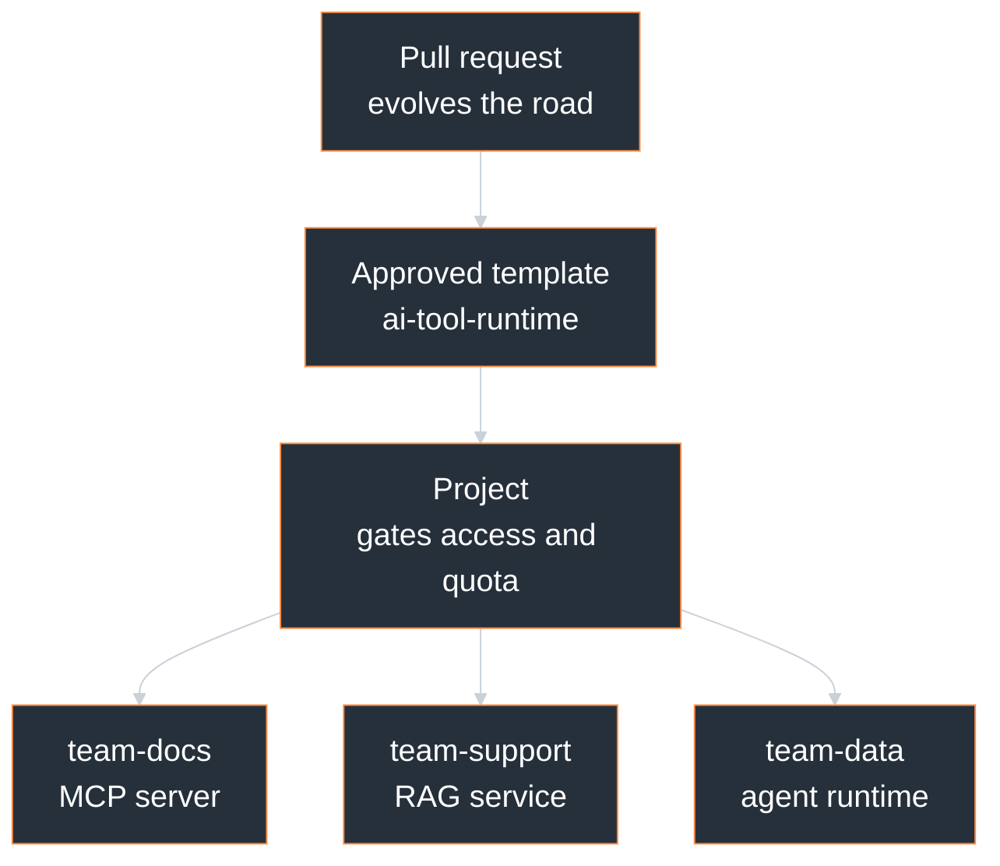

# Paved Roads for AI Tools

> Governed self-service runtimes with vCluster

<!-- new_lines: 3 -->

```bash +exec_replace
echo "Paved Roads" | figlet -f small -w 90
```

<!-- jump_to_middle -->

```bash +exec_replace
while IFS= read -r line; do
    printf '\033[38;5;208m%s\033[0m\n' "$line"
done < vcluster-logo-ascii.txt
```

<!-- end_slide -->

## About Me

```bash +exec_replace
echo "Piotr Zaniewski" | figlet -f small -w 90
```

> Head of Engineering Enablement @ vCluster

```bash +exec_replace
printf "  Expertise  | Platform engineering, Kubernetes, GitOps, SRE, CNCF\n  Speaking   | Workshops, presentations, live demos\n  Content    | YouTube, Medium, Killercoda\n  Projects   | Neovim, CLI tools, MCP servers, K8s operators" | ccze -A
```

```bash +exec_replace
qrencode -t UTF8 -m 2 "https://cloudrumble.net"
```

> cloudrumble.net  ·  github.com/Piotr1215  ·  @cloud-native-corner

<!-- end_slide -->

## Demo Setup

> A local Kubernetes control plane and a tenant cluster created from an approved policy template.

```bash +exec
./setup.sh
```

> The tenant cluster carries pod security, quota, limits, and network policy from the moment it starts.

<!-- end_slide -->

## Teams Want to Run AI Tools on Kubernetes

> MCP servers, RAG services, and agents are just workloads, and Kubernetes runs workloads well.

| AI tool                        | Why Kubernetes fits             |
| ------------------------------ | ------------------------------- |
| Internal documentation server | Scales, self-heals, rolls out   |
| RAG service over company data  | Secrets, storage, scheduling    |
| Agent runtime with credentials | Identity and network built in   |
| Any tool, iterated fast        | Declarative, repeatable deploys |

> Teams want the platform's scheduling, identity, and rollout for their AI tools.

<!-- end_slide -->

## The Shared Cluster Makes It Hard

> One cluster, many teams, and every AI tool lands next to workloads it should never touch.

```bash +exec_replace
printf '\e[1;36m%s\e[0m\n\n' "SHARED-CLUSTER PAIN"
printf '  \e[35m•\e[0m \e[37m%s\e[0m\n' "Isolation: one namespace is a weak boundary"
printf '  \e[35m•\e[0m \e[37m%s\e[0m\n' "Blast radius: a noisy tool starves its neighbors"
printf '  \e[35m•\e[0m \e[37m%s\e[0m\n' "Access: who is allowed to reach which tool"
printf '  \e[35m•\e[0m \e[37m%s\e[0m\n' "Policy sprawl: rules copied per team, drift sets in"
```

> Speed cannot come at the cost of a dependable boundary.

<!-- end_slide -->

## What a Team Actually Asks For

> A team brings an image and a need. The platform answers with a runtime.

| Team A brings                     | The platform provides        |
| --------------------------------- | ---------------------------- |
| "I built an MCP server"           | A tenant cluster to run it   |
| "It has to be served over HTTP"   | Ingress and a public route   |
| "Who is allowed to reach it?"     | OIDC and SSO, wired in       |
| "It must run on our own hardware" | Private nodes, same template |

> The team owns the tool. The platform owns everything around it. That is the paved road.

<!-- end_slide -->

<!-- include: ../_partials/what-is-vcluster.md -->

<!-- end_slide -->

<!-- include: ../_partials/vcluster-architecture.md -->

<!-- end_slide -->

## The Paved Road

> On the vCluster Platform, an approved template creates a governed tenant cluster on demand.

```bash
vcluster platform create vcluster --template ai-tool-runtime
```

| Without the paved road        | With `ai-tool-runtime`             |
| ----------------------------- | ---------------------------------- |
| Platform ticket               | Team self-service                  |
| Bespoke cluster configuration | Approved, repeatable contract      |
| Policy added later            | Policy present at creation         |
| Platform engineer in the loop | Platform engineer defines the road |

> The Platform UI exposes the same self-service path.

<!-- end_slide -->

## The Design

> One approved template becomes many isolated runtimes, and one pull request evolves them all.



> Governance is code: change the template once, every future runtime inherits it.

<!-- end_slide -->

## The Ownership Split

> Clear ownership removes the platform team from the delivery path.

| Teams own                         | Platform owns                           |
| --------------------------------- | --------------------------------------- |
| Tool code and behavior            | Approved runtime templates              |
| Container images and dependencies | Security and resource policy            |
| Release cadence                   | Template access through Projects        |
| Workload configuration            | Shared identity, secrets, observability |

> Teams iterate on tools while the platform evolves the contract.

<!-- end_slide -->

## The Contract

> `ai-tool-runtime` defines the baseline every workload inherits.

```yaml
# ai-tool-runtime values - the policy envelope
policies:
  podSecurityStandard: restricted     # non-root, drop ALL, no privilege escalation
  resourceQuota:
    enabled: true
    quota:
      requests.cpu: "8"
      requests.memory: 16Gi
      limits.cpu: "16"
      limits.memory: 32Gi
      count/pods: "40"
  limitRange:
    enabled: true                     # default requests + limits per container
  networkPolicy:
    enabled: true                     # declared; enforced by a policy-capable CNI
```

| Contract element | Runtime value |
| ---------------- | ------------- |
| Pod security | Restricted admission baseline |
| ResourceQuota | Aggregate capacity boundary |
| LimitRange | Default requests and limits |
| NetworkPolicy | Declared network boundary |

<!-- end_slide -->

## The Tool Is Real

> `vcluster-yaml` answers vcluster.yaml configuration questions over MCP.

```bash +exec_replace
printf '  \e[35m•\e[0m \e[37m%s\e[0m\n' "Image: piotrzan/vcluster-yaml-mcp-server:1.5.0"
printf '  \e[35m•\e[0m \e[37m%s\e[0m\n' "ArgoCD ApplicationSet ships the workload"
printf '  \e[35m•\e[0m \e[37m%s\e[0m\n' "ArgoCD Image Updater writes image tags back to Git"
printf '  \e[35m•\e[0m \e[37m%s\e[0m\n' "Public endpoint: vcluster-yaml.cloudrumble.net"
```

```bash +exec
curl -s https://vcluster-yaml.cloudrumble.net/health
```

> A real production MCP server, live right now.

<!-- end_slide -->

## Step 1: A Real Cluster the Team Owns

> A tenant cluster is a full Kubernetes API of its own. The team is admin inside it; the host stays untouched.

```bash +exec
./isolation.sh
```

> Not a namespace with extra rules. A cluster, safely theirs.

<!-- end_slide -->

## Step 2: Deploy the MCP Server

> The team's manifest deploys into the governed tenant cluster and carries no policy of its own.

```bash +exec
./ship.sh
```

> The runtime already enforces pod security and resource limits. The team authored zero policy manifests.

<!-- end_slide -->

## Step 3: Add It to Your AI Client

> Every HTTP-capable MCP client can reach the same live server. Add it now.

Claude Code:

```bash
claude mcp add --transport http vcluster-yaml https://vcluster-yaml.cloudrumble.net/mcp
```

Codex (`~/.codex/config.toml`):

```toml
[mcp_servers.vcluster-yaml]
url = "https://vcluster-yaml.cloudrumble.net/mcp"
```

Any MCP client:

```json
{ "type": "http", "url": "https://vcluster-yaml.cloudrumble.net/mcp" }
```

> One command, one hundred clients, one live server.

<!-- end_slide -->

## Step 4: Ask It a Question

> what does sync.toHost.ingresses.enabled do?

The same tool, now answering live in every client in the room.

What the team shipped is what the whole audience is using.

<!-- end_slide -->

## The Pattern

> Any team self-serves a tenant cluster, drops in its tool, and owns nothing else.

1. Team selects the approved template
2. Team self-serves an isolated tenant cluster
3. Team deploys its MCP server, RAG service, or agent
4. Platform supplies isolation, identity, and public exposure

> One recipe for every AI tool the organization will ever ship.

<!-- end_slide -->

## The Takeaway

> The MCP server is the example. The product is the paved road.

```bash +exec_replace
printf '\e[1;36m%s\e[0m\n\n' "GOVERNED SELF-SERVICE"
printf '  \e[35m•\e[0m \e[37m%s\e[0m\n' "Teams own and ship their AI tools"
printf '  \e[35m•\e[0m \e[37m%s\e[0m\n' "The platform owns the runtime contract"
printf '  \e[35m•\e[0m \e[37m%s\e[0m\n' "Approved templates turn policy into a reusable product"
printf '  \e[35m•\e[0m \e[37m%s\e[0m\n' "Projects control template access and quotas"
printf '\n\e[32m%s\e[0m\n' "Team-owned tools. Platform-owned guardrails. vCluster paves the road."
```

<!-- end_slide -->

## Resources

```markdown
Documentation:
- vCluster Docs: https://vcluster.com/docs
- Internal Kubernetes Platform: https://vcluster.com/docs/vcluster/production-guide/internal-k8s-platform
- Create a Template: https://vcluster.com/docs/platform/administer/templates/create-templates

Community:
- vCluster Slack: https://slack.loft.sh
- Office Hours: https://www.loft.sh/events
```

<!-- end_slide -->

## Runtime Lifecycle Is Part of the Product

> A tenant cluster and its governed policy envelope can be removed together.

```bash +exec
./cleanup.sh
```

> Self-service includes creation, use, and clean retirement.

<!-- end_slide -->

<!-- new_lines: 3 -->

```bash +exec_replace
while IFS= read -r line; do
    printf '\033[38;5;208m%s\033[0m\n' "$line"
done < vcluster-logo-ascii.txt
```

<!-- new_lines: 5 -->

<!-- jump_to_middle -->
```bash +exec_replace
echo "Thank You!" | figlet -f small -w 90
```

## Questions?

<!-- end_slide -->
