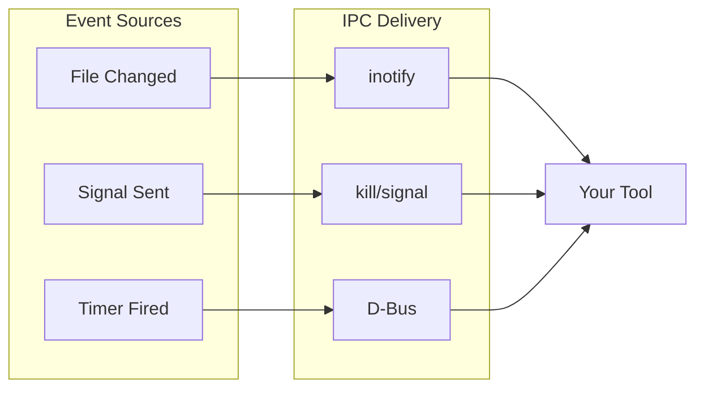

# Event Driven Terminal Workflows

<!-- new_lines: 5 -->

```bash +exec_replace
echo "Process Events" | figlet -f small -w 90
```

<!-- jump_to_middle -->
<!-- end_slide -->

## The Problem

> Repetitive manual reactions to system and user events

```markdown
FILE CHANGES        → manually run tests, rebuild
SYSTEM EVENTS       → manually check logs, status
NEED ALERTS         → manually watch terminal output
PROCESS LIFECYCLE   → manually cleanup, restart
```

<!-- end_slide -->

## What is IPC?

> IPC = Inter-Process Communication


```bash +exec_replace
cat << 'EOF' | ccze -A
MECHANISM     DESCRIPTION                  EXAMPLE
─────────────────────────────────────────────────────────
Signals       Interrupts between procs     kill -HUP pid
Pipes         Data streams                 cmd1 | cmd2
Sockets       Bidirectional channels       Unix domain sockets
D-Bus         Desktop message bus          Notifications
EOF
```

<!-- end_slide -->

## What are Events?

> An event is something that happened that you can react to

```bash +exec_replace
cat << 'EOF' | ccze -A
TYPE            DESCRIPTION                    EXAMPLES
───────────────────────────────────────────────────────────────────
State change    Something changed              File modified, process exited
Request         Asked for attention            Signal received, message arrived
Time-based      Scheduled occurrence           Timer fired, cron triggered
EOF
```

```markdown
KEY PROPERTY: Events are asynchronous
  → You don't know WHEN they'll happen
  → You define WHAT to do when they do
```

<!-- end_slide -->

## Events + IPC

> IPC delivers events from source to your tool



```bash +exec_replace
cat << 'EOF' | ccze -A
EVENT              IPC MECHANISM      TOOL RECEIVES
──────────────────────────────────────────────────────────
File saved         inotify            entr, watchexec
Ctrl+C pressed     Signal (INT)       trap handler
Timer elapsed      D-Bus/systemd      notify-send
EOF
```

<!-- end_slide -->

## Event Driven Terminal Workflows

> Four categories of event-driven automation

```bash +exec_replace
cat << 'EOF' | ccze -A
CATEGORY           REACTS TO              EXAMPLE
────────────────────────────────────────────────────────────────
Command Polling    Output changes         Pod status, network stats
File Watching      File modifications     Code saves, config changes
Notifications      Send alerts            Build done, tests failed
Process Signals    Signals, exit          Cleanup, reload config
EOF
```

<!-- end_slide -->

## Category 1: Command Polling

> Re-run command, show changes

```bash +exec_replace
cat << 'EOF' | ccze -A
TOOL      PLATFORM           NOTES
───────────────────────────────────────────────────────
watch     Linux, Mac (brew)  Built-in on Linux
viddy     Linux, Mac, WSL    Modern, diff highlighting
EOF
```

```bash
# Pure Bash equivalent
while true; do clear; date; uptime; sleep 2; done
```

```bash +exec +acquire_terminal
# viddy: live network stats with diff highlighting
viddy -d -n 1s "ss -s | head -4"
```

<!-- end_slide -->

## Category 2: File Watching

> React when files change

```bash +exec_replace
cat << 'EOF' | ccze -A
TOOL          PLATFORM         NOTES
───────────────────────────────────────────────────────
entr          Linux, Mac, BSD  Simple, piped input
watchexec     Linux, Mac, WSL  Glob patterns, restart
inotifywait   Linux only       Low-level, scriptable
EOF
```

```bash
# Pure Bash (polling)
while old=$(md5sum f); do sleep 1; [ "$old" != "$(md5sum f)" ] && break; done
```

```bash +exec +acquire_terminal
# entr: celebrate every save with a wise cow
ls *.md | entr -c sh -c 'fortune -s | cowsay -f tux'
```

<!-- end_slide -->

## Category 3: Notifications

> Alert the user with actionable notifications

```bash +exec_replace
cat << 'EOF' | ccze -A
TOOL          PLATFORM           NOTES
───────────────────────────────────────────────────────
notify-send   Linux (libnotify)  Simple, everywhere
dunstify      Linux (dunst)      Actions, replace, timeout
osascript     Mac only           Native macOS
EOF
```

```bash
# Pure Bash equivalent
echo -e "\a"  # Terminal bell
```

```bash +exec
# Create fake log, show notification, open on click
echo "ERROR: build failed" > /tmp/build.log
dunstify -A "open,Open" "Build Failed" | grep -q open && open /tmp/build.log
```

<!-- end_slide -->

## Category 4: Process Signals

> USR1/USR2: talk to any running process without restart, sockets, or config files

```bash +exec_replace
cat << 'EOF' | ccze -A
SIGNAL    USE CASE
────────────────────────────────────────────
INT       Ctrl+C - cleanup before exit
TERM      Graceful shutdown
HUP       Reload config (nginx, sshd)
QUIT      Dump debug info + exit
USR1      Toggle debug, dump stats
USR2      Rotate logs, second custom action
EOF
```

```bash +exec
# Define callback, register with trap, send signal with pkill
bash -c '
  my_callback() { echo ">>> signal received! <<<"; }
  trap my_callback USR1
  echo "waiting..."; sleep 3
' &
sleep 1 && pkill -USR1 -f my_callback
```

> Docs: `man 7 signal` or https://man7.org/linux/man-pages/man7/signal.7.html

<!-- end_slide -->

## Beyond Ad-Hoc: systemd Services

> For production: restart on failure, logging, scheduling

```bash +exec_replace
cat << 'EOF' | ccze -A
APPROACH             USE CASE
───────────────────────────────────────────────────────
Ad-hoc (this video)  Development, quick automation
systemd services     Production, restart on failure
systemd timers       Scheduled tasks (cron replace)
systemd path units   File watching as a service
EOF
```

<!-- end_slide -->

## When to Use What?

```bash +exec_replace
cat << 'EOF' | ccze -A
SITUATION                TOOL        WHY
───────────────────────────────────────────────────────
Monitor command output   viddy       Diff highlighting
React to file saves      entr        Simple, fast
Complex file patterns    watchexec   Glob support
Desktop alerts           dunstify    Actions, timeout
Cleanup on exit          trap EXIT   Built-in, no deps
Reload config            trap HUP    Standard Unix pattern
Cross-platform           fswatch     Works everywhere
Production service       systemd     Restart, logging
EOF
```

<!-- end_slide -->

## Resources

```bash +exec_replace
cat << 'EOF' | ccze -A
RESOURCE          LINK
───────────────────────────────────────────────────────
entr              http://eradman.com/entrproject/
viddy             https://github.com/sachaos/viddy
watchexec         https://github.com/watchexec/watchexec
Pure Bash Bible   https://github.com/dylanaraps/pure-bash-bible
EOF
```

<!-- end_slide -->

# That's All Folks!

<!-- new_lines: 5 -->

```bash +exec_replace
echo "That's all folks!" | figlet -f small -w 90
```

<!-- jump_to_middle -->
