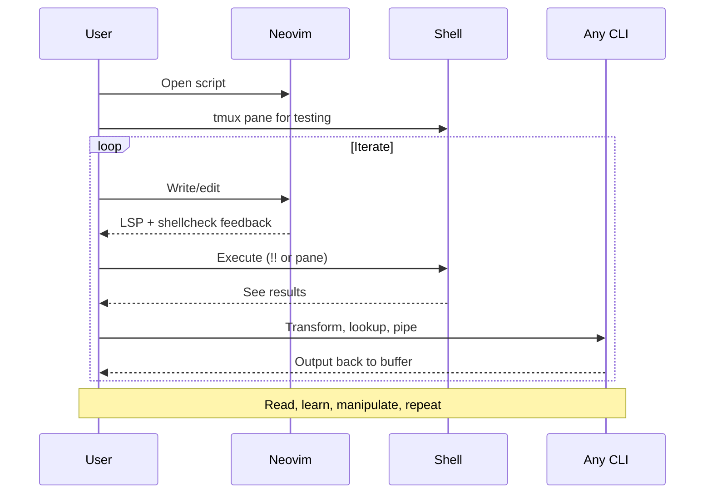

# Bash Scripting Workbench

<!-- new_lines: 5 -->

```bash +exec_replace
echo "Writing Bash" | figlet -f small -w 90
```

<!-- jump_to_middle -->
<!-- end_slide -->

## The Problem

> Writing bash scripts is clunky without proper setup

```markdown
Google syntax              →  :tldr / :cheat 
Copy boilerplate           →  Snippets
Run in terminal            →  Execute inline or file
Manual checks              →  shellcheck, LSP and more
```

<!-- end_slide -->

## Vim's Shell Integration

> Modern AI:       "Hey Claude, sort these lines and remove duplicates"
Original "AI":   :%!sort -u

```markdown
COMMAND             WHAT IT DOES
──────────────────────────────────────────────────────────
:!cmd               Run cmd, show output (pause)
:r !cmd             Insert cmd output below cursor
:.!cmd              Filter current line through cmd
:%!jq .             Filter entire buffer through jq
!!sort              Normal mode: filter line (same as :.!)
!ip sort            Filter paragraph through sort
:.w !cmd            Preview: send line to cmd (no replace)
:'<,'>w !cmd        Preview: send selection to cmd
```

<!-- end_slide -->

## Vim's Shell Integration (cont.)

```markdown
HOW IT WORKS
──────────────────────────────────────────────────────────
Lines passed as text blob to stdin (newlines preserved)
  → Same as: echo "line1\nline2\nline3" | cmd
  → Command reads stdin however it wants
  → stdout (with newlines) replaces selection
```

```markdown
Works with ANY command - including lookups:
  :!tldr <C-r><C-w>       tldr for word under cursor
  :!man <C-r><C-w>        man page for word under cursor
  :!curl cht.sh/<C-r><C-w> cheat.sh lookup
  :r !date                Insert current date
```

> `<C-r><C-w>` inserts word under cursor into command line

<!-- end_slide -->

## The Workbench (Neovim Extras)

```markdown
TOOL              TRIGGER                 USE CASE
──────────────────────────────────────────────────────────
bashls            (automatic)             Syntax as you type
shellcheck        :w + K on error         Catch bugs, explain why
tldr              :Tldr find              Quick command reference
cheat.sh          :Cheat bash/arrays      "How do I..." questions
bash help         :BashHelp for           Built-in keywords
postfix           cmd.var<Tab>            result=$(cmd) expansion
```

<!-- end_slide -->

## The Flow

> Your editor is a bash REPL



> No terminal switching. No copy-paste. Just flow.

<!-- end_slide -->


## Testing with Bats

```markdown
STRUCTURE
─────────────────────────────────────────────────────────
script.sh           Your script
test/
  script.bats       Test file

WORKFLOW
─────────────────────────────────────────────────────────
<leader>et          Run bats (in .bats → that file, else test/)
Write test          @test "description" { ... }
run ./script.sh     Capture output
[ "$status" -eq 0 ] Assert exit code
[[ "$output" =~ x ]] Assert output contains
```

<!-- end_slide -->

## Why it matters

```bash +exec_replace
cat << 'EOF' | ccze -A
  • Preventing skill atrophy
  • Programming is fun <- if you can invest the time it takes
  • Learning
  • If anyting, understanding what AI spits out
EOF
```

<!-- end_slide -->
## Demo

```bash +exec
tmux switchc -t demo
```

<!-- end_slide -->

# That's All Folks!

<!-- new_lines: 5 -->

```bash +exec_replace
echo "Craft Your Scripts" | figlet -f small -w 90
```

<!-- jump_to_middle -->
