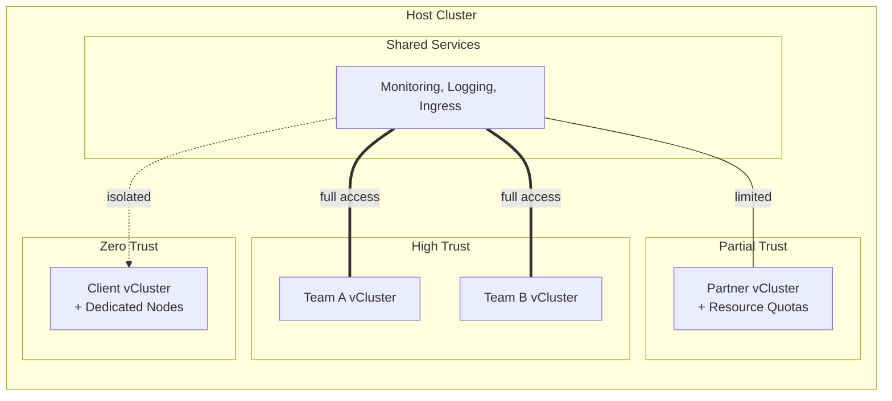
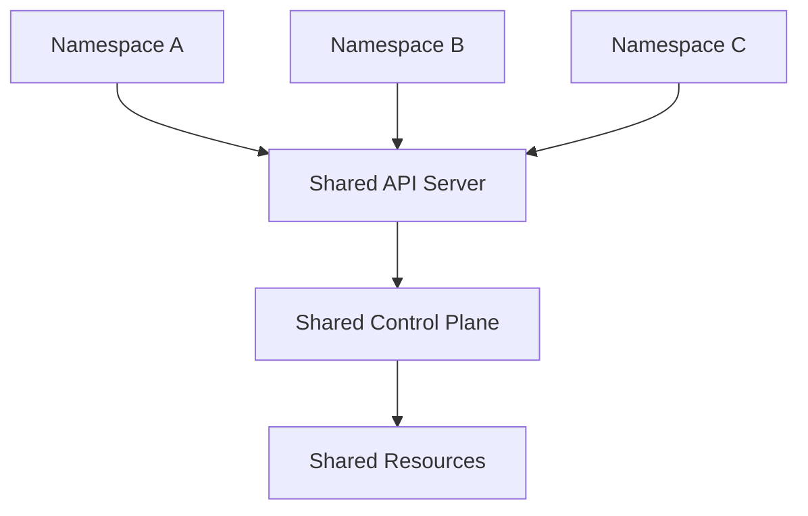
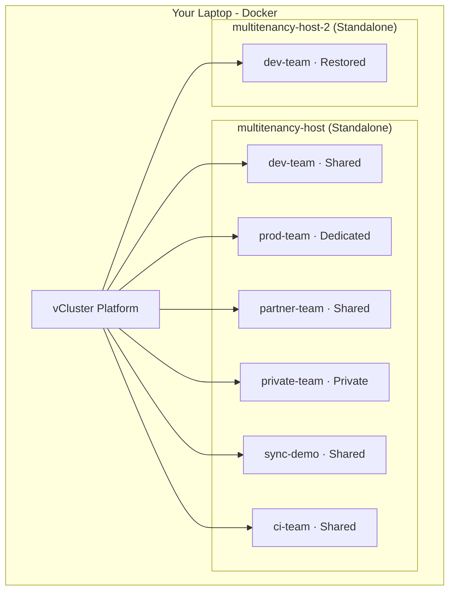

# Flexible Multi-Tenancy with vCluster

<!--jump_to_middle-->


```bash +exec_replace
echo "Flexible Multi-Tenancy" | figlet -f small -w 90
```

<!-- end_slide -->


## About Me

```bash +exec_replace
echo "Piotr Zaniewski" | figlet -f small -w 90
```

> **Head of Engineering Enablement** @ vCluster

```bash +exec_replace
printf "  Expertise  │  Platform teams, Kubernetes, GitOps, SRE, CNCF\n  Speaking   │  Workshops, presentations, live demos\n  Content    │  YouTube, Medium, Killercoda\n  Projects   │  Neovim, CLI tools, MCP servers, K8s operators" | ccze -A
```

```bash +exec_replace
qrencode -t UTF8 -m 2 "https://cloudrumble.net"
```

> cloudrumble.net  ·  github.com/Piotr1215  ·  @cloud-native-corner

<!-- end_slide -->


## Namespace Tenancy

 

> Noisy neighbors

<!-- end_slide -->


## vCluster Tenancy

 

> Your own cluster shared infra

<!-- end_slide -->


## vCluster Advanced Tenancy

 

> Your own cluster and infra

<!-- end_slide -->


<!-- include: ../_partials/what-is-vcluster.md -->

<!-- end_slide -->


## Deploy Host Cluster

```bash +exec
vcluster use driver docker
docker rm -f vcluster-platform 2>/dev/null; vcluster platform start
```

<!-- end_slide -->

## Create Host Cluster

```bash +exec
bash create-host.sh multitenancy-host --values vcluster.yaml
```

<!-- end_slide -->


## Flexible Multi-Tenancy Models


```mermaid +render
graph LR
    subgraph "Host Cluster"
        subgraph "Shared Services"
            S[Monitoring, Logging, Ingress]
        end
        
        subgraph "High Trust"
            A[Team A vCluster]
            B[Team B vCluster]
        end
        
        subgraph "Partial Trust"
            P[Partner vCluster<br/>+ Resource Quotas]
        end
        
        subgraph "Zero Trust"
            C[Client vCluster<br/>+ Dedicated Nodes]
        end
        
        S ===|full access| A
        S ===|full access| B
        S ---|limited| P
        S -.->|isolated| C
    end
```

> **Flexibility**: Configure each vCluster for its trust level!

<!-- end_slide -->


## Check nodes

```bash +exec_replace
kubectl config current-context
```

```bash +exec
kubectl get nodes -o wide

# Label worker node for demo purposes
WORKER=$(kubectl get nodes --no-headers -o name | grep -v control-plane | head -1)
kubectl label $WORKER team=shared --overwrite
```

<!-- end_slide -->


## Install Shared Services

```bash +exec_replace
kubectl config current-context
```

```bash +exec
# Ingress controller
kubectl apply -f https://raw.githubusercontent.com/kubernetes/ingress-nginx/main/deploy/static/provider/cloud/deploy.yaml

# Wait for ingress controller
kubectl wait --namespace ingress-nginx \
  --for=condition=ready pod \
  --selector=app.kubernetes.io/component=controller \
  --timeout=90s
```

> **Shared Service**: All vClusters can use the same ingress controller

<!-- end_slide -->


## Multi-Tenancy Challenges in Kubernetes


```mermaid +render
graph TD
    N1[Namespace A]
    N2[Namespace B]
    N3[Namespace C]
    
    SA[Shared API Server]
    SC[Shared Control Plane]
    SR[Shared Resources]
    
    N1 --> SA
    N2 --> SA
    N3 --> SA
    
    SA --> SC
    SC --> SR
```

> **Problems:**
> - Limited isolation between tenants
> - Shared control plane risks
> - No CRD isolation
> - Version lock-in

<!-- end_slide -->


## Demo 1: Development Team vCluster

```bash +exec_replace
vcluster connect multitenancy-host --driver docker 2>/dev/null
kubectl config current-context
```

> Create a resource-limited vCluster for development team

```bash +exec +id:create_dev_vcluster
# Show dev team configuration - resource quotas and limits
cat dev-values.yaml

# Create development team vCluster with resource controls
vcluster create dev-team --driver helm --connect=false --values dev-values.yaml

# Wait for it to be ready
kubectl wait --for=condition=ready pod -l app=vcluster -n vcluster-dev-team --timeout=300s
```

> **Resource Controls**: Automatic limits prevent runaway resource consumption

<!-- snippet_output: create_dev_vcluster -->

<!-- end_slide -->


## Why vCluster for Multi-Tenancy?

| **Team** | **Requirements** | **vCluster Solution** |
|---|---|---|
| Development | Dev/Test environments | ✅ Full admin access, isolated CRDs |
| Production | Stable, isolated workloads | ✅ Resource quotas, ingress sync |
| Data Science | GPU access, custom tools | ✅ Node selectors, custom schedulers |
| Partners | Limited access, compliance | ✅ Security policies, filtered sync |


> **Multi-Tenancy**: Complete Kubernetes API compatibility with true isolation

<!-- end_slide -->


## Connect to Development vCluster

```bash +exec
# Connect to development team's vCluster
vcluster connect dev-team --driver helm
```

> **Note**: Each team gets their own kubeconfig context

<!-- end_slide -->


## vCluster Architecture: What's Inside?


```bash +exec
# Show all containers in the vCluster pod
kubectl --context vcluster-docker_multitenancy-host get pod -n vcluster-dev-team -l app=vcluster -o json | \
  jq -r '.items[0] | 
    "INIT CONTAINERS:\n" + 
    (.spec.initContainers[] | "  \(.name): \(.image)") + 
    "\n\nMAIN CONTAINERS:\n" + 
    (.spec.containers[] | "  \(.name): \(.image)")'
```

> **Architecture**: Init container prepares the environment, syncer synchronizes resources between host and virtual cluster!

<!-- end_slide -->


## vCluster Data Storage: SQLite Inside!


```bash +exec
# Check the SQLite database file inside vCluster pod
kubectl --context vcluster-docker_multitenancy-host exec -n vcluster-dev-team dev-team-0 -c syncer -- ls -lh /data/state.db

# Also check for kine database (k3s uses kine as SQLite wrapper)
kubectl --context vcluster-docker_multitenancy-host exec -n vcluster-dev-team dev-team-0 -c syncer -- ls -lh /data/
```

> **Storage**: vCluster uses embedded SQLite - it's easy to configure external data store!

<!-- end_slide -->


## Dev Team: Deploy Applications  

> Development team deploys applications with automatic resource limits

```bash +exec
# Create a web deployment
kubectl apply -f web-app.yaml

# Show automatic resource limits applied to pod
kubectl get pod -l app=web-app -o jsonpath='{.items[0].spec.containers[0].resources}' | jq . 
```

<!-- end_slide -->


### Web Page

```bash +exec
vcluster connect dev-team --driver helm
kubectl port-forward deployment/web-app 8081:80 &
sleep 2
curl http://localhost:8081/ 
```

<!-- end_slide -->


## vCluster State Management

> vCluster stores all state in a single SQLite database

```bash +exec
# Snapshot to ephemeral docker image registry
vcluster snapshot dev-team "oci://ttl.sh/vcluster-dev-team:1h"
```

> **Backup Options:**
> - `vcluster snapshot` to OCI/S3/Container
> - Direct SQLite backup
> - Platform API backups (Pro)
> - Volume snapshots

<!-- end_slide -->


### Snapshot Artifact

> OCI image on ttl.sh - expires in 1 hour

```bash +exec
crane manifest ttl.sh/vcluster-dev-team:1h | jq '{
  mediaType,
  layers: [.layers[] | {mediaType, size: (.size / 1024 | floor | tostring + " KB")}],
  annotations: .annotations
}'
```

<!-- end_slide -->

### Delete dev-team from host1

```bash +exec
vcluster disconnect
vcluster connect multitenancy-host --driver docker
vcluster delete dev-team --driver helm --delete-context
```

<!-- end_slide -->

### Create a second host cluster

```bash +exec
bash create-host.sh multitenancy-host-2 --values vcluster.yaml
```

<!-- end_slide -->


> Restore our virtual cluster onto the new host

```bash +exec
vcluster create dev-team --driver helm --restore "oci://ttl.sh/vcluster-dev-team:1h"
```

<!-- end_slide -->


### Web Page (restored cluster)

> A cluster inside a cluster running inside Docker on a laptop

```bash +exec
vcluster connect multitenancy-host-2 --driver docker
vcluster connect dev-team --driver helm
kubectl rollout status deployment/web-app --timeout=60s
kubectl port-forward deployment/web-app 8081:80 &
sleep 2
curl http://localhost:8081/
```

<!-- end_slide -->


## Demo 2: Production Team with Advanced Networking

> Create a production vCluster with DNS resolution and node syncing

```bash +exec
# Show production configuration - DNS and cross-vCluster communication
vcluster connect multitenancy-host --driver docker
cat prod-values.yaml

# Create production vCluster
vcluster create prod-team --driver helm --connect=false --values prod-values.yaml

# Wait for ready
kubectl wait --for=condition=ready pod -l app=vcluster -n vcluster-prod-team --timeout=300s
```

> **Advanced Features**: Real nodes, custom DNS, cross-vCluster service discovery!

<!-- end_slide -->


## Connect to Production vCluster

```bash +exec
# Connect to production team's vCluster
vcluster connect prod-team --driver helm
```

<!-- end_slide -->


## Production Team: Deploy with Cross-vCluster DNS

> Production team can resolve services from other vClusters

```bash +exec
# Create production app
kubectl apply -f web-app.yaml

# Create a service alias for dev team to access
kubectl expose deployment web-app --name=prod-api --port=80

# Show real nodes synced from host with labels
kubectl get nodes -L team

# Test cross-namespace DNS resolution
kubectl run dns-test --image=busybox:1.28 --rm -it --restart=Never -- nslookup kubernetes.default.svc.cluster.local
```

> **Flexibility**: Ingresses sync to host cluster while keeping workloads isolated!

<!-- end_slide -->


## Demo 3: Partner Team with Pre-populated Resources

> Create a vCluster with platform credentials pre-installed

```bash +exec
# Disconnect from current context
vcluster disconnect

# Show partner configuration - pre-populated resources
vcluster connect multitenancy-host --driver docker
cat partner-values.yaml
```

> **Pre-populated**: Partners get platform configs and credentials automatically!

<!-- end_slide -->


## Create Partner vCluster

```bash +exec
# Create partner vCluster with restricted configuration
vcluster create partner-team --driver helm --connect=false --values partner-values.yaml

# Wait for it to be ready
kubectl wait --for=condition=ready pod -l app=vcluster -n vcluster-partner-team --timeout=300s
```

<!-- end_slide -->


## Partner Team: Limited Node View

```bash +exec
# Connect to partner vCluster
vcluster connect partner-team --driver helm

# Show pre-populated resources
kubectl get configmap,secret -n default

# Show pods in all namespaces
kubectl get pods -A
```

> **Security**: Partners operate in a controlled sandbox

<!-- end_slide -->


## Private Nodes Team

> GPU workloads, compliance, bare metal — pods run only on dedicated machines

```bash +exec_replace
bat --color=always --style=plain private-values.yaml
```

```bash +exec
vcluster disconnect
vcluster connect multitenancy-host --driver docker
vcluster create private-team --driver helm --values private-values.yaml
```

<!-- end_slide -->

## Namespace Sync + Sync Patches

```bash +exec_replace
bat --color=always --style=plain free-tier-values.yaml
```

<!-- end_slide -->

## Create vCluster with Sync Features

```bash +exec
vcluster disconnect
vcluster connect multitenancy-host --driver docker
vcluster create sync-demo --driver helm --values free-tier-values.yaml
```

<!-- end_slide -->

## Namespace Sync

> GCP Workload Identity, NVIDIA Run:ai — need real namespace names, not rewritten ones

```bash +exec
vcluster connect sync-demo --driver helm

# Create namespace inside vCluster
kubectl create namespace production

# Verify it exists on the host cluster with the same name
kubectl --context vcluster-docker_multitenancy-host get namespace production
```

<!-- end_slide -->

## Sync Patches

> Tenants deploy freely, platform team auto-injects governance labels on every synced pod

```bash +exec
# Deploy inside the vCluster - tenant sees no special labels
kubectl create deployment patch-test --image=nginx:alpine 2>/dev/null || true
kubectl rollout status deployment/patch-test --timeout=60s
echo "=== Tenant view (inside vCluster) ==="
kubectl get pod -l app=patch-test -o custom-columns=NAME:.metadata.name,LABELS:.metadata.labels

echo ""
echo "=== Host view (governance labels injected) ==="
kubectl --context vcluster-docker_multitenancy-host get pods -n vcluster-sync-demo -l managed-by=vcluster-platform -o custom-columns=NAME:.metadata.name,MANAGED-BY:.metadata.labels.managed-by,TENANT:.metadata.labels.tenant
```

<!-- end_slide -->

## CRD Sync: Platform CRD on Host

> Platform team provides a DatabaseClaim CRD — like Crossplane but simpler

```bash +exec
vcluster disconnect
vcluster connect multitenancy-host --driver docker
kubectl apply -f platform-crd.yaml
kubectl get crd databaseclaims.platform.example.io
```

<!-- end_slide -->

## CRD Sync: CI Team

```bash +exec_replace
bat --color=always --style=plain ci-values.yaml
```

```bash +exec
vcluster create ci-team --driver helm --values ci-values.yaml
```

<!-- end_slide -->

## CRD Sync: Tenant Creates a DatabaseClaim

> CRD synced from host — tenant uses it without installing anything

```bash +exec
echo "=== CRD available inside vCluster ==="
kubectl get crd databaseclaims.platform.example.io

echo ""
echo "=== Tenant creates a database claim ==="
kubectl apply -f - <<'EOF'
apiVersion: platform.example.io/v1
kind: DatabaseClaim
metadata:
  name: my-db
spec:
  engine: postgres
  size: small
EOF
kubectl get databaseclaims

echo ""
echo "=== Synced to host cluster ==="
kubectl --context vcluster-docker_multitenancy-host get databaseclaims -n vcluster-ci-team
```

<!-- end_slide -->

## Flexible Resource Syncing

> Choose exactly what syncs between virtual and host clusters

| Resource | Dev | Prod | Partner | Private | Sync | CI |
|---|---|---|---|---|---|---|
| Pods | ✅ Quotas | ✅ All | ✅ Tolerations | ✅ | ✅ Patched | ✅ |
| Namespaces | rewritten | rewritten | rewritten | rewritten | 1:1 mapped | rewritten |
| Custom CRDs | ❌ | ❌ | ❌ | ❌ | ❌ | ✅ DatabaseClaim |
| Sync Patches | ❌ | ❌ | ❌ | ❌ | ✅ Labels | ❌ |
| Pre-populated | ❌ | ❌ | ✅ Secrets | ❌ | ❌ | ❌ |
| Tenancy | 🔵 Shared | 🟢 Dedicated | 🟡 Shared | 🔴 Private | 🔵 Shared | 🔵 Shared |

> Standalone (Docker hosts) + Shared + Dedicated — Private Nodes available via VPN

> **Key Point**: Fine-grained control over what crosses the boundary

<!-- end_slide -->


## Demo Architecture


```mermaid +render
graph TD
    subgraph "Your Laptop - Docker"
        Platform[vCluster Platform]
        subgraph "multitenancy-host (Standalone)"
            DEV[dev-team · Shared]
            PROD[prod-team · Dedicated]
            PARTNER[partner-team · Shared]
            PRIVATE[private-team · Private]
            SYNC[sync-demo · Shared]
            CI[ci-team · Shared]
        end
        subgraph "multitenancy-host-2 (Standalone)"
            DEV2[dev-team · Restored]
        end
    end
    Platform --> DEV
    Platform --> PROD
    Platform --> PARTNER
    Platform --> PRIVATE
    Platform --> SYNC
    Platform --> CI
    Platform --> DEV2
```

> 8 clusters, 4 tenancy models, 2 hosts — all on Docker

<!-- end_slide -->


## Compare vCluster Configurations

> Each team's unique capabilities:

```bash +exec
echo "=== Host clusters (Docker driver) ==="
vcluster list --driver docker

echo ""
echo "=== vClusters on multitenancy-host ==="
vcluster connect multitenancy-host --driver docker
vcluster list --driver helm

echo ""
echo "=== vClusters on multitenancy-host-2 ==="
vcluster disconnect
vcluster connect multitenancy-host-2 --driver docker
vcluster list --driver helm
```

> **Key Insight**: Same platform, different isolation levels per team!

<!-- end_slide -->


## vCluster: The Complete Multi-Tenancy Solution

| Use Case | → | How vCluster Solves It |
|---|---|---|
| Dev/Test environments | → | ✅ Provision clusters in seconds via Docker driver |
| Tenant isolation | → | ✅ Full admin access with no noisy neighbors |
| Snapshot portability | → | ✅ Small OCI image, restore on any host |
| Platform governance | → | ✅ Sync patches inject labels transparently |
| CRD sharing | → | ✅ Platform CRDs available in every vCluster |
| Namespace mapping | → | ✅ 1:1 sync for Workload Identity, Run:ai |
| Security boundaries | → | ✅ Isolated control planes, resource quotas |

> Six teams, four tenancy models, two hosts, eight clusters — all on Docker, all free tier

<!-- end_slide -->


## That's All Folks!

> Questions?

<!--jump_to_middle-->


```bash +exec_replace
echo "Thank You!" | figlet -f small -w 90
```
