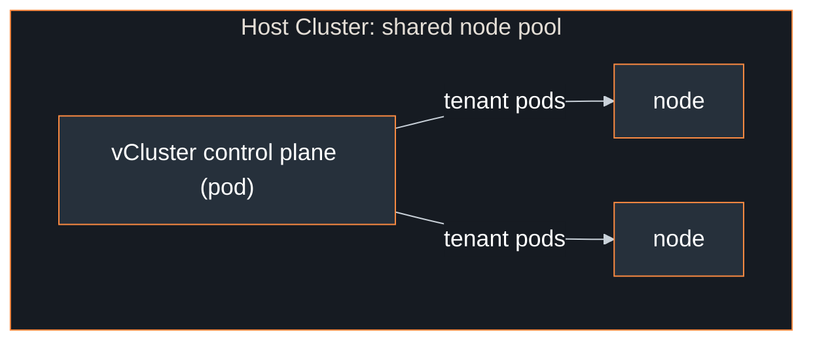
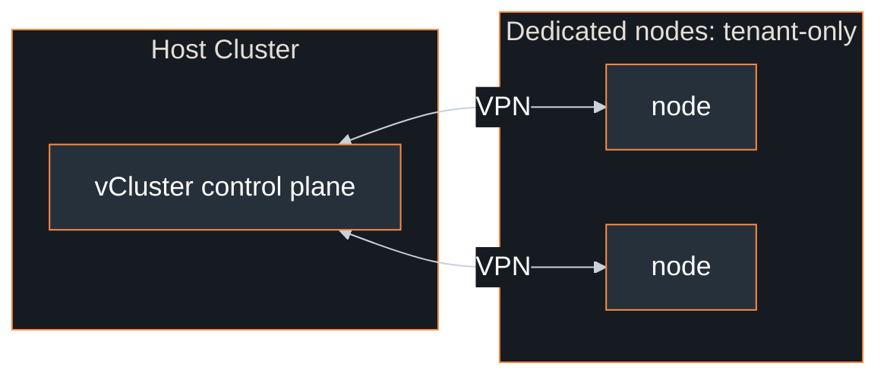
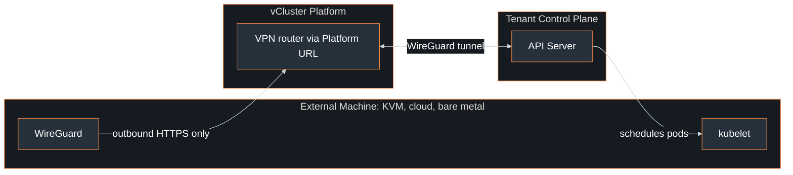
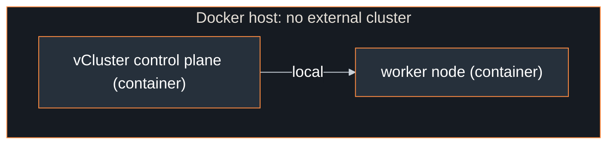

# Flexible Tenant Isolation with vCluster

```bash +exec_replace
echo "Tenant Isolation" | figlet -f small -w 90
```

<!-- jump_to_middle -->

```bash +exec_replace
while IFS= read -r line; do
    printf '\033[38;2;255;102;0m%s\033[0m\n' "$line"
done < vcluster-logo-ascii.txt
```

<!-- end_slide -->

## About Me

```bash +exec_replace
echo "Piotr Zaniewski" | figlet -f small -w 90
```

> **Head of Engineering Enablement** @ vCluster

```bash +exec_replace
printf "  Expertise  │  Platform teams, Kubernetes, GitOps, SRE, CNCF\n  Speaking   │  Workshops, presentations, live demos\n  Content    │  YouTube, Medium, Killercoda\n  Projects   │  Neovim, CLI tools, MCP servers, K8s operators" | ccze -A
```

```bash +exec_replace
qrencode -t UTF8 -m 2 "https://cloudrumble.net"
```

> cloudrumble.net  ·  github.com/Piotr1215  ·  @cloud-native-corner

<!-- end_slide -->

## Namespace Tenancy


> Noisy neighbors

<!-- end_slide -->

## vCluster Tenancy

 

> Your own cluster shared infra

<!-- end_slide -->

## vCluster Advanced Tenancy

 

> Your own cluster and infra

<!-- end_slide -->

## Levels of Tenancy

> One platform, a spectrum of isolation. Each tenant cluster picks the level its workload needs; this talk drives shared and private nodes.

```bash +exec_replace
printf '\e[1;36m%s\e[0m\n\n' "ISOLATION SPECTRUM:  more sharing  →  full isolation"
printf '%-22s \e[38;5;208m%s\e[0m  \e[37m%s\e[0m\n' "Shared nodes"          "█░░░" "own API + RBAC, shared worker nodes"
printf '%-22s \e[38;5;208m%s\e[0m  \e[37m%s\e[0m\n' "Dedicated node pools"  "██░░" "exclusive node pool, shared platform services"
printf '%-22s \e[38;5;208m%s\e[0m  \e[37m%s\e[0m\n' "Private nodes"         "███░" "dedicated nodes, own CNI + CSI, nothing shared"
printf '%-22s \e[38;5;208m%s\e[0m  \e[37m%s\e[0m\n' "Private nodes + vNode" "████" "+ a runtime isolation boundary on top"
printf '\n\e[33m%s\e[0m\n' "vCluster ships four deployment models:"
printf '  \e[37m%s\e[0m\n' "shared nodes  ·  private nodes  ·  vind (local dev, offline CI)  ·  standalone (bare metal, edge)"
```

<!-- end_slide -->

## Deploy the Platform

> Set up the demo environment. We talk through what the platform does during the session.

```bash +exec
vcluster use driver docker
vcluster platform start
```

<!-- end_slide -->

## Create the Demo Environment

> This just stands up the cluster we deploy onto. Think of it as our EKS for the session.

```bash +exec
bash create-host.sh multitenancy-host --values vcluster.yaml
```

<!-- end_slide -->

## Check nodes

```bash +exec_replace
kubectl config current-context
```

```bash +exec
kubectl get nodes -o wide

# Label worker node for demo purposes
WORKER=$(kubectl get nodes --no-headers -o name | grep -v control-plane | head -1)
kubectl label $WORKER team=shared --overwrite
```

<!-- end_slide -->

## Install Shared Services

```bash +exec_replace
kubectl config current-context
```

```bash +exec
# Ingress controller
kubectl apply -f ingress-nginx.yaml

# Wait for ingress controller
kubectl -n ingress-nginx rollout status deployment/ingress-nginx-controller --timeout=120s
```

> **Shared Service**: All tenant clusters can use the same ingress controller

<!-- end_slide -->

<!-- include: ../_partials/what-is-vcluster.md -->

<!-- end_slide -->

## Shared Nodes

> Tenant clusters share the host's worker nodes, and vCluster is highly configurable: one YAML tunes each one.


```mermaid +render
%%{init: {'theme':'base','themeVariables':{'primaryColor':'#26303b','primaryBorderColor':'#ff8c42','primaryTextColor':'#ffffff','secondaryColor':'#26303b','tertiaryColor':'#1b2129','lineColor':'#c9d1d9','textColor':'#ffffff','clusterBkg':'#161b22','clusterBorder':'#ff8c42','edgeLabelBackground':'#161b22','fontSize':'18px'}}}%%
graph TB
    subgraph HOST["Host Cluster: shared node pool"]
        CP["vCluster control plane (pod)"]
        N1["node"]
        N2["node"]
        CP -->|tenant pods| N1
        CP -->|tenant pods| N2
    end
```

<!-- end_slide -->

## Create the Dev Team Tenant Cluster

```bash +exec_replace
vcluster connect multitenancy-host --driver docker >/dev/null 2>&1
kubectl config current-context
```

> A tenant cluster is its own Kubernetes API server, running as a pod on the shared nodes. The dev team gets full admin inside it.

```bash +exec +id:create_dev_vcluster
# Show dev team configuration - resource quotas and limits
cat dev-values.yaml

# Create development team tenant cluster with resource controls
vcluster create dev-team --driver helm --connect=false --values dev-values.yaml

# Wait for it to be ready (poll until the pod object exists, then for readiness)
until kubectl -n vcluster-dev-team get pod -l app=vcluster --no-headers 2>/dev/null | grep -q .; do sleep 2; done
kubectl wait --for=condition=ready pod -l app=vcluster -n vcluster-dev-team --timeout=300s
```

> **Resource Controls**: Automatic limits prevent runaway resource consumption

<!-- snippet_output: create_dev_vcluster -->

<!-- end_slide -->

## Connect to the Dev Tenant Cluster

```bash +exec
# Connect to development team's tenant cluster
vcluster connect dev-team --driver helm
```

> **Note**: Each team gets their own kubeconfig context

<!-- end_slide -->

## What's Inside a Tenant Cluster?


```bash +exec
# Show all containers in the tenant cluster pod
kubectl --context vcluster-docker_multitenancy-host get pod -n vcluster-dev-team -l app=vcluster -o json | \
  jq -r '.items[0] | 
    "INIT CONTAINERS:\n" + 
    (.spec.initContainers[] | "  \(.name): \(.image)") + 
    "\n\nMAIN CONTAINERS:\n" + 
    (.spec.containers[] | "  \(.name): \(.image)")'
```

> **Architecture**: Init container delivers the Kubernetes binaries; the syncer container runs the virtual control plane and syncs resources to the host.

<!-- end_slide -->

## Data Storage: SQLite Inside


```bash +exec
# Check the SQLite database file inside the tenant cluster pod
kubectl --context vcluster-docker_multitenancy-host exec -n vcluster-dev-team dev-team-0 -c syncer -- ls -lh /data/state.db

# Also check for kine database (k3s uses kine as SQLite wrapper)
kubectl --context vcluster-docker_multitenancy-host exec -n vcluster-dev-team dev-team-0 -c syncer -- ls -lh /data/
```

> **Storage**: vCluster uses embedded SQLite - it's easy to configure an external data store!

<!-- end_slide -->

## Dev Team: Deploy Applications  

> Development team deploys applications with automatic resource limits

```bash +exec
# Create a web deployment
kubectl apply -f web-app.yaml

# Wait for the pod to exist before inspecting it
kubectl rollout status deployment/web-app --timeout=60s

# Show automatic resource limits applied to pod
kubectl get pod -l app=web-app -o jsonpath='{.items[0].spec.containers[0].resources}' | jq . 
```

<!-- end_slide -->

### Web Page

```bash +exec
vcluster connect dev-team --driver helm
kubectl port-forward deployment/web-app 8081:80 &
sleep 2
curl http://localhost:8081/ 
```

<!-- end_slide -->

## Namespace Isolation Is Useful, Until You Need More

> Namespaces give you a boundary. Real platforms quickly need more than that.

```bash +exec_replace
printf '\e[1;36m%s\e[0m\n\n' "A namespace alone cannot give you:"
printf '\e[35m•\e[0m \e[33m%-24s\e[0m %s\n' "Real names on the host" "Workload Identity and Run:ai need them"
printf '\e[35m•\e[0m \e[33m%-24s\e[0m %s\n' "Governance everywhere" "labels injected on every synced pod"
printf '\e[35m•\e[0m \e[33m%-24s\e[0m %s\n' "Shared platform CRDs" "tenants consume them, install nothing"
printf '\e[35m•\e[0m \e[33m%-24s\e[0m %s\n' "Seeded config + secrets" "every tenant starts pre-populated"
printf '\n\e[32m%s\e[0m\n' "vCluster turns these on with one config file →"
```

<!-- end_slide -->

## One vcluster.yaml

```bash +exec_replace
bat --color=always --style=plain free-tier-values.yaml
```

<!-- end_slide -->

## Apply the Config

> The whole tenant cluster comes from that one file.

```bash +exec
vcluster disconnect
vcluster connect multitenancy-host --driver docker

# Register the shared CRD on the control plane, then create the tenant cluster
kubectl apply -f config-crd.yaml
vcluster create sync-demo --driver helm --values free-tier-values.yaml
```

<!-- end_slide -->

## The Config in Action

> The same tenant cluster, now doing what a namespace cannot.

```bash +exec
# host context, so we can watch what crosses the boundary
vcluster connect multitenancy-host --driver docker >/dev/null 2>&1
HOST_CTX=$(kubectl config current-context)

# tenant-side work
vcluster connect sync-demo --driver helm >/dev/null 2>&1
kubectl create namespace production 2>/dev/null || true
kubectl create deployment demo --image=nginx:alpine 2>/dev/null || true
kubectl rollout status deployment/demo --timeout=60s >/dev/null

echo "=== 1:1 namespace on the host, not rewritten ==="
kubectl --context "$HOST_CTX" get namespace production

echo ""
echo "=== governance labels injected on every synced pod ==="
kubectl --context "$HOST_CTX" get pods -n vcluster-sync-demo -L managed-by,tenant

echo ""
echo "=== config + secret pre-populated inside the tenant ==="
kubectl get configmap platform-config
```

<!-- end_slide -->

## Private Nodes

> Isolate a tenant's workloads onto dedicated nodes. Any Linux machine, bare metal or cloud VM, joins one tenant cluster over a VPN.


```mermaid +render
%%{init: {'theme':'base','themeVariables':{'primaryColor':'#26303b','primaryBorderColor':'#ff8c42','primaryTextColor':'#ffffff','secondaryColor':'#26303b','tertiaryColor':'#1b2129','lineColor':'#c9d1d9','textColor':'#ffffff','clusterBkg':'#161b22','clusterBorder':'#ff8c42','edgeLabelBackground':'#161b22','fontSize':'18px'}}}%%
graph LR
    subgraph HOST["Host Cluster"]
        CP["vCluster control plane"]
    end
    subgraph PRIV["Dedicated nodes: tenant-only"]
        N1["node"]
        N2["node"]
    end
    CP <-->|VPN| N1
    CP <-->|VPN| N2
```

<!-- end_slide -->

## Create a Private-Nodes Tenant Cluster

> Add a real machine to a tenant cluster: KVM, cloud VM, or bare metal

```bash +exec_replace
bat --color=always --style=plain private-values.yaml
```

```bash +exec
vcluster disconnect
vcluster connect multitenancy-host --driver docker
vcluster create private-team --driver helm --connect=false --values private-values.yaml

# pre-warm the vNode runtime; the DaemonSet activates on the node once it joins
vcluster connect private-team --driver helm
helm upgrade --install vnode-runtime vnode-runtime \
  --repo https://charts.loft.sh -n vnode-runtime --create-namespace
```

<!-- end_slide -->

### Generate a Join Token

> Private nodes start empty. You bring your own machine and join it with one token.

```bash +exec
vcluster connect private-team --driver helm
echo "=== No nodes until you join one ==="
kubectl get nodes

echo ""
echo "=== Join token (paste the curl on any machine) ==="
vcluster token create --expires=1h

echo ""
echo "=== A real VM waiting on the same host (KVM) ==="
sudo virsh domifaddr cloud-node 2>/dev/null | grep ipv4
```

<!-- end_slide -->

### Join the VM

> SSH in, paste the curl command from the token

```bash +acquire_terminal
VM_IP=$(sudo virsh domifaddr cloud-node | awk '/ipv4/ {print $4}' | cut -d/ -f1) && ssh -o StrictHostKeyChecking=accept-new root@$VM_IP
```

<!-- end_slide -->

### Verify the External Node

> A Docker control plane plus a KVM worker, one cluster

```bash +exec
vcluster connect private-team --driver helm
kubectl get nodes -o wide
```

<!-- end_slide -->

### How Private Nodes Work


```mermaid +render
%%{init: {'theme':'base','themeVariables':{'primaryColor':'#26303b','primaryBorderColor':'#ff8c42','primaryTextColor':'#ffffff','secondaryColor':'#26303b','tertiaryColor':'#1b2129','lineColor':'#c9d1d9','textColor':'#ffffff','clusterBkg':'#161b22','clusterBorder':'#ff8c42','edgeLabelBackground':'#161b22','fontSize':'18px'}}}%%
graph LR
    subgraph EXT["External Machine: KVM, cloud, bare metal"]
        KUBELET[kubelet]
        WG[WireGuard]
    end
    subgraph PLAT["vCluster Platform"]
        VPN[VPN router via Platform URL]
    end
    subgraph CP["Tenant Control Plane"]
        API[API Server]
    end
    WG -->|outbound HTTPS only| VPN
    VPN <-->|WireGuard tunnel| API
    API -->|schedules pods| KUBELET
```

> The node needs only outbound HTTPS to the Platform. The control plane API is never exposed inbound.

<!-- end_slide -->

### vNode: A Privileged Pod Owns the Node

> A dedicated KVM node still runs whatever the tenant schedules. A privileged hostPID pod owns the whole machine.

```bash +exec
vcluster connect private-team --driver helm
kubectl apply -f bad-boy.yaml
kubectl wait --for=condition=Ready pod/bad-boy --timeout=90s
echo ""
echo "=== ps -ef inside the pod: the whole node is in reach ==="
kubectl exec bad-boy -- ps -ef | grep -E 'kubelet|containerd|sshd|systemd' | grep -v grep | head
```

<!-- end_slide -->

### vNode: Same Pod, Contained

> One line, runtimeClassName: vnode, drops the same privileged pod into a virtual node. hostPID stops at the sandbox.

```bash +exec
vcluster connect private-team --driver helm
# runtime was pre-installed at tenant creation; confirm it is live on the node
kubectl -n vnode-runtime wait --for=condition=Ready pod --all --timeout=180s
kubectl delete pod bad-boy --ignore-not-found --wait
kubectl apply -f bad-boy-vnode.yaml
kubectl wait --for=condition=Ready pod/bad-boy --timeout=120s
echo ""
echo "=== ps -ef inside the same pod, now vnode-sandboxed ==="
kubectl exec bad-boy -- ps -ef
echo ""
echo "Same privileged pod. Its process view stops at the sandbox."
```

<!-- end_slide -->

## vind

> Full Kubernetes in Docker. Snapshot a tenant cluster to an OCI artifact, restore it anywhere.


```mermaid +render
%%{init: {'theme':'base','themeVariables':{'primaryColor':'#26303b','primaryBorderColor':'#ff8c42','primaryTextColor':'#ffffff','secondaryColor':'#26303b','tertiaryColor':'#1b2129','lineColor':'#c9d1d9','textColor':'#ffffff','clusterBkg':'#161b22','clusterBorder':'#ff8c42','edgeLabelBackground':'#161b22','fontSize':'18px'}}}%%
graph TB
    subgraph DOCKER["Docker host: no external cluster"]
        CP["vCluster control plane (container)"]
        N1["worker node (container)"]
        CP -->|local| N1
    end
```

<!-- end_slide -->

## vind: Kubernetes in Docker

> It's just Docker containers. No VM, no kubeadm, a full cluster in under a minute.

```bash +exec_replace
printf '\e[1;36m%-25s\e[0m \e[32m%-20s\e[0m \e[33m%-20s\e[0m\n' "Feature" "vind" "kind"
printf '\e[36m%-25s\e[0m \e[32m%-20s\e[0m \e[33m%-20s\e[0m\n' "─────────────────────────" "────────────────────" "────────────────────"
printf '%-25s \e[32m%-20s\e[0m \e[33m%-20s\e[0m\n' "Built-in UI" "vCluster Platform" "none"
printf '%-25s \e[32m%-20s\e[0m \e[33m%-20s\e[0m\n' "Sleep/Wake" "native" "delete & recreate"
printf '%-25s \e[32m%-20s\e[0m \e[33m%-20s\e[0m\n' "Load Balancers" "automatic" "manual setup"
printf '%-25s \e[32m%-20s\e[0m \e[33m%-20s\e[0m\n' "Image Caching" "via Docker cache" "external registries"
printf '%-25s \e[32m%-20s\e[0m \e[33m%-20s\e[0m\n' "External Nodes" "supported (VPN)" "local only"
printf '%-25s \e[32m%-20s\e[0m \e[33m%-20s\e[0m\n' "CNI/CSI Options" "flexible" "limited"
printf '%-25s \e[32m%-20s\e[0m \e[33m%-20s\e[0m\n' "Snapshots" "to OCI / S3" "none"
```

<!-- end_slide -->

## Snapshot the Tenant Cluster

> One command captures the whole tenant cluster: state, config, and Helm release, into a single artifact.

```bash +exec
# Snapshot the tenant cluster to an ephemeral OCI registry (ttl.sh)
vcluster disconnect
vcluster connect multitenancy-host --driver docker
vcluster snapshot create dev-team --driver helm "oci://ttl.sh/vcluster-dev-team:1h"
```

> **Backup Options:**
> - `vcluster snapshot create` to OCI, S3, or a container path
> - Works on any vCluster, not just Docker
> - Platform API backups (Pro)

<!-- end_slide -->

### Snapshot Artifact

> OCI image on ttl.sh - expires in 1 hour

```bash +exec
crane manifest ttl.sh/vcluster-dev-team:1h | jq '{
  mediaType,
  layers: [.layers[] | {mediaType, size: (.size / 1024 | floor | tostring + " KB")}],
  annotations: .annotations
}'
```

<!-- end_slide -->

### Delete dev-team from the first host

```bash +exec
vcluster disconnect
vcluster connect multitenancy-host --driver docker
vcluster delete dev-team --driver helm --delete-context
```

<!-- end_slide -->

### Create a second control plane cluster

```bash +exec
bash create-host.sh multitenancy-host-2 --values vcluster.yaml
```

<!-- end_slide -->

### Restore onto the new host

> Restore our tenant cluster onto the new control plane cluster

```bash +exec
vcluster create dev-team --driver helm --restore "oci://ttl.sh/vcluster-dev-team:1h"
```

<!-- end_slide -->

### Web Page (restored cluster)

> A cluster inside a cluster running inside Docker on a laptop

```bash +exec
vcluster connect multitenancy-host-2 --driver docker
vcluster connect dev-team --driver helm
kubectl rollout status deployment/web-app --timeout=60s
kubectl port-forward deployment/web-app 8081:80 &
sleep 2
curl http://localhost:8081/
```

<!-- end_slide -->

## The Tenant Isolation Spectrum

> Not a ranking, a spectrum. Each tenant cluster picks the level its workload needs, trading host integration for isolation.

```bash +exec_replace
printf '\e[38;5;208m%s\e[0m\n\n' "more sharing, lower overhead   ─────────▶   full isolation, higher overhead"
printf '\e[1;33m%-20s%-20s%-20s%s\e[0m\n' "Namespace" "Shared Nodes" "Private Nodes" "Private + vNode"
printf '\e[38;5;208m%s\e[0m\n' "░░░░                █░░░                ███░                ████"
printf '\e[37m%-20s%-20s%-20s%s\e[0m\n' "soft limits only" "own API server" "dedicated nodes" "runtime sandbox"
printf '\e[37m%-20s%-20s%-20s%s\e[0m\n\n' "the starting pain" "dev-team demo" "KVM node demo" "privileged-safe"
printf '\e[32m%s\e[0m\n' "vind ran snapshot and restore: the same models, packaged in Docker."
```

<!-- end_slide -->

## vCluster: The Complete Tenant Isolation Solution

| Use Case | → | How vCluster Solves It |
|---|---|---|
| Dev/Test environments | → | ✅ Provision tenant clusters in seconds via Docker driver |
| Tenant isolation | → | ✅ Full admin access with no noisy neighbors |
| Snapshot portability | → | ✅ Small OCI image, restore on any host |
| Platform governance | → | ✅ Sync patches inject labels transparently |
| CRD sharing | → | ✅ Platform CRDs available in every tenant cluster |
| Namespace mapping | → | ✅ 1:1 sync for Workload Identity, Run:ai |
| Security boundaries | → | ✅ Isolated control planes, resource quotas |

> Tenant clusters at every isolation level, across two control plane clusters on the free tier

<!-- end_slide -->

## Where to Go From Here

```markdown
Docs:
  Deployment models:
    vcluster.com/docs/vcluster/deploy/overview

  Shared & Private Nodes quick starts:
    vcluster.com/docs/vcluster/quick-start

  vNode runtime isolation:
    vnode.com

  vCluster Platform (free tier):
    vcluster.com/docs/platform
```

> Try it on the free tier: real isolation, no credit card.

<!-- end_slide -->

<!-- new_lines: 3 -->

```bash +exec_replace
while IFS= read -r line; do
    printf '\033[38;2;255;102;0m%s\033[0m\n' "$line"
done < vcluster-logo-ascii.txt
```

<!-- new_lines: 5 -->

<!-- jump_to_middle -->

```bash +exec_replace
echo "Questions?" | figlet -f small -w 90
```
