<!--
Note: Commands marked with +exec can be run with Ctrl+E
For better output display, use the spane script in a separate terminal
-->

# Flexible Multi-Tenancy with vCluster

> Adapt Kubernetes isolation to your exact needs


```bash +exec_replace
echo "Flexible Multi-Tenancy" | figlet -f small -c -w 90
```

<!-- end_slide -->

## Namespace Tenancy

 

> Noisy neighbors

<!-- end_slide -->

## vCluster Tenancy

 

> Your own cluster shared infra

<!-- end_slide -->

## vCluster Advanced Tenancy

 

> Your own cluster and infra

<!-- end_slide -->

## What is vCluster?

```mermaid +render
%%{init: {'flowchart' : {'curve' : 'linear'}}}%%
flowchart TB
    subgraph host["Host Kubernetes Cluster"]
        subgraph vclusters[" "]
            direction LR
            subgraph vc1["vCluster 1"]
                W1["Team 1<br/>Workloads"]
            end
            
            subgraph vc2["vCluster 2"]
                direction TB
                W2["Team 2<br/>Workloads"]
                Ingress2["• Ingress"]
                CertManager2["• Cert Manager"]
            end
            
            subgraph vc3["vCluster 3"]
                W3["Team 3<br/>Workloads"]
            end
        end
        
        Shared["Shared Services<br/>(Cert Manager, Ingress Controller)"]
    end
    
    W1 --> Shared
    W3 --> Shared
    
    classDef cluster fill:#495057,stroke:#fff,stroke-width:2px,color:#fff
    classDef workload fill:#6c757d,stroke:#fff,stroke-width:2px,color:#fff
    classDef service fill:#343a40,stroke:#fff,stroke-width:2px,color:#fff
    
    class vc1,vc2,vc3 cluster
    class W1,W2,W3 workload
    class Shared,CertManager2,Ingress2 service
```



> **vCluster** = Containerized Kubernetes inside a Pod!

<!-- end_slide -->


## Deploy Kubernetes Cluster

```bash +exec
kind create cluster --name vcluster-multitenancy --config kind-multitenancy.yaml
```

> **Note**: vCluster can run on any Kubernetes cluster (managed, on prem)
<!-- end_slide -->

## Flexible Multi-Tenancy Models


> **Flexibility**: Configure each vCluster for its trust level!

<!-- end_slide -->


## Check nodes

```bash +exec
kubectl get nodes -o wide

# Label nodes for demo purposes
kubectl label node vcluster-multitenancy-worker team=shared --overwrite
```

<!-- end_slide -->

## Install Shared Services: Ingress Controller

```bash +exec
# Install NGINX Ingress Controller in host cluster
kubectl apply -f https://raw.githubusercontent.com/kubernetes/ingress-nginx/main/deploy/static/provider/kind/deploy.yaml

# Wait for ingress controller to be ready
kubectl wait --namespace ingress-nginx \
  --for=condition=ready pod \
  --selector=app.kubernetes.io/component=controller \
  --timeout=90s
```

> **Shared Service**: All vClusters can use the same ingress controller

<!-- end_slide -->

## Multi-Tenancy Challenges in Kubernetes


> **Problems:**
> - Limited isolation between tenants
> - Shared control plane risks
> - No CRD isolation
> - Version lock-in

<!-- end_slide -->


## Why vCluster for Multi-Tenancy?

| **Team** | **Requirements** | **vCluster Solution** |
|---|---|---|
| Development | Dev/Test environments | ✅ Full admin access, isolated CRDs |
| Production | Stable, isolated workloads | ✅ Resource quotas, ingress sync |
| Data Science | GPU access, custom tools | ✅ Node selectors, custom schedulers |
| Partners | Limited access, compliance | ✅ Security policies, filtered sync |


> **Multi-Tenancy**: Complete Kubernetes API compatibility with true isolation

<!-- end_slide -->

## Demo 1: Development Team vCluster

> Create a resource-limited vCluster for development team

```bash +exec +id:create_dev_vcluster
# Show dev team configuration - resource quotas and limits
cat dev-values.yaml

# Create development team vCluster with resource controls
vcluster create dev-team --connect=false --values dev-values.yaml

# Wait for it to be ready
kubectl wait --for=condition=ready pod -l app=vcluster -n vcluster-dev-team --timeout=300s
```

> **Resource Controls**: Automatic limits prevent runaway resource consumption

<!-- snippet_output: create_dev_vcluster -->

<!-- end_slide -->

## Connect to Development vCluster

```bash +exec
# Connect to development team's vCluster
vcluster connect dev-team
```

> **Note**: Each team gets their own kubeconfig context

<!-- end_slide -->

## vCluster Architecture: What's Inside?


```bash +exec
# Show all containers in the vCluster pod
kubectl --context kind-vcluster-multitenancy get pod -n vcluster-dev-team -l app=vcluster -o json | \
  jq -r '.items[0] | 
    "INIT CONTAINERS:\n" + 
    (.spec.initContainers[] | "  \(.name): \(.image)") + 
    "\n\nMAIN CONTAINERS:\n" + 
    (.spec.containers[] | "  \(.name): \(.image)")'
```

> **Architecture**: Init container prepares the environment, syncer synchronizes resources between host and virtual cluster!

<!-- end_slide -->

## vCluster Data Storage: SQLite Inside!


```bash +exec
# Check the SQLite database file inside vCluster pod
kubectl --context kind-vcluster-multitenancy exec -n vcluster-dev-team dev-team-0 -c syncer -- ls -lh /data/state.db

# Also check for kine database (k3s uses kine as SQLite wrapper)
kubectl --context kind-vcluster-multitenancy exec -n vcluster-dev-team dev-team-0 -c syncer -- ls -lh /data/
```

> **Storage**: vCluster uses embedded SQLite - it's easy to configure external data store!

<!-- end_slide -->

## Dev Team: Deploy Applications  

> Development team deploys applications with automatic resource limits

```bash +exec
# Create a web deployment
kubectl apply -f web-app.yaml

# Show automatic resource limits applied to pod
kubectl get pod -l app=web-app -o jsonpath='{.items[0].spec.containers[0].resources}' | jq . 
```

<!-- end_slide -->

### Web Page

```bash +exec
vcluster connect dev-team
kubectl port-forward deployment/web-app 8081:80 &
sleep 2
curl http://localhost:8081/ 
```

<!-- end_slide -->


## vCluster State Management

> vCluster stores all state in a single SQLite database

```bash +exec
# Snapshot to ephemeral docker image registry
vcluster snapshot dev-team "oci://ttl.sh/vcluster-dev-team:1h"
```

> **Backup Options:**
> - `vcluster snapshot` to OCI/S3/Container
> - Direct SQLite backup
> - Platform API backups (Pro)
> - Volume snapshots

<!-- end_slide -->

### Create a new kind cluster

```bash +exec
kind create cluster --name host2
```
        
<!-- end_slide -->

> Restore our virtual cluster onto it!

```bash +exec 
vcluster create dev-team --restore "oci://ttl.sh/vcluster-dev-team:1h"
```

<!-- end_slide -->

### Web Page

```bash +exec
vcluster connect dev-team
kubectl port-forward deployment/web-app 8081:80 &
sleep 2
curl http://localhost:8081/ 
```

<!-- end_slide -->


### Cleanup kind cluster

```bash +exec 
kind delete cluster --name host2 
```

<!-- end_slide -->

## Demo 2: Production Team with Advanced Networking

> Create a production vCluster with DNS resolution and node syncing

```bash +exec
# Show production configuration - DNS and cross-vCluster communication
kubectl config use-context kind-vcluster-multitenancy
cat prod-values.yaml

# Create production vCluster
vcluster create prod-team --connect=false --values prod-values.yaml

# Wait for ready
kubectl wait --for=condition=ready pod -l app=vcluster -n vcluster-prod-team --timeout=300s
```

> **Advanced Features**: Real nodes, custom DNS, cross-vCluster service discovery!

<!-- end_slide -->

## Connect to Production vCluster

```bash +exec
# Connect to production team's vCluster
vcluster connect prod-team
```

<!-- end_slide -->

## Production Team: Deploy with Cross-vCluster DNS

> Production team can resolve services from other vClusters

```bash +exec
# Create production app
kubectl apply -f web-app.yaml

# Create a service alias for dev team to access
kubectl expose deployment web-app --name=prod-api --port=80

# Show real nodes synced from host with labels
kubectl get nodes -L team

# Test cross-namespace DNS resolution
kubectl run dns-test --image=busybox:1.28 --rm -it --restart=Never -- nslookup kubernetes.default.svc.cluster.local
```

> **Flexibility**: Ingresses sync to host cluster while keeping workloads isolated!

<!-- end_slide -->


## Demo 3: Partner Team with Pre-populated Resources

> Create a vCluster with platform credentials pre-installed

```bash +exec
# Disconnect from current context
vcluster disconnect

# Show partner configuration - pre-populated resources
kubectl config use-context kind-vcluster-multitenancy
cat partner-values.yaml
```

> **Pre-populated**: Partners get platform configs and credentials automatically!

<!-- end_slide -->

## Create Partner vCluster

```bash +exec
# Create partner vCluster with restricted configuration
vcluster create partner-team --connect=false --values partner-values.yaml

# Wait for it to be ready
kubectl wait --for=condition=ready pod -l app=vcluster -n vcluster-partner-team --timeout=300s
```

<!-- end_slide -->

## Partner Team: Limited Node View

```bash +exec
# Connect to partner vCluster
vcluster connect partner-team

# Show pre-populated resources
kubectl get configmap,secret -n default

# Show pods in all namespaces
kubectl get pods -A
```

> **Security**: Partners operate in a controlled sandbox

<!-- end_slide -->

## Flexible Resource Syncing

> Choose exactly what syncs between virtual and host clusters

| **Resource** | **Dev Team** | **Prod Team** | **Partner Team** |
|---|---|---|---|
| Pods | ✅ With quotas | ✅ Unlimited | ✅ With tolerations |
| Services | ✅ ClusterIP only | ✅ All types | ❌ Disabled |
| Ingresses | ❌ Disabled | ✅ Enabled | ❌ Disabled |
| Nodes | 🔵 Pseudo | 🟢 Real | 🟡 Filtered |
| ConfigMaps | ✅ Isolated | ✅ Isolated | 📥 From host |
| Resource Limits | ✅ Enforced | ❌ None | ❌ None |

> **Key Point**: Fine-grained control over what crosses the boundary

<!-- end_slide -->

## Compare vCluster Configurations

> Each team's unique capabilities:

```bash +exec
# Show all vClusters running
kubectl config use-context kind-vcluster-multitenancy
vcluster list
```

> **Key Insight**: Same platform, different isolation levels per team!

<!-- end_slide -->

## vCluster: The Complete Multi-Tenancy Solution

| **Use Case** | → | **How vCluster Solves It** |
|---|---|---|
| Dev/Test environments | → | ✅ Provision new clusters in minutes - 10x cheaper |
| Tenant isolation | → | ✅ Full admin access with no noisy neighbors |
| Independent versioning | → | ✅ Each team picks their K8s & scheduler versions |
| Platform efficiency | → | ✅ Sleep idle clusters, share platform tools |
| Security boundaries | → | ✅ Reduced attack surface, isolated control planes |

> **Today's demo proved**: Three teams, three schedulers, one host cluster!

<!-- end_slide -->

## That's All Folks!

> Questions?


```bash +exec_replace
echo "Thank You!" | figlet -f small -w 90
```
